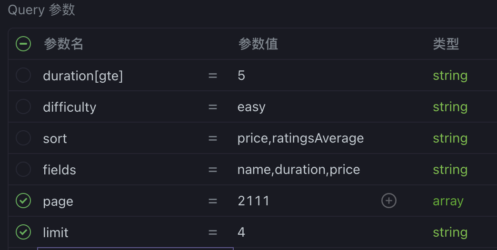

- DONE  express learning-mongodb
  :LOGBOOK:
  CLOCK: [2024-05-30 Thu 10:59:01]
  CLOCK: [2024-05-30 Thu 10:59:29]--[2024-05-30 Thu 10:59:33] =>  00:00:04
  CLOCK: [2024-05-30 Thu 10:59:50]--[2024-05-30 Thu 15:00:21] =>  04:00:31
  :END:
	- login Mongodb Atlas
	- create project and cluster
- NOW  Section 8: Using MongoDB with Mongoose
  :LOGBOOK:
  CLOCK: [2024-05-30 Thu 15:01:11]
  :END:
	- ### [Mongoose](https://mongoosejs.com/docs/guide.html)
		- 理论
			- 1.  **对象数据建模（ODM）库**：
				- Mongoose 是一个对象数据建模（ODM）库，用于在 Node.js 环境中与 MongoDB 交互。
				- 它提供了高层次的抽象，使开发者能够在代码中定义数据模型（Schemas）和模式验证（Schema Validation），这对应用程序的数据结构进行更严格的控制和验证。
				- Mongoose 还提供了丰富的中间件（Middleware）功能，使得在执行数据库操作前后可以执行一些自定义逻辑。
			- 2.  **简化开发**：
				- Mongoose 提供的 Schema 定义和 Model API，使得数据库操作更具声明性和简洁性。
				- 它内置了数据验证、类型转换、钩子（Hooks）、虚拟属性（Virtuals）和其他高级功能，帮助开发者管理数据的生命周期和复杂的应用逻辑。
		- 实践
			- connect database
			  collapsed:: true
				- ```javascript
				  const DB = process.env.DATABASE.replace(
				    '<PASSWORD>',
				    process.env.DATABASE_PASSWORD,
				  );
				  // mongoose.connect('mongodb://127.0.0.1:27017/myapp');
				  mongoose.connect(DB).then(() => console.log('DB connection successful!'));
				  ```
			- build schema
			  collapsed:: true
				- ```javascript
				  const mongoose = require('mongoose');
				  
				  const tourSchema = new mongoose.Schema({
				    name: {
				      type: String,
				      required: [true, 'A tour must have a name'],
				      unique: true,
				    },
				    rating: { type: Number, dedault: 4.5 },
				    price: { type: Number, required: [true, 'A tour must have a price'] },
				  });
				  
				  const Tour = mongoose.model('Tour', tourSchema);
				  
				  module.exports = Tour;
				  ```
			- find all document
			  collapsed:: true
				- ```javascript
				  exports.getAllTours = async (req, res) => {
				    try {
				      const tours = await Tour.find();
				      res.status(200).json({
				        status: 'success',
				        results: tours.length,
				        data: {
				          tours,
				        },
				      });
				    } catch (err) {
				      res.status(404).json({
				        status: 'fail',
				        message: err,
				      });
				    }
				  };
				  ```
			- find one document
			  collapsed:: true
				- ```javascript
				  exports.getTour = async (req, res) => {
				    try {
				      const tour = await Tour.findById(req.params.id);
				      // Tour.findOne({_id: req.params.id})
				      res.status(200).json({
				        status: 'success',
				        data: {
				          tour,
				        },
				      });
				    } catch (err) {
				      res.status(404).json({
				        status: 'fail',
				        message: err,
				      });
				    }
				    // const id = req.params.id * 1;
				    // const tour = tours.find((el) => el.id === id);
				    //
				    // res.status(200).json({
				    //   status: 'success',
				    //   data: {
				    //     tour,
				    //   },
				    // });
				  };
				  
				  ```
			- create one document
			  collapsed:: true
				- ```javascript
				  exports.createTour = async (req, res) => {
				    try {
				      // const newTour = new Tour({})
				      // newTour.save()
				  
				      const newTour = await Tour.create(req.body);
				  
				      res.status(201).json({
				        status: 'success',
				        data: {
				          tour: newTour,
				        },
				      });
				    } catch (err) {
				      res.status(400).json({
				        status: 'fail',
				        message: 'Invalid data sent!',
				      });
				    }
				  
				    // const newId = tours[tours.length - 1].id + 1;
				    // const newTour = Object.assign({ id: newId }, req.body);
				    //
				    // tours.push(newTour);
				    // fs.writeFile(
				    //   `${__dirname}/../dev-data/data/tours-simple.json`,
				    //   JSON.stringify(tours),
				    //   (err) => {
				    //     res.status(201).json({
				    //       status: 'success',
				    //       data: {
				    //         tour: newTour,
				    //       },
				    //     });
				    //   },
				    // );
				  };
				  
				  ```
			- update one document
			  collapsed:: true
				- ```javascript
				  exports.updateTour = async (req, res) => {
				    try {
				      const tour = await Tour.findByIdAndUpdate(req.params.id, req.body, {
				        new: true,
				        runValidators: true,
				      });
				  
				      res.status(200).json({
				        status: 'success',
				        data: {
				          tour,
				        },
				      });
				    } catch (err) {
				      res.status(404).json({
				        status: 'fail',
				        message: 'Invalid data sent!',
				      });
				    }
				  };
				  
				  ```
			- delete one document
			  collapsed:: true
				- ```javascript
				  exports.deleteTour = async (req, res) => {
				    try {
				      await Tour.findByIdAndDelete(req.params.id);
				  
				      res.status(204).json({
				        status: 'success',
				        data: null,
				      });
				    } catch (err) {
				      res.status(404).json({
				        status: 'fail',
				        message: 'Invalid data sent!',
				      });
				    }
				  };
				  ```
			- 脚本导入数据和删除数据
			  collapsed:: true
				- ```javascript
				  const fs = require('fs');
				  const mongoose = require('mongoose');
				  const dotenv = require('dotenv');
				  const Tour = require('./../../models/tourModel');
				  
				  dotenv.config({ path: './../../config.env' });
				  
				  const DB = process.env.DATABASE.replace(
				    '<PASSWORD>',
				    process.env.DATABASE_PASSWORD,
				  );
				  
				  mongoose.connect(DB).then(() => console.log('DB connection successful!'));
				  
				  // READ JSON FILE
				  const tours = JSON.parse(
				    fs.readFileSync(`${__dirname}/tours-simple.json`, 'utf-8'),
				  );
				  
				  // IMPORT DATA INTO DB
				  const importData = async () => {
				    try {
				      await Tour.create(tours);
				      console.log('Data successfully loaded!');
				      process.exit();
				    } catch (err) {
				      console.log(err);
				    }
				  };
				  
				  // DELETE ALL DATA FROM DB
				  const deleteData = async () => {
				    try {
				      await Tour.deleteMany();
				      console.log('Data successfully deleted!');
				      process.exit();
				    } catch (err) {
				      console.log(err);
				    }
				  };
				  
				  if (process.argv[2] === '--import') {
				    importData();
				  } else if (process.argv[2] === '--delete') {
				    deleteData();
				  }
				  
				  ```
			- advance query
				- query example
				  collapsed:: true
					- 
				- filter data when query
				  collapsed:: true
					- ```javascript
					  // BUILD QUERY
					      const queryObj = { ...req.query };
					      const excludeFields = ['page', 'sort', 'limit', 'fields'];
					      excludeFields.forEach((el) => delete queryObj[el]);
					  
					      const query = Tour.find(queryObj);
					      // const query = Tour.find()
					      //   .where('duration')
					      //   .equals(5)
					      //   .where('difficulty')
					      //   .equals('easy');
					  
					      // EXECUTE QUERY
					      const tours = await query;
					  ```
				- advanced filter
				  collapsed:: true
					- ```javascript
					      // 2 advanced filtering
					      const queryStr = JSON.stringify(queryObj);
					      const formatQueryStr = queryStr.replace(
					        /\b(gte|gt|lte|lt)\b/g,
					        (match) => `$${match}`,
					      );
					      console.log(JSON.parse(formatQueryStr));
					  
					      // { duration: { gte: '5' } }
					      // { duration: { $gte: '5' } }
					      // gte, gt, lte, lt
					      const query = Tour.find(JSON.parse(formatQueryStr));
					  ```
				- sort
				  collapsed:: true
					- ```javascript
					      let query = Tour.find(JSON.parse(formatQueryStr));
					  
					      // 2 Sorting
					      if (req.query.sort) {
					        const sortBy = req.query.sort.split(',').join(' ');
					        query = query.sort(sortBy);
					      } else {
					        query = query.sort('-createdAt');
					      }
					  ```
				- fields limit
				  collapsed:: true
					- ```javascript
					      // 3 Field Limiting
					      if (req.query.fields) {
					        const fields = req.query.fields.split(',').join(' ');
					        query = query.select(fields);
					      } else {
					        query = query.select('-__v');
					      }
					  ```
				- pagination
				  collapsed:: true
					- ```javascript
					      // 4 Pagination
					      const page = req.query.page * 1 || 1;
					      const limit = req.query.limit * 1 || 100;
					      const skip = (page - 1) * limit;
					      query = query.skip(skip).limit(limit);
					  
					      if (req.query.page) {
					        const numTours = await Tour.countDocuments();
					        if (skip > numTours) throw new Error('This page does not exists');
					      }
					  ```
			- alilas url
			  collapsed:: true
				- ```javascript
				  router.route('/top-5-cheap').get(aliasTopTours, getAllTours);
				  
				  exports.aliasTopTours = (req, res, next) => {
				    req.query.limit = '5';
				    req.query.sort = '-ratingsAverage,price';
				    req.query.fields = 'name,price,ratingsAverage,summary,difficulty';
				    next();
				  };
				  ```
			- refactor by use class
			  collapsed:: true
				- ```javascript
				  
				  class APIFeature {
				    constructor(query, queryString) {
				      this.query = query;
				      this.queryString = queryString;
				    }
				  
				    filter() {
				      const queryObj = { ...this.queryString };
				      const excludeFields = ['page', 'sort', 'limit', 'fields'];
				      excludeFields.forEach((el) => delete queryObj[el]);
				  
				      // 1b advanced filtering
				      const queryStr = JSON.stringify(queryObj);
				      const formatQueryStr = queryStr.replace(
				        /\b(gte|gt|lte|lt)\b/g,
				        (match) => `$${match}`,
				      );
				      // { duration: { gte: '5' } }
				      // { duration: { $gte: '5' } }
				      // gte, gt, lte, lt
				      this.query.find(JSON.parse(formatQueryStr));
				      return this;
				    }
				  
				    sort() {
				      if (this.queryString.sort) {
				        const sortBy = this.queryString.sort.split(',').join(' ');
				        this.query = this.query.sort(sortBy);
				      } else {
				        this.query = this.query.sort('-createdAt');
				      }
				      return this;
				    }
				  
				    limitFields() {
				      if (this.queryString.fields) {
				        const fields = this.queryString.fields.split(',').join(' ');
				        this.query = this.query.select(fields);
				      } else {
				        this.query = this.query.select('-__v');
				      }
				      return this;
				    }
				  
				    paginate() {
				      const page = this.queryString.page * 1 || 1;
				      const limit = this.queryString.limit * 1 || 100;
				      const skip = (page - 1) * limit;
				      this.query = this.query.skip(skip).limit(limit);
				  
				      return this;
				    }
				  }
				  
				      // EXECUTE QUERY
				      const features = new APIFeature(Tour.find(), req.query)
				        .filter()
				        .sort()
				        .limitFields()
				        .paginate();
				      const tours = await features.query;
				  ```
	- [Aggregation Pipelines](https://www.mongodb.com/docs/manual/aggregation/)
		- MongoDB 聚合 (Aggregation) 是一种用于处理和分析大量数据的方法，能够将数据从一个集合转换成有意义的结果。聚合操作使用多个阶段的流水线 (pipeline) 来对数据进行过滤、转换和处理。每个阶段接受输入并输出结果，作为下一个阶段的输入。最终，流水线返回聚合后的结果。
		- ### 核心概念
			- 1.  **管道阶段 (Pipeline Stages)**：每个管道阶段执行一个特定的操作，例如过滤、排序、分组或投影。常用的阶段包括：
				- `$match`：过滤文档，类似于 SQL 中的 `WHERE` 子句。
				- `$group`：分组文档并计算汇总值，类似于 SQL 中的 `GROUP BY` 子句。
				- `$sort`：对文档排序。
				- `$project`：修改输入文档的结构，例如重命名、添加或删除字段。
				- `$limit` 和 `$skip`：限制返回的文档数量或跳过指定数量的文档。
				- `$lookup`：执行集合之间的连接操作，类似于 SQL 中的 `JOIN`。
			- 2.  **表达式 (Expressions)**：用于计算值。表达式可以嵌套，并可以包含字段路径、操作符和系统变量。
		- 实践
			- Aggregation Pipeline: Matching and Grouping
			  collapsed:: true
				- ```javascript
				  exports.getTourStats = async (req, res) => {
				    try {
				      const stats = await Tour.aggregate([
				        {
				          $match: { ratingsAverage: { $gte: 4.5 } },
				        },
				        {
				          $group: {
				            _id: { $toUpper: '$difficulty' },
				            numTours: { $sum: 1 },
				            numRatings: { $sum: '$ratingsQuantity' },
				            avgRating: { $avg: '$ratingsAverage' },
				            avgPrice: { $avg: '$price' },
				            minPrice: { $min: '$price' },
				            maxPrice: { $max: '$price' },
				          },
				        },
				        {
				          $sort: { avgPrice: 1 },
				        },
				        // {
				        //   $match: { _id: { $ne: 'EASY' } },
				        // },
				      ]);
				      res.status(201).json({
				        status: 'success',
				        data: {
				          stats: stats,
				        },
				      });
				    } catch (err) {
				      res.status(400).json({
				        status: 'fail',
				        message: err,
				      });
				    }
				  };
				  
				  router.route('/tour-stats').get(getTourStats);
				  
				  ```
			- Aggregation Pipeline: Unwinding and Projecting
			  collapsed:: true
				- ```javascript
				  exports.getMonthlyPlan = async (req, res) => {
				    try {
				      const year = req.params.year * 1; // 2021
				  
				      const plan = await Tour.aggregate([
				        {
				          $unwind: '$startDates',
				        },
				        {
				          $match: {
				            startDates: {
				              $gte: new Date(`${year}-01-01`),
				              $lte: new Date(`${year}-12-31`),
				            },
				          },
				        },
				        {
				          $group: {
				            _id: { $month: '$startDates' },
				            numToursStarts: { $sum: 1 },
				            tours: { $push: '$name' },
				          },
				        },
				        {
				          $addFields: { month: '$_id' },
				        },
				        {
				          $project: {
				            _id: 0,
				          },
				        },
				        {
				          $sort: { numTourStarts: -1 },
				        },
				        {
				          $limit: 6,
				        },
				      ]);
				  
				      res.status(201).json({
				        status: 'success',
				        data: {
				          plan,
				        },
				      });
				    } catch (err) {
				      res.status(400).json({
				        status: 'fail',
				        message: err,
				      });
				    }
				  };
				  
				  router.route('/monthly-plan/:year').get(getMonthlyPlan);
				  
				  ```
-