# Data Milky Way: A Brief History (Part 1) - OLTP vs. OLAP
collapsed:: true
	- Data Engineering: The Good Parts (1/4)
	  collapsed:: true
		- {{video https://www.youtube.com/watch?v=8VD2qoebacA&t=8s&ab_channel=PawaritLaosunthara}}
	- ## Basic Definitions
	  collapsed:: true
		- BIG DATA
		- 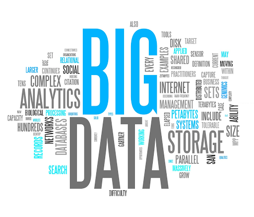
		- Databases, NoSQL, Data Warehouses, Data Lakes, Spark…and many other terms in this domain space!
		- You've probably come across at least a few of these terms, but you might be wondering what these technologies do and how do they fit together with one another in the vast landscape of Data Engineering and AI.
	- ## OLTP vs OLAP
	  collapsed:: true
		- ### OLTP (在线事务处理)
			- **用途**：OLTP系统主要用于日常事务处理，适用于高频率、小规模的交易操作。典型应用包括银行交易、订单处理和库存管理等。其主要特点包括处理日常事务和操作，例如订单处理、银行交易、客户管理系统等。
			- **特征**：
				- **实时性**：支持快速、及时的事务处理。
				- **数据更新频繁**：涉及大量的插入、更新和删除操作。
				- **数据量小但频繁**：每个事务涉及的数据量较小，但事务数量多。
				- **高并发性**：支持大量用户同时进行读写操作。
				- **实时处理**：交易需要立即处理和记录。
				- **数据一致性**：确保事务的原子性、一致性、隔离性和持久性（ACID特性）。
				- **小规模查询**：查询通常涉及少量记录和简单的数据库操作。
			- Typical use cases and implementations:
				- Application databases
				- Caches
				- SQL and NoSQL ("Not Only SQL") - lots of diverse technologies in the OLTP space.
		- ### OLAP (在线分析处理)
			- **用途**：进行复杂的查询和数据分析，例如商业智能、报表生成、数据挖掘等。
			- **特征**：
				- **复杂查询**：支持复杂的查询和数据聚合操作，通常涉及大量数据。
				- **数据历史性**：处理的是长时间累积的数据，以便进行趋势分析和历史数据挖掘。
				- **低并发性**：与OLTP相比，OLAP系统的用户并发数较低，但每个查询的复杂度较高。
				- **大规模数据操作**：查询通常涉及大量记录，需要高效的数据读取和分析能力。
			- Typical use cases:
				- **Data Warehouses**: A way to implement data models in a database to cater to OLAP style workloads.
				- **Data Lakes**: Have emerged strongly within the last 5-10 years to more exclusively match the requirements of large data workloads.
		- ### 区别总结
			- 1.  **操作类型**：OLTP侧重于插入、更新和删除操作，OLAP侧重于复杂查询和分析。
			- 2.  **数据量**：OLTP处理较小的数据量但操作频繁，OLAP处理大数据量且主要是读取操作。
			- 3.  **响应时间**：OLTP需要快速响应以支持实时事务处理，OLAP允许较长的查询时间以支持深入分析。
			- 4. **目标**：OLTP旨在支持日常业务操作，而OLAP旨在支持业务决策和数据分析。
			- 5. **数据处理**：OLTP处理简单和频繁的事务性数据，而OLAP处理复杂和低频率的分析性数据。
			- 6. **数据库设计**：OLTP数据库设计强调规范化，以减少冗余和提高数据一致性；OLAP数据库设计则通常采用维度建模，如星型或雪花型架构，以优化查询性能。
		- ### 实例应用
			- **OLTP**：银行的交易处理系统、电子商务平台的订单管理系统。
			- **OLAP**：企业的数据仓库、报表和商业智能系统。
		- # SQL Tutorial: OLTP and OLAP
			- {{video https://www.youtube.com/watch?v=-v3PhEtOuxw&ab_channel=DataCamp}}
	- ## From Database to Data Lake[​](https://data-derp.github.io/docs/2.0/data-engineering-the-good-parts/data-milky-way-brief-history-part-1#from-database-to-data-lake "Direct link to From Database to Data Lake")
	  collapsed:: true
		- ### Step 1: Database to Data Warehouse
			- **Watch:** Database vs. Data Warehouse
				- {{video https://www.youtube.com/watch?v=FxQG65OhXAQ&t=1s&ab_channel=intricity101}}
			- **Read:** [The Difference Between a Database and a Data Warehouse](https://panoply.io/data-warehouse-guide/the-difference-between-a-database-and-a-data-warehouse/)
		- ### Step 2: Data Warehouse to Data Lake
			- Let's take it one step further and have a look at the more commonly found implementation today, the Data Lake.
			- **Read:** [Data Warehouse vs Data Lake](https://panoply.io/data-warehouse-guide/data-warehouse-vs-data-lake/)
	- ## Focus of this course: OLAP workloads[​](https://data-derp.github.io/docs/2.0/data-engineering-the-good-parts/data-milky-way-brief-history-part-1#focus-of-this-course-olap-workloads "Direct link to Focus of this course: OLAP workloads")
	  collapsed:: true
		- **Why are we focusing more on OLAP than OLTP?**
			- OLTP databases (sometimes interchangeably referred to as application databases) are a topic concerning stability and performance of your operations / live applications
			- OLTP data models and tech stacks for different problems/businesses vary a lot more than those for OLAP workloads!
			- When people/customers talk about developing Data & AI, Analytics, Data Science, Machine Learning, they’re most likely referring to OLAP-style workloads.
-
- # Data Milky Way: Distributed Data Systems (NoSQL & CAP)
  collapsed:: true
	- ## Introduction to NoSQL • MartinFowler • GOTO 2012
	  collapsed:: true
		- {{video https://www.youtube.com/watch?v=qI_g07C_Q5I&t=484s&ab_channel=GOTOConferences}}
	- ## CAP Theorem
	  collapsed:: true
		- Lesson 111 - CAP Theorem Illustrated
		  collapsed:: true
			- {{video https://www.youtube.com/watch?v=9SSvdLnmDiI&ab_channel=MarkRichards}}
		- CAP定理（CAP Theorem），也被称为布鲁尔定理（Brewer's Theorem），是分布式计算中的一个重要理论，由计算机科学家Eric Brewer在2000年提出，并在2002年由Seth Gilbert和Nancy Lynch正式证明。CAP定理说明了在分布式数据存储系统中，有三种重要的特性，但只能同时满足其中的两种：
			- 1.  **一致性（Consistency）**：
				- 系统在读取请求时，始终能够返回最新的写入结果。这意味着所有节点在任何时刻都能看到相同的数据。
			- 2.  **可用性（Availability）**：
				- 每个请求（无论成功或失败）都能收到非错误响应。换句话说，系统在任何时候都能提供服务。
			- 3.  **分区容忍性（Partition Tolerance）**：
				- 系统能够继续操作，即使存在网络分区（网络故障导致节点之间无法通信）。这意味着系统在面对节点或网络故障时仍然能维持其运作。
		- ### CAP定理的限制
			- 根据CAP定理，在一个分布式系统中，当出现网络分区时，必须在一致性和可用性之间进行权衡。这意味着：
				- **CA（一致性 + 可用性）**： 在没有网络分区的情况下，系统可以同时具备一致性和可用性。但一旦出现网络分区，系统将无法满足分区容忍性。
				- **CP（一致性 + 分区容忍性）**： 系统在面对网络分区时仍然能保持一致性，但可能会牺牲一些可用性（即部分请求可能会失败或延迟）。
				- **AP（可用性 + 分区容忍性）**： 系统在面对网络分区时仍然能保持高可用性，但可能会牺牲一致性（即不同节点可能会返回不同的数据）。
		- ### 实际应用中的选择
			- 在设计分布式系统时，工程师必须根据实际需求在一致性、可用性和分区容忍性之间进行选择。例如：
				- **一致性优先**：金融交易系统通常需要高一致性，以确保数据的准确性和可靠性。
				- **可用性优先**：社交网络等应用通常需要高可用性，以确保用户在任何时候都能访问服务，即使这可能导致短时间的数据不一致。
				- **分区容忍性优先**：大多数现代分布式系统都必须处理网络分区，因此分区容忍性是一个基本要求。
		- ### 结论
			- CAP定理强调了分布式系统设计中的权衡和挑战，提醒我们在追求高性能和高可靠性的同时，必须在一致性、可用性和分区容忍性之间做出取舍​ ([Tech Differences](https://techdifferences.com/difference-between-data-mining-and-data-warehousing.html))​​ ([Tech Differences](https://techdifferences.com/difference-between-server-and-database.html))​。
		- **Summary: Pick Two:**
			- **C** (consistency)
			- **A** (availability)
			- **P** (partition tolerance)
		- But is it really true in the real world?
			- What unrealistic assumption are we making here?
				- Can we really assume that network communications won’t fail?
				- Is there really such thing as a distributed system that won’t have partitions?
			- In Reality: not a binary choice between C and A
			- Several NoSQL solutions offer a tunable tradeoff between C and A
		- **Further Reading (bonus content):** [What is the CAP Theorem? 3 types of NoSQL databases](https://www.ibm.com/cloud/learn/cap-theorem#toc-the-cap-in-9y9p3uen)
	- ## Summary[​](https://data-derp.github.io/docs/2.0/data-engineering-the-good-parts/data-milky-way-nosql-cap-theorem#summary "Direct link to Summary")
	  collapsed:: true
		- A CP system will say “Sorry, I can’t be sure yet” to the client, in order to avoid giving an out-of-date answer.
		- 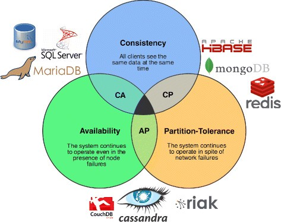
		- An AP system tries to spits out an answer even if it might not be the most up-to-date one.
		- 
		- From [Wikipedia](https://en.wikipedia.org/wiki/CAP_theorem)
-
- # Data Milky Way: A Brief History (Part 2) - Evolution
  collapsed:: true
	- Data Engineering: The Good Parts (2/4)
	  collapsed:: true
		- {{video https://www.youtube.com/watch?v=MxSwJQvWKuw&t=3s&ab_channel=PawaritLaosunthara}}
	-
	- ## 1980s: Databases & Data Warehouses[​](https://data-derp.github.io/docs/2.0/data-engineering-the-good-parts/data-milky-way-brief-history-part-2-evolution/?nav=false#1980s-databases--data-warehouses "Direct link to 1980s: Databases & Data Warehouses")
	  collapsed:: true
		- Since the 1980s up until the mid-late 2000s, businesses still stored both [OLTP and OLAP](https://www.youtube.com/watch?v=-v3PhEtOuxw&ab_channel=DataCamp) data in relational databases (RDBMS)
			- e.g. Oracle, Microsoft SQL Server, MySQL, PostgreSQL, etc.
			- OLAP-oriented databases for storing large amounts of data were called **Data Warehouses**
			- Relational databases were notoriously difficult to distribute/scale out
			- As more data came in, businesses often opted to scale up 💰 ([scale up vs scale out](https://hackernoon.com/database-scaling-horizontal-and-vertical-scaling-85edd2fd9944))
				- Greater investment risk, difficult to plan capacity, expensive
				- Restrictive limits to CPU & memory for a single server
				- Nowadays, modern Massively Parallel Processing (MPP) warehouses can provide scale out capabilities
		- However, Data Warehouses still require careful **upfront** planning
			- Schema and layout need to be decided beforehand
			- Query patterns/use-cases needed to be preempted
			- Separation of storage and compute often a weakness (perhaps except for modern warehouses such as Google BigQuery and Snowflake)
		- 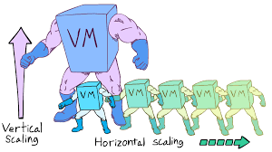
	- ## Data Warehouses[​](https://data-derp.github.io/docs/2.0/data-engineering-the-good-parts/data-milky-way-brief-history-part-2-evolution/?nav=false#data-warehouses "Direct link to Data Warehouses")
	  collapsed:: true
		- 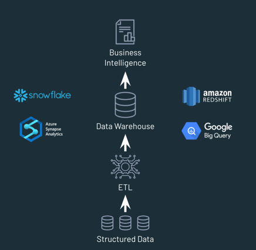
		- Pros
			- Good for Business Intelligence (BI) applications (structured data, so long as it isn't too massive)
		- Cons
			- **Limited support** for advanced analytics & machine learning workloads
			- **Limited support** for non-tabular, unstructured data (e.g. free text, images)
			- Proprietary systems with only a SQL interface
		- Because of the limitations around flexibility and scaling, a new technology emerged in the early 2000s.
	- ## Early 2000s: Hadoop Hype Train[​](https://data-derp.github.io/docs/2.0/data-engineering-the-good-parts/data-milky-way-brief-history-part-2-evolution/?nav=false#early-2000s-hadoop-hype-train "Direct link to Early 2000s: Hadoop Hype Train")
	  collapsed:: true
		- Arrival of On-Prem Data Lakes (2004) Google published the [MapReduce](https://www.youtube.com/watch?v=s8EPQpgpWVE&ab_channel=CBTNuggets) whitepaper, inspiring the Apache Hadoop project
			- enabled **(on-prem)** distributed data processing on **commodity (cheap) hardware**
			- businesses began throwing data into their Hadoop clusters!
		- 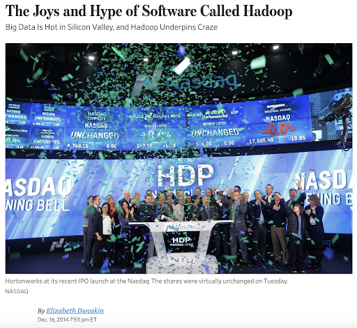
		- 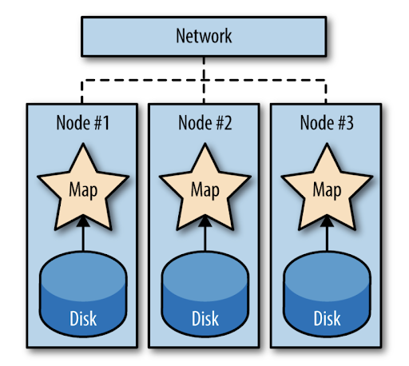
		- **Bonus content**: [What you need to know about Hadoop](https://www.oreilly.com/content/hadoop-what-you-need-to-know/) (Very detailed and not required for the remainder of the course!)
	- ## The Hadoop Disillusionment[​](https://data-derp.github.io/docs/2.0/data-engineering-the-good-parts/data-milky-way-brief-history-part-2-evolution/?nav=false#the-hadoop-disillusionment "Direct link to The Hadoop Disillusionment")
	  collapsed:: true
		- Several years later, people became [disillusioned about Hadoop](https://www.datanami.com/2017/03/13/hadoop-failed-us-tech-experts-say/#:~:text=The%20Hadoop%20dream%20of%20unifying,find%20a%20happy%20Hadoop%20customer.):
		- 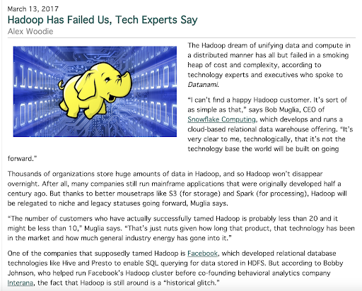
		- Working with distributed computing can be extremely challenging with respect to the learning curve, especially for business analysts. Instead of working with SQL, they'd have to learn Java libraries and frameworks related to MapReduce.
		- Excerpt:
			- INFO
				- Hadoop is great if you're a data scientist who knows how to code in MapReduce or Pig, Johnson says, but as you go higher up the stack, the **abstraction layers have mostly failed to deliver on the promise of enabling business analystics to get at the data.**
		- In addition to the learning curve, the performance was surprisingly slow for BI users. They would have expected that compared to the warehouse, they would have had performance gains but in fact the queries were running a lot slower on hadoop than on the traditional data warehouses.
		- Excerpt:
			- INFO
				- "At the Hive layer, it's kind of OK. But people think they're going to use Hadoop for data warehouse...**are pretty surprised that this hot new technology is 10x slower than what they're using before**," Johnson says.
		- This disillusionment led to the sunsetting of Hadoop projects, including at Google (who were the inventors of the entire ecossystem).
		- 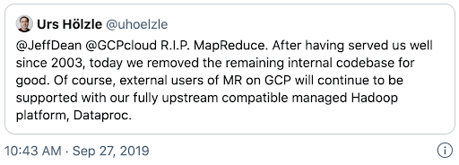
		- Senior Vice President of Technical Infrastructure, Google
		- While data locality + coupling storage and compute in Hadoop clusters was a decent idea for data throughput…
			- Businesses were forced to increase **both** CPU & Disk when they often only needed to scale up just one or the other
			- You’d have to pay for more CPU just to store inactive, rarely-utilized data, what a waste!
			- Storing and replicating data on HDFS (Hadoop Distributed File System) was **expensive** and difficult to maintain
			- Query performance was **lackluster** and other beneficial properties of RDBMS were gone
	- ## Latency[​](https://data-derp.github.io/docs/2.0/data-engineering-the-good-parts/data-milky-way-brief-history-part-2-evolution/?nav=false#latency "Direct link to Latency")
	  collapsed:: true
		- Latency nightmare when only using disk and network (i.e. MapReduce). Let's get a feel for it relative to "humanized" time.
		- | Type | Time | Time (humanized form) |
		  | :-: | :-: | :-: |
		  | 1 CPU Cycle | 0.3 ns | 1 s |
		  | Level 1 Cache Access | 0.9 ns | 3 s |
		  | Level 2 Cache Access | 2.8 ns | 9 s |
		  | Level 3 Cache Access | 12.9 ns | 43 s |
		  | Main Memory Access | 120 ns | 6 min |
		  | Solid-state disk I/O | 50 - 150 µs | 2 - 6 days |
		  | Rotational disk I/O | 1 - 10 ms | 1 - 12 months |
		  | Internet: SF to NYC | 40 ms | 4 years |
		  | Internet: SF to Australia | 183 ms | 19 years |
		  | OS Virtualization reboot | 4 s | 23 years |
		  | SCSI command time-out | 30 s | 3000 years |
		  | Hardware Virtualization reboot | 40 s | 4000 years |
		  | Physical System reboot | 5 m | 32 millenia |
	- ## Latency matters in Hadoop[​](https://data-derp.github.io/docs/2.0/data-engineering-the-good-parts/data-milky-way-brief-history-part-2-evolution/?nav=false#latency-matters-in-hadoop "Direct link to Latency matters in Hadoop")
	  collapsed:: true
		- Hadoop is all about fault tolerance and simple api of map and reduce steps. But all that fault tolerance in Hadoop comes at a very huge cost:
			- 1.  To recover from potential failures, Hadoop MapReduce writes intermediate data between Map and Reduce steps to the disk for every job.
			- 2.  The MapReduce implementation in Hadoop, by design, shuffles the data between map and reduce steps, which is expensive.
		- Now looking at the above table, we know that writing to the disk and network communications are slow and expensive and quite naturally increases latency. Because of the inherent behavior of MapReduce (constant data transmissions and persisting), attention must be paid to the amount of data that gets transmitted to manage both speed and costs of queries.
	- ## Spark is pre-built to reduce latency[​](https://data-derp.github.io/docs/2.0/data-engineering-the-good-parts/data-milky-way-brief-history-part-2-evolution/?nav=false#spark-is-pre-built-to-reduce-latency "Direct link to Spark is pre-built to reduce latency")
	  collapsed:: true
		- Spark also provides fault tolerance like Hadoop but with significantly reduced latency in the following way :
			- 1.  It keeps all data immutable and in memory, thus avoiding disk writes, by keeping data in memory.
			- 2.  It provides Scala like chains of operations (called transformations) and keeps track of it in its light weight client side process called as Spark Driver.
			- 3.  In the event of a node failure, it finds a new node, copies the partition data on that node and just simply plays the tracked operations in step 2 above.
		- Additionally Spark provides rich APIs in Scala, Python, Java and R. Lastly, unlike hadoop, it makes data shuffle optional by making it necessary only when using certain spark operations (formally called wide transformations in Spark) like joins, groupBy etc.
		- **Optional content**: 24 minute video version of Latency in Big Data (demonstrates the massive impact of using memory vs disk vs network in Big Data):
		- [Big Data Analysis with Scala and Spark](https://www.youtube.com/@bigdataanalysiswithscalaan7712)
		  collapsed:: true
			- {{video https://www.youtube.com/watch?v=DXq5MOYGK1U&ab_channel=BigDataAnalysiswithScalaandSpark}}
	- ## Cloud Revolution[​](https://data-derp.github.io/docs/2.0/data-engineering-the-good-parts/data-milky-way-brief-history-part-2-evolution/?nav=false#cloud-revolution "Direct link to Cloud Revolution")
	  collapsed:: true
		- Cloud Revolution: [Why object storage wins over Hadoop-based storage](https://www.ibm.com/cloud/blog/cutting-cord-separating-data-compute-data-lake-object-storage)
			- To scale cost-effectively, we need to really separate compute and storage
				- e.g. simply provision more CPU-intensive clusters only when needed, while leaving storage the same
			- As analytics and AI began to involve images, audio, unstructured data:
				- Cloud Data Lakes (often based on object storage) became the ideal storage solution
		- Time for **unified analytics/query engines** such as **Spark** and **Presto** to shine 💫
			- [Spark](https://www.oreilly.com/library/view/learning-spark-2nd/9781492050032/ch01.html) & [Presto](https://prestodb.io/overview.html)
				- Both engines excel when running analytical queries against data stored on Object Storage (e.g. Amazon S3, Azure Blob Storage)
				- Both engines take advantage of **both memory and disk** (unlike Hadoop MapReduce which read/writes data via disk only)
		- **Spark** (much more on this later) is **extremely popular for programmatic (Python/Scala/Java/R) use-cases** but can also support SQL queries.
		- **Presto** is a popular choice for **ad-hoc interactive SQL queries** (e.g. AWS Athena is a serverless offering based on Presto).
		- Many companies (especially tech giants) can even often have both Spark and Presto/Athena in their stack:
		- 
	- ## Unified Analytics Engines[​](https://data-derp.github.io/docs/2.0/data-engineering-the-good-parts/data-milky-way-brief-history-part-2-evolution/?nav=false#unified-analytics-engines "Direct link to Unified Analytics Engines")
	  collapsed:: true
		- Both Spark and Presto can be considered **Unified Analytics Engines**, meaning they can cover most of your data needs from ingestion from different sources over transformation to visualisations. What's special is that this multi-purpose approach enables you to adjust the technologies to your needs (and the arrangement of your data) and not vice versa.
		- 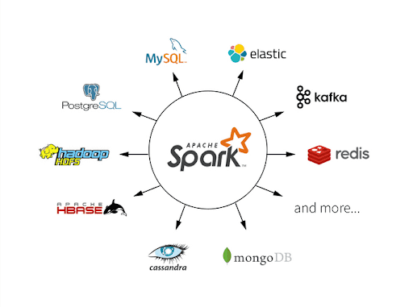
		- 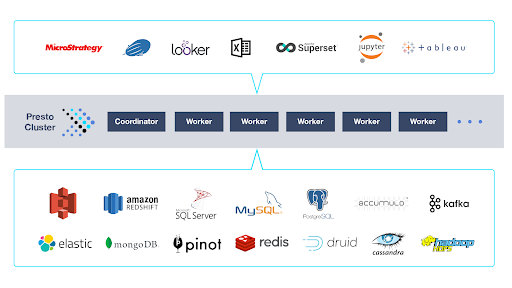
		- ### Mission Accomplished?[​](https://data-derp.github.io/docs/2.0/data-engineering-the-good-parts/data-milky-way-brief-history-part-2-evolution/?nav=false#mission-accomplished "Direct link to Mission Accomplished?")
			- While being able to directly query your cloud object storage (e.g. S3, Azure Data Lake Storage) with big data engines such as Spark and Presto moved the field in a great direction, some missing pieces still remained. Let's have a look at the setup of traditional data lakes versus more versatile solutions.
	- ## 2000s - 2010s: Traditional Data Lakes[​](https://data-derp.github.io/docs/2.0/data-engineering-the-good-parts/data-milky-way-brief-history-part-2-evolution/?nav=false#2000s---2010s-traditional-data-lakes "Direct link to 2000s - 2010s: Traditional Data Lakes")
	  collapsed:: true
		- 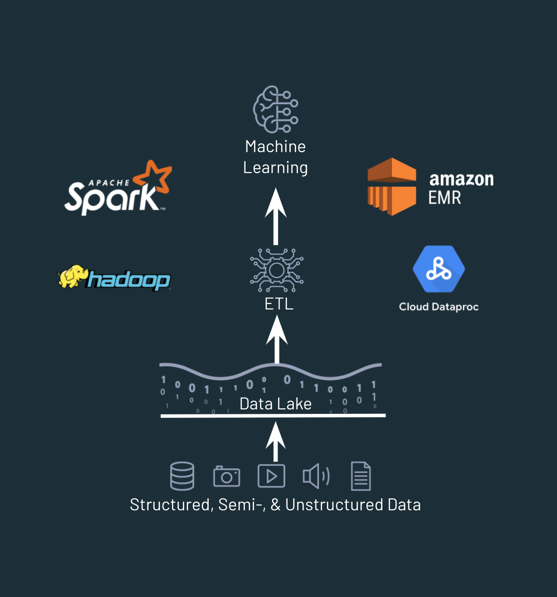
		- **Pros**
			- Extremely cheap and scalable
			- Open, arbitrary data formats and big ecosystem
			- Supports ML
		- **Cons**
			- Some BI workloads still not snappy enough
			- Complex data quality problems
			- No data management layer
			- Difficult for GDPR compliance
	- ## Can we get the best of both worlds?[​](https://data-derp.github.io/docs/2.0/data-engineering-the-good-parts/data-milky-way-brief-history-part-2-evolution/?nav=false#can-we-get-the-best-of-both-worlds "Direct link to Can we get the best of both worlds?")
	  collapsed:: true
		- The goal in this space is to get rid of the current shortcomings listed above. We want to continue to use cheap and scalable computing resources and a wide ecosystem while being able to tackle more advanced problems, opening up data related problems to entire companies while maintaining appropriate data security and access policies.
		- One approach is the so-called **Data Lakehouse** which we’ll revisit in the second week of the course.
		- {:height 277, :width 512}
		- Other challengers in this area are [Delta Lake](https://delta.io/), [Dremio](https://www.dremio.com/) or [Databricks Photon](https://databricks.com/product/photon). We’ll also cover how Lakehouse can serve as the technological foundation to support philosophies such as Data Mesh near the end of this course.
		- 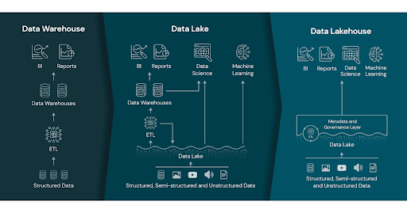
-
- # Data Milky Way: Brief History (Part 3) - Data Processing
  collapsed:: true
	- Data Engineering: The Good Parts (3/4)
	  collapsed:: true
		- {{video https://www.youtube.com/watch?v=Uc-Wtem-lyw&ab_channel=PawaritLaosunthara}}
	-
	- ## Evolution of Data Processing[​](https://data-derp.github.io/docs/2.0/data-engineering-the-good-parts/data-milky-way-brief-history-part-3-data-processing/?nav=false#evolution-of-data-processing "Direct link to Evolution of Data Processing")
		- 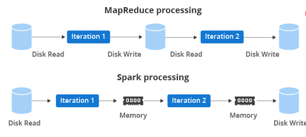
		- 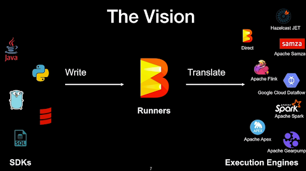
		- Recap: [Why move from Hadoop to Spark + Object Storage](https://www.xplenty.com/blog/apache-spark-vs-hadoop-mapreduce/) (~20 minute read)
		- **Bonus Content, not necessary for the progression in this course**:
			- [Intro to Metastores and Data Catalogs](https://lakefs.io/metadata-management-hive-metastore-vs-aws-glue/) (~10 minutes)
			- [Batch and Micro-Batch Streaming](https://www.upsolver.com/blog/batch-stream-a-cheat-sheet) (~20 minutes)
			- [Continuous Processing](https://hazelcast.com/glossary/stream-processing/) (~10 minutes)
			- [One syntax to rule them all?](https://beam.apache.org/) (~2 minutes)
				- Apache Beam is based on the [Dataflow model introduced by Google](https://storage.googleapis.com/pub-tools-public-publication-data/pdf/43864.pdf) (scientific paper, will take a while to digest)
				- Aims to unify the semantics of batch & streaming processing across engines (Flink, Spark, etc.)
				- You don’t necessarily need streaming, let alone Beam! Many teams simply choose either Spark Structured Streaming or Flink without Beam.
		- Evaluate your own project’s needs. We will cover streaming in the second half of the course, so more material will be provided then.
	- ## Orchestration Core Concepts[​](https://data-derp.github.io/docs/2.0/data-engineering-the-good-parts/data-milky-way-brief-history-part-3-data-processing/?nav=false#orchestration-core-concepts "Direct link to Orchestration Core Concepts")
		- But how do we make our pipeline **flow**? 🌊
			- Data Engineering workflows often involve transforming and transferring data from one place to another.
			- We want to combine data from different locations, and we want to do this in a way that is **reproducible** and **scalable** when there are updates to the data or to our workflows.
			- Workflows in real-life have multiple steps and stages. We want to be able to **orchestrate** these steps and stages and **monitor** the progress of our workflows.
			- Sometimes, everything might work fine with just CRON jobs.
			- But other times, you might want to control the state transitions of these steps:
				- e.g. if Step A doesn’t run properly, don’t run Step B because the data could be corrupt, instead run Step C.
				- Once again, the concept of [Directed Acyclic Graphs (DAGs)](https://en.wikipedia.org/wiki/Directed_acyclic_graph) can come to our rescue.
			- **Bonus Content**: [Apache Airflow](https://www.youtube.com/watch?v=XD7euLOzKbs&ab_channel=SFPython) (32 minute video) is one nice way of setting up DAGs to orchestrate jobs 🌈
				- Note: Airflow is primarily designed as a task orchestration tool.
				- You can trigger tasks on the Airflow cluster itself or on remote targets (e.g. AWS Fargate, Databricks, etc.).
				- NOT designed for transferring large amounts of actual data.
				- [Reference Documentation](https://airflow.apache.org/docs/apache-airflow/1.10.1/#beyond-the-horizon)
				- [Play around with Airflow locally](https://github.com/kelseymok/airflow/) (very optional!)
	- ## Practical Data Workloads[​](https://data-derp.github.io/docs/2.0/data-engineering-the-good-parts/data-milky-way-brief-history-part-3-data-processing/?nav=false#practical-data-workloads "Direct link to Practical Data Workloads")
		- 
		- We’re here to teach you big data skills, but in reality...
		- ### Single-Node vs. Cluster[​](https://data-derp.github.io/docs/2.0/data-engineering-the-good-parts/data-milky-way-brief-history-part-3-data-processing/?nav=false#single-node-vs-cluster "Direct link to Single-Node vs. Cluster")
			- Not everything is Big Data! You don’t always need Spark! [Sometimes Pandas deployed on a single node function/container is just fine!](https://www.indellient.com/blog/a-journey-from-pandas-to-spark-data-frames/).
		- ### Batch vs Streaming[​](https://data-derp.github.io/docs/2.0/data-engineering-the-good-parts/data-milky-way-brief-history-part-3-data-processing/?nav=false#batch-vs-streaming "Direct link to Batch vs Streaming")
			- [Streaming isn’t always the solution](https://www.section.io/engineering-education/batch-processing-vs-stream-processing/)! (Optional reading, ~10 minutes)
		- ### Orchestration options[​](https://data-derp.github.io/docs/2.0/data-engineering-the-good-parts/data-milky-way-brief-history-part-3-data-processing/?nav=false#orchestration-options "Direct link to Orchestration options")
			- Here, it's just useful to know a few of the names but going into detail is not necessary for the course.
			- **DAG-based approaches:**
				- [Apache Airflow](https://airflow.apache.org/)
				- [Databricks Jobs Orchestration](https://databricks.com/blog/2021/07/13/announcement-orchestrating-multiple-tasks-with-databricks-jobs-public-preview.html)
				- [Dagster](https://dagster.io/)
			- **Event-Driven + Declarative**
				- [Databricks Auto Loader](https://databricks.com/discover/demos/delta-lake-data-integration-demo-auto-loader-and-copy-into)
				- [Delta Live Tables](https://databricks.com/discover/demos/delta-live-tables-demo)
			- **Other triggers:**
				- [AWS Lambda](https://aws.amazon.com/lambda/)
				- [Glue Triggers](https://docs.aws.amazon.com/glue/latest/dg/trigger-job.html)
-
- # Data Milky Way: A Brief History (Part 4) - Architecture Reference
  collapsed:: true
	- Data Engineering: The Good Parts (4/4)
	  collapsed:: true
		- {{video https://www.youtube.com/watch?v=Mzz4o2xDVzw&ab_channel=PawaritLaosunthara}}
	- ## Typical Data Pipeline
		- 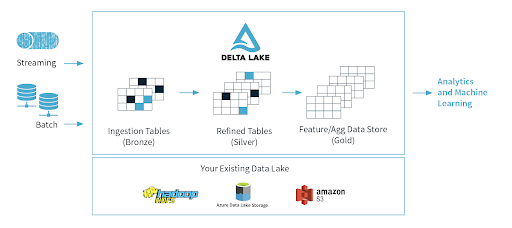
	- ## Open Source Example Architecture
		- 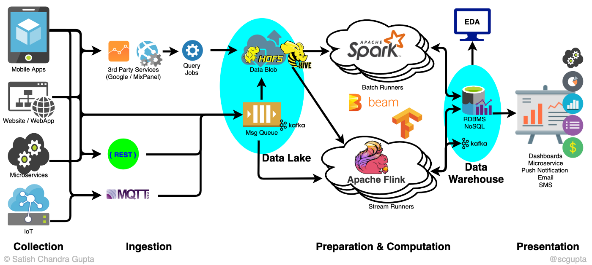
		- [Reference](https://towardsdatascience.com/scalable-efficient-big-data-analytics-machine-learning-pipeline-architecture-on-cloud-4d59efc092b5)
	- ## AWS Overview
		- 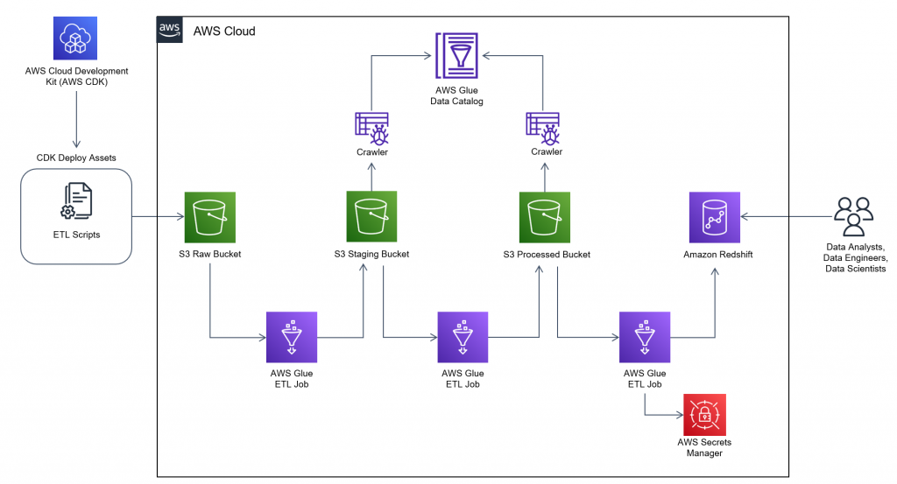
		- [Reference Architecture](https://aws.amazon.com/blogs/architecture/field-notes-how-to-build-an-aws-glue-workflow-using-the-aws-cloud-development-kit/)
		- This example uses AWS Glue. There are other AWS services like EMR that can handle even more complex cases.
	- ## Batch Processing on Azure
		- 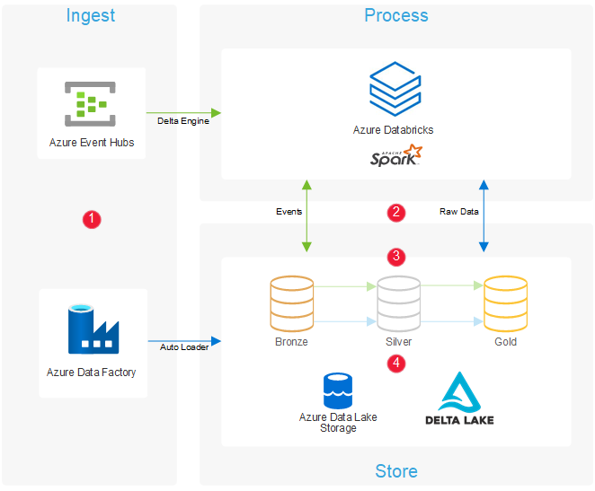
		- [Reference](https://docs.microsoft.com/en-us/azure/architecture/solution-ideas/articles/ingest-etl-stream-with-adb)
	- ## Batch & Streaming (Lambda Architecture) on Azure
		- 
		- [Reference](https://docs.microsoft.com/en-us/azure/architecture/example-scenario/dataplate2e/data-platform-end-to-end)
	-
	- ## Lambda vs. Kappa Architecture[​](https://data-derp.github.io/docs/2.0/data-engineering-the-good-parts/data-milky-way-brief-history-part-4-arch-ref/?nav=false#lambda-vs-kappa-architecture "Direct link to Lambda vs. Kappa Architecture")
		- Read about the [differences](https://luminousmen.com/post/modern-big-data-architectures-lambda-kappa).
		- **Lambda**: The two layers (speed layer & batch layer) resemble the two legs of the λ symbol.
			- 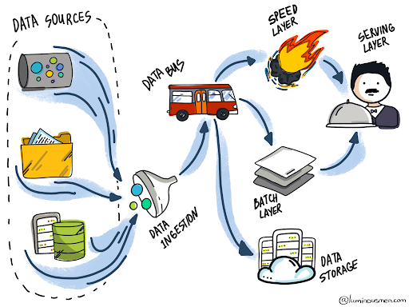
	- **Kappa**: The left stem of the 𝚱 (kappa symbol) signifies unified input data store and processing logic.
		- 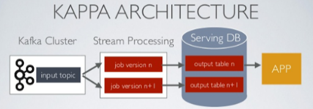
	-
	- 1.  **Lambda架构**：
		- **特点**：Lambda架构将数据处理流程分为批处理层（Batch Layer）和速度层（Speed Layer），结合批处理和实时处理来处理数据。
		- **数据处理**：批处理层负责处理历史数据，生成批处理视图（Batch Views），通常使用类似Hadoop的批处理技术（例如MapReduce）。
		- **速度层**：速度层处理最新的数据，实时计算出实时视图（Real-time Views），通常使用流处理技术（例如Apache Storm、Apache Flink）。
		- **合并层**：合并层负责将批处理视图和实时视图进行合并，提供一致的查询结果。
		- **优点**：Lambda架构适用于需要处理大量历史数据和实时数据，并且能够容忍稍许延迟的应用场景。
	- 2.  **Kappa架构**：
		- **特点**：Kappa架构提出简化架构，只使用流处理来处理所有数据。它消除了Lambda架构中的批处理层，所有数据处理都通过流处理实时完成。
		- **数据处理**：Kappa架构中数据仅通过流处理技术（例如Apache Kafka、Apache Flink）进行处理，不存在批处理过程。
		- **优点**：Kappa架构简化了架构，减少了系统的复杂性和维护成本，同时实现了更低的延迟和更简单的数据一致性。
	- 3.  **主要区别**：
		- **处理方式**：Lambda架构同时使用批处理和流处理来处理数据，而Kappa架构只使用流处理。
		- **复杂性**：Lambda架构相对于Kappa架构来说更复杂，因为需要管理两个不同的数据处理流程（批处理和流处理）。
		- **延迟**：Kappa架构通常具有较低的延迟，因为所有数据处理都是实时进行的，而Lambda架构中的批处理部分可能会引入较大的延迟。
-
- # Data Serialisation & Data Formats
  collapsed:: true
	- ## Wait...what’s data serialisation again?[​](https://data-derp.github.io/docs/2.0/data-engineering-the-good-parts/data-formats/?nav=false#waitwhats-data-serialisation-again "Direct link to Wait...what’s data serialisation again?")
	  collapsed:: true
		- (extracted from [Devopedia](https://devopedia.org/data-serialization))
			- Data serialisation is the process of converting data objects present in complex data structures into a byte stream for storage, transfer and distribution purposes on physical devices.
			- Computer systems may **vary** in their hardware architecture, OS, addressing mechanisms. Internal representations of data also vary accordingly in every environment/language. Storing and exchanging data between such varying environments requires a **platform-and-language-neutral data format** that all systems understand.
			- Once the serialized data is transmitted from the source machine to the destination machine, the reverse process of creating objects from the byte sequence called **deserialisation** is carried out. Reconstructed objects are clones of the original object.
			- Choice of data serialisation format for an application depends on factors such as data complexity, need for human readability, speed and storage space constraints.
			- 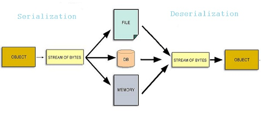
	- ## Data Formats[​](https://data-derp.github.io/docs/2.0/data-engineering-the-good-parts/data-formats/?nav=false#data-formats "Direct link to Data Formats")
		- Data Serialisation and Data Formats go hand in hand because it describes how data is stored and then retrieved. Based on these patterns on storage and access, we might choose a specific file format to optimise those processes. There are a variety of file formats common to Data Engineering use cases - the classics include CSV, JSON, Avro, and Parquet (among others). There are other more modern data formats which we'll get to a little later.
		- A few important points to note before we dive into individual formats:
			- Data on the hard disks is saved in blocks and gets loaded one at a time in memory.
				- 硬盘上的数据以块的形式保存，并逐块加载到内存中。
			- Reading unnecessary, fragmented and random data is expensive therefore sequential reads / writes are recommended.
				- 读取不必要、碎片化和随机的数据代价高，因此建议进行顺序读取/写入。
			- File formats determine the way that data is stored on the disk and is of different types for e.g Unstructured (Text, CSV, TSV etc), Semi-structured (jSON, XML etc) and Structured (Avro, Parquet etc).
				- 文件格式决定了数据在磁盘上的存储方式，包括非结构化（文本、CSV、TSV等）、半结构化（JSON、XML等）和结构化（Avro、Parquet等）等不同类型。
			- File formats stores data in a row oriented, column oriented or a hybrid format. Irrespective of the data orientation, the data is always arranged on the disk in sequential manner due the benefit of faster reads as mentioned above.
				- 文件格式可以按行向、列向或混合方式存储数据。无论数据的方向如何，由于上述快速读取的好处，数据始终以顺序方式排列在磁盘上。
			- Row-wise formats are best for write-heavy operations (OLTP workflows), Columnar are best for read-heavy (OLAP workflows) and Hybrid Formats try to provide the best of both worlds.
				- 按行存储格式最适合写入密集型操作（OLTP工作流），按列存储最适合读取密集型操作（OLAP工作流），混合格式试图提供两者的最佳组合。
		- Some helpful vocabulary:
			- **Splittable** = take one file and split it into multiple chunks (partitions) to allow for concurrent processing
				- 将一个文件拆分成多个块（分区），以允许并发处理
			- **Compressibility** = encoding a file using fewer bits than the original representation
				- 使用比原始表示更少的位对文件进行编码
			- **Self-describing** = file contains both data and metadata (about the data, like the schema)
				- 文件包含数据和关于数据的元数据（如模式）
			- **Schema evolution** = file can handle new columns and backwards-compatibility
				- 文件可以处理新列和向后兼容
		- ### CSV[​](https://data-derp.github.io/docs/2.0/data-engineering-the-good-parts/data-formats/?nav=false#csv "Direct link to CSV")
			- Row-based and human-readable
			- Compressible and splittable
			- Faster writes but slower reads
			- Flexible (as in, data can be easily changed, but can also be corrupted) but does not support schema evolution
			- Best suited for smaller data sets which don't need any query time optimizations
		- ### JSON[​](https://data-derp.github.io/docs/2.0/data-engineering-the-good-parts/data-formats/?nav=false#json "Direct link to JSON")
			- Row-based and human-readable
			- Compressible and splittable
			- Faster writes but slower reads
			- Self-describing
			- Support complex data type like arrays and nested values
			- Schema Evolution is not supported though column names are embedded inside the datasets
			- Best suited for if the dataset has highly nested values which, like CSV, does not need query optimizations
			- Suited for smaller data sets if used as a data exchange format
		- ### Avro[​](https://data-derp.github.io/docs/2.0/data-engineering-the-good-parts/data-formats/?nav=false#avro "Direct link to Avro")
			- Row-based but not human-readable
			- is itself a serialization format so it can be used for data exchange across the wire across different OS
			- Self describing with support for Schema Evolution
			- Binary format with Schema stored inside the file in JSON format
			- Optimised for write-intensive applications
			- Compressible and splittable
			- Supports rich data structures like arrays and enumerated types
			- Best suited for both realtime and batch workflows where fast data writes and transfer, schema validation and evolution is required.
			- 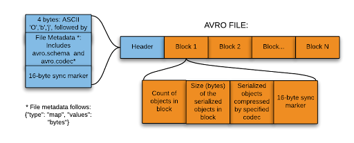
		- ### Parquet[​](https://data-derp.github.io/docs/2.0/data-engineering-the-good-parts/data-formats/?nav=false#parquet "Direct link to Parquet")
			- Columnar-based and not human-readable
			- Self-describing
			- Hybrid format where rows are grouped by row groups and then columns are partitioned
			- Binary format like Avro with Schema stored inside the file in JSON format but does not support Schema Evolution
			- Optimised for read intensive applications but performs well for write operations too due to its hybrid nature
			- Compressible and splittable
			- Support rich data structures like arrays and enumerated types, again like Avro
			- Best suited for analytics workflow where fast query performance is needed
			- 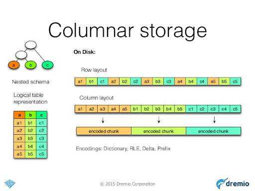
			- 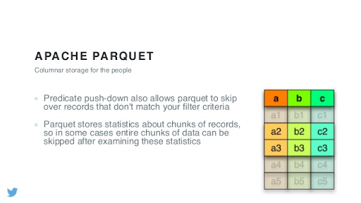
			- 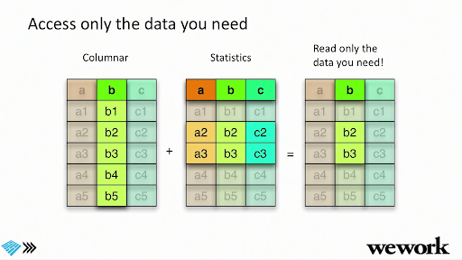
	- ### Additional Resources (optional)[​](https://data-derp.github.io/docs/2.0/data-engineering-the-good-parts/data-formats/?nav=false#additional-resources-optional "Direct link to Additional Resources (optional)")
		- [Big Data File Formats](https://luminousmen.com/post/big-data-file-formats)
		- [Comparing the formats](https://www.datanami.com/2018/05/16/big-data-file-formats-demystified/#:~:text=The%20biggest%20difference%20between%20ORC,in%20a%20row%2Dbased%20format.&text=While%20column%2Doriented%20stores%20like,might%20be%20the%20better%20choice.)
		- [Big Data File Showdown: Avro vs Parquet](https://www.confessionsofadataguy.com/big-data-file-showdown-avro-vs-parquet-with-python/)
		- Avro is a [popular choice for streaming](https://www.confluent.io/blog/avro-kafka-data/) and persisting streaming data into data lakes (e.g. [Azure Event Hubs Capture](https://docs.microsoft.com/en-us/azure/event-hubs/event-hubs-capture-overview#exploring-the-captured-files-and-working-with-avro)).
		- The Apache Spark File Format Ecosystem
			- {{video https://www.youtube.com/watch?v=auNAzC3AU18&t=153s&ab_channel=Databricks}}
		- The Parquet Format and Performance Optimization Opportunities Boudewijn Braams (Databricks)
			- {{video https://www.youtube.com/watch?v=1j8SdS7s_NY&ab_channel=Databricks}}
	- ## Check Your Learning
		- Unlike MapReduce vs Spark, there’s no clear winner. There’s always still a time and place for each of these formats!
		- |  | CSV | JSON | Parquet | Avro |
		  | --- | --- | --- | --- | --- |
		  | Compressibility | ✅ | ✅ | ✅ | ✅ |
		  | Human Readability | ✅ | ✅ |  |  |
		  | Schema Evolution |  |  |  | ✅ |
		  | Row or Columnar Storage |  |  | ✅ | ✅ |
	- ## Bonus: Delta Lake[​](https://data-derp.github.io/docs/2.0/data-engineering-the-good-parts/data-formats/?nav=false#bonus-delta-lake "Direct link to Bonus: Delta Lake")
		- We'll cover Delta Lake in detail in the "Making Big Data Work" section, but let's define it here so you can keep an ear out for it. Delta Lake is an **open source** storage layer. It is similar to Parquet (some people refer to it as Parquet Plus) but it provides ACID transactions, time travel, the ability to remove data across various versions (vaccuuming), and you can stream and batch at the same time.
-
- # Apache Spark Primer
  collapsed:: true
	- ## Introduction to Spark[​](https://data-derp.github.io/docs/2.0/data-engineering-the-good-parts/apache-spark-primer/?nav=false#introduction-to-spark "Direct link to Introduction to Spark")
		- **A Must-Read:** [Slides from Brooke Wenig](https://brookewenig.com/SparkOverview.html#/)
		- Apache Spark: Why use Spark?
			- {{video https://www.youtube.com/watch?v=35Mjaa1YWTk&ab_channel=SundogEducationwithFrankKane}}
		- Important comment upon Frank Kane’s video
			- Scala is only faster than Python if you’re writing a lot of custom UDFs or data structures with RDDs. If you’re using built-in Spark functions, then performance is **identical**.
			- Most modern Spark users are shifting towards a Python codebase to take advantage of modern data science and machine learning tools - see next slides for empirical evidence 😉.
	- Takeaways
		- What is the difference between Transformations (lazy evaluation) and Actions?
		- What is the difference between Driver and Worker nodes?
	- ## Programming language popularity[​](https://data-derp.github.io/docs/2.0/data-engineering-the-good-parts/apache-spark-primer/?nav=false#programming-language-popularity "Direct link to Programming language popularity")
		- Python has massively overtaken Scala in popularity for Spark.
			- 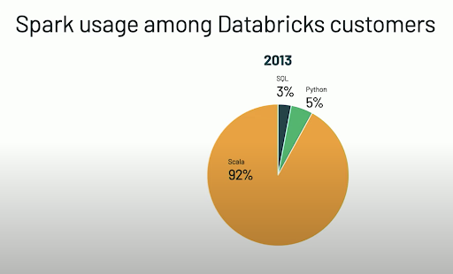
			- 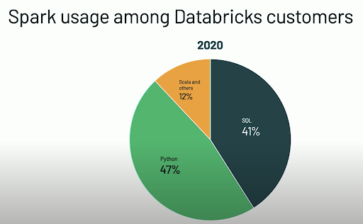
		- For the exercises of this course we will use Python. The APIs we will be using are:
			- Spark DataFrames
			- Pandas
		- **Bonus Content:** [Spark SQL Programming Guide](http://spark.apache.org/docs/3.1.1/sql-getting-started.html)
	- ## Bonus Content: Data + AI Summit 2020[​](https://data-derp.github.io/docs/2.0/data-engineering-the-good-parts/apache-spark-primer/?nav=false#bonus-content-data--ai-summit-2020 "Direct link to Bonus Content: Data + AI Summit 2020")
		- One of the keynote presentations from the Chief Architect of Databricks
			- Project Zen: Making Spark Pythonic | Reynold Xin | Keynote Data + AI Summit EU 2020
			  collapsed:: true
				- {{video https://www.youtube.com/watch?v=-vJLTEOdLvA&ab_channel=Databricks}}
		- Heading towards taking advantage of idiomatic Python with type hints
		- Improving Python debugging is on the Databricks roadmap
		- There’s no denying the rich ecosystem of libraries, especially for advanced analytics & ML
-
- # Look into the Past (Bonus)
  collapsed:: true
	- Hadoop/MapReduce are in the past, but it is still important to understand what they are...
	- MicroNugget: What is MapReduce?
	  collapsed:: true
		- {{video https://www.youtube.com/watch?v=s8EPQpgpWVE&ab_channel=CBTNuggets}}
	- ...and why we have moved on
	- What Happened to Hadoop?
	- {{video https://www.youtube.com/watch?v=e0Kjf55eyog&ab_channel=DatabaseTrendsandApplications}}
-
- # Quiz
  collapsed:: true
	- What are some key differences between OLAP and OLTP systems?
		- > **OLTP**
		  Frequent updates, transactional behaviour/requirements
		  Query priorities:
		  low-latency, up-to-date, consistent data for standard business operations
		  **OLAP**
		  Oriented towards analysis, modelling, reporting, business intelligence
		  Query Priorities:
		  asking big questions against big data, supporting flexible queries/analyses
		  efficiently processing millions of rows and returning thousands/millions of rows
	- Why did people start moving from traditional databases and data warehouses to HDFS for Big Data Analytics in the mid 2000s?
		- Traditional relational databases and data warehouses relied on vertical scaling which required expensive/specialized hardware and was hard to plan for. HDFS and MapReduce allowed for horizontal scalability with cheap commodity hardware.
	- And subsequently, why did people move from HDFS to Object Storage for Big Data Analytics?
		- Cloud-based Object Storage is super scalable and cheap, far more than HDFS (which is only often used in on-prem environments these days). It was also great for storing all sorts of file formats (unstructured text, images, video, etc.). Most modern cloud-based Data Lakes are built-on Object Storage technologies. Modern query engines such as Apache Spark, Presto, Dremio, etc. can efficiently scan data laying on object stores. To summarize: object storage + (on-demand) query engines = fully decoupled storage and compute (great for scalability, elasticity, cost)
	- Name some object storage offerings from the 3 major cloud providers
		- AWS
			- Amazon S3 (general purpose)
			- Amazon S3 Glacier (for archiving)
		- Microsoft Azure
			- Azure Blob Storage (general purpose)
			- Azure Data Lake Storage Gen2 (has a file systems hierarchy, great for large structured and semi-structured datasets)
		- GCP
			- Google Cloud Storage or GCS (general purpose)
	- Assign either the word OLTP or OLAP to the following technologies
		- Operational Databases
			- OLTP
		- MongoDB or Cassandra
			- Depends (you’ll find use-cases online for either)
		- Data Warehouses (e.g. Oracle, Snowflake, Redshift)
			- OLAP
		- Apache Spark
			- OLAP
		- Presto/Athena
			- OLAP
-
- # Exercise: Gentle Introduction to Spark
  collapsed:: true
	- Follow instructions [here](https://github.com/data-derp/small-exercises/tree/master/gentle-introduction-to-spark) to get started
	- collapsed:: true
	  ```python
	  import pyspark.sql.functions as F
	  
	  # let's add a new column: instead of 1, 2, 3, 4, 5 let's make it a percentage between 0 and 1
	  # e.g. 4/5 => 80%
	  brand_new_column = F.col("rating_percentage") / 2 # with Column expressions, you don't need a column to even exist yet!
	  
	  df = df.withColumn("rating_percentage", (F.col("rating") / F.lit(5)) * F.lit(100))
	  display(df.withColumn("half_rating_percentage", brand_new_column))
	  ```
		- 这段代码展示了如何在Databricks或类似的Apache Spark环境中使用PySpark库来处理数据框（DataFrame）。特别是，它演示了如何通过计算和添加新的列来转换数据。让我们逐步解释每一部分的含义：
		- ### 代码解释：
		  
		  1. **导入必要的库**：
			- 假设 `F` 代表的是 `pyspark.sql.functions`，一个包含许多内置Spark SQL函数的模块。
			  
			  2. **创建一个新的列表达式 `brand_new_column`**：
			  ```python
			  brand_new_column = F.col("rating_percentage") / 2
			  ```
			- 这里 `F.col("rating_percentage")` 是指一个名为 `rating_percentage` 的列。
			- 将 `rating_percentage` 列的值除以 2。
			- 重要的是，这里 `rating_percentage` 列还不存在，它会在后续步骤中创建。
			  
			  3. **创建并添加新列 `rating_percentage` 到数据框 `df`**：
			  ```python
			  df = df.withColumn("rating_percentage", (F.col("rating") / F.lit(5)) * F.lit(100))
			  ```
			- 使用 `withColumn` 方法向 `df` 数据框添加一个新列，列名为 `rating_percentage`。
			- `F.col("rating")` 获取 `rating` 列的值。
			- `F.lit(5)` 创建一个常量值 5。
			- `F.col("rating") / F.lit(5)` 将 `rating` 列的值除以 5，得到一个0到1之间的百分比。
			- `* F.lit(100)` 将前面的结果乘以 100，转换成百分比形式。
			- 最终的计算 `(F.col("rating") / F.lit(5)) * F.lit(100)` 生成一个从 0 到 100 的百分比。
			  
			  4. **显示数据框并添加另一列 `half_rating_percentage`**：
			  ```python
			  display(df.withColumn("half_rating_percentage", brand_new_column))
			  ```
			- 使用 `withColumn` 方法再次向 `df` 数据框添加一个新列，列名为 `half_rating_percentage`，其值是之前定义的 `brand_new_column` 表达式的结果，即 `rating_percentage` 列的值除以 2。
			- `display` 是Databricks中的一个函数，用于在笔记本环境中展示数据框的内容。
		- ### 总结
		  整个过程如下：
		- 先定义一个新的列表达式 `brand_new_column`，表示 `rating_percentage` 列的值除以2。
		- 然后向数据框 `df` 添加一个新的列 `rating_percentage`，其值是 `rating` 列的百分比表示。
		- 最后，展示添加了 `rating_percentage` 和 `half_rating_percentage` 两列的数据框。
		- ### 示例
		  假设我们有一个数据框 `df` 如下：
		  ```plaintext
		  +-------+
		  | rating|
		  +-------+
		  |      1|
		  |      2|
		  |      3|
		  |      4|
		  |      5|
		  +-------+
		  ```
		  
		  执行上述代码后，数据框 `df` 将变成：
		  ```plaintext
		  +-------+----------------+----------------------+
		  | rating|rating_percentage|half_rating_percentage|
		  +-------+----------------+----------------------+
		  |      1|             20.0|                  10.0|
		  |      2|             40.0|                  20.0|
		  |      3|             60.0|                  30.0|
		  |      4|             80.0|                  40.0|
		  |      5|            100.0|                  50.0|
		  +-------+----------------+----------------------+
		  ```
		  
		  希望这个解释能帮助你理解代码的意义和执行过程。如果有其他问题，请随时提问。
	- ### Can I make my OWN DataFrames??
		- collapsed:: true
		  ```python
		  import pandas as pd
		  from datetime import datetime 
		  
		  pandas_df = pd.DataFrame({"x": [1, 2, 3, 4], "y": ["A", "B", "C", "D"]})
		  pandas_df["t"] = [datetime.now()] * len(pandas_df)
		  pandas_df
		  ```
			- 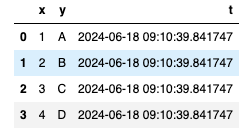
		- collapsed:: true
		  ```python
		  spark_df = spark.createDataFrame(pandas_df)
		  spark_df = spark_df.withColumn("z", F.col("t").cast(LongType())) # convert to Epoch seconds
		  spark_df = spark_df.withColumn("t_recreated", F.col("z").cast(TimestampType()))
		  ```
			- 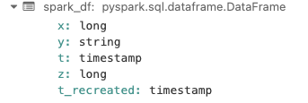
		- collapsed:: true
		  ```python
		  spark_df.collect()
		  ```
			- ```
			  [Row(x=1, y='A', t=datetime.datetime(2024, 6, 18, 9, 10, 39, 841747), z=1718701839, t_recreated=datetime.datetime(2024, 6, 18, 9, 10, 39)),
			   Row(x=2, y='B', t=datetime.datetime(2024, 6, 18, 9, 10, 39, 841747), z=1718701839, t_recreated=datetime.datetime(2024, 6, 18, 9, 10, 39)),
			   Row(x=3, y='C', t=datetime.datetime(2024, 6, 18, 9, 10, 39, 841747), z=1718701839, t_recreated=datetime.datetime(2024, 6, 18, 9, 10, 39)),
			   Row(x=4, y='D', t=datetime.datetime(2024, 6, 18, 9, 10, 39, 841747), z=1718701839, t_recreated=datetime.datetime(2024, 6, 18, 9, 10, 39))]
			  ```
		- collapsed:: true
		  ```python
		  display(spark_df)
		  ```
			- 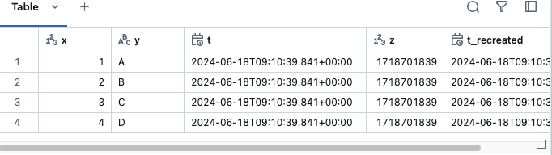
-
- # Vanilla Spark on your Local Machine (Bonus)
	- ## Running Spark locally: Spark Shell & UI[​](https://data-derp.github.io/docs/2.0/data-engineering-the-good-parts/demo-vanilla-spark/#running-spark-locally-spark-shell--ui "Direct link to Running Spark locally: Spark Shell & UI")
		- Basics of Spark Shell
		- Basics of Spark UI
			- Can be seen through Spark Shells
			- Also in the Databricks Notebooks
		- Spark Shell and UI
		  collapsed:: true
			- {{video https://www.youtube.com/watch?v=y2M6nYhpPPg&ab_channel=DataDerp}}
		- To practice the concepts and examples that are demonstrated in the above video, specific versions of Apache Spark and Java Standard Edition are required to be installed on your machines. Follow the instructions [here](https://github.com/data-derp/exercise-vanilla-spark/tree/main#readme) to do so.
	- ## Spark Ecosystem, Spark Session (Spark Object)
	  collapsed:: true
		- {{video https://www.youtube.com/watch?v=2KlydmMU9ko&ab_channel=DataDerp}}
	- ## Spark Program Structure
	  collapsed:: true
		- {{video https://www.youtube.com/watch?v=T1pD6lwssXc&ab_channel=DataDerp}}
	- ## Spark Applications and Jobs
	  collapsed:: true
		- {{video https://www.youtube.com/watch?v=byMySPRrPB4&ab_channel=DataDerp}}
	- ## Spark Input Partitions, Stages, and DAGs
	  collapsed:: true
		- {{video https://www.youtube.com/watch?v=zOZtmc-yOnw&ab_channel=DataDerp}}
	- ## Spark Tasks and Operations
	  collapsed:: true
		- {{video https://www.youtube.com/watch?v=dSuNVxwl9FU&ab_channel=DataDerp}}
	- ## Do it yourself
		- Starting from the video below, a Git repo is used to demonstrate the examples in Pycharm. If you would like to follow along on your local machine, set up the repo in Pycharm by following the instructions [here](https://github.com/data-derp/exercise-vanilla-spark/tree/main#repo-set-up-in-pycharm).
	- ## Spark Read data from files - Part 1
	  collapsed:: true
		- {{video https://www.youtube.com/watch?v=koW-Wq7WULs&ab_channel=DataDerp}}
	- ## Spark Read data from files - Part 2
		- {{video https://youtu.be/KuMf9wevWcI}}
	- ## Spark groupBy and Shuffle Partitions - Part 1
		- {{video https://youtu.be/XKK4DIIUkeo}}
	- ## Spark groupBy and Shuffle Partitions - Part 2
		- {{video https://youtu.be/kamn0HUnosw}}
	- ## Spark Repartitions - Part 1
		- {{video https://youtu.be/eJlFlVbRIPI}}
	- ## Spark Repartitions - Part 2
		- {{video https://youtu.be/6u8k4gfDYmY}}
	- ## Spark Program on the cluster - detailed explanation
		- {{video https://youtu.be/UjAonolAYgU}}
	- ## Spark PartitionBy
		- {{video https://youtu.be/YZEel_twezA}}
	- ## Spark BucketBy
		- {{video https://youtu.be/LT8TUMbZvoo}}
	- ## Spark Submit - Part 1
		- {{video https://youtu.be/52BVRpcv85A}}
	- ## Spark Submit - Part 2
		- {{video https://youtu.be/W-_WtKQ4kL8}}
	- ## Spark Submit - Part 3
		- {{video https://youtu.be/iA0V-zZ38QQ}}
	- ## Spark Structured Streaming - Introduction
		- {{video https://youtu.be/4X5rRI4M_II}}
	- ## Spark Structured Streaming - Example 1
		- {{video https://youtu.be/HdoBE2EhvIQ}}
	- ## Spark Structured Streaming - Example 2
		- {{video https://youtu.be/J2s8k40X2GA}}
	- ## Spark Structured Streaming - Example 3
		- {{video https://youtu.be/F5XzssAX8UI}}
	- ## Spark Caching - Introduction
		- {{video https://youtu.be/Lecq2uhQrTM}}
	- ## Spark Caching - Example 1
		- {{video https://youtu.be/Qjvl0j3Bcns}}
	- ## Spark Caching - Example 2
		- {{video https://youtu.be/huD72RkWA24}}
	- ## Spark Caching - Example 3
		- {{video https://youtu.be/7A6cOKoadME}}
	- ## Summary
		- {{video https://youtu.be/JiZPOYYBZ0U}}
-
-