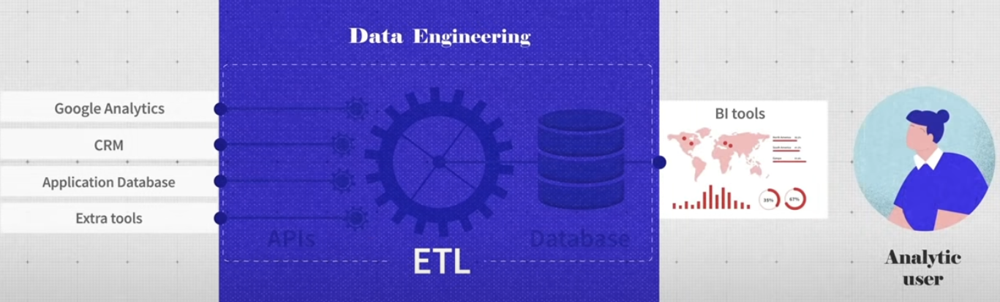
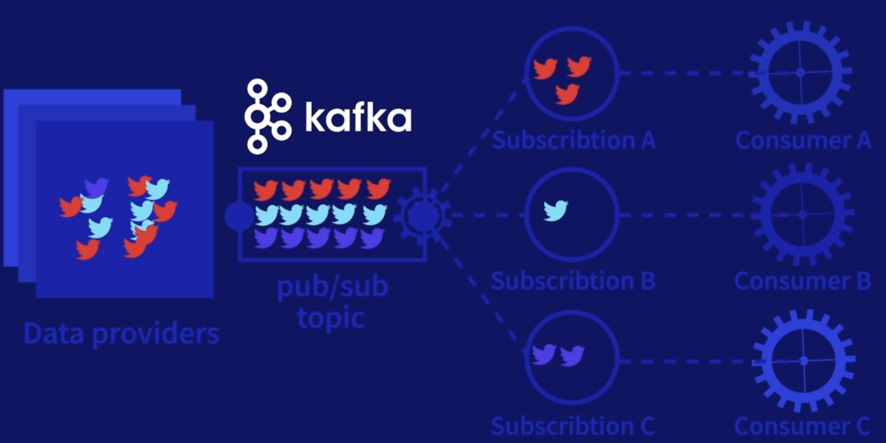
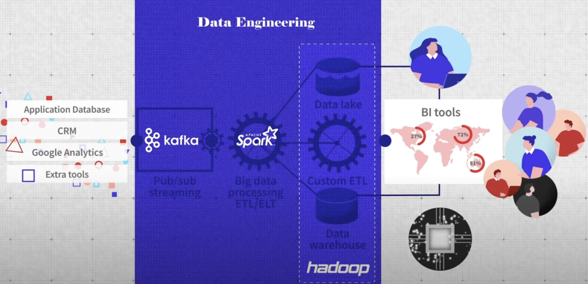

- What is Data Engineering?
  collapsed:: true
	- video
		- {{video https://www.youtube.com/watch?v=qWru-b6m030&t=100s&ab_channel=AltexSoft}}
	- ETL pipeline
	  collapsed:: true
		- Extract
		- Transform
		- Load
		- 
	- Data warehouse
	- Data scientists and Data engineers
	- data lake
	- Big Data
	- Date streaming
		- 
	- Distributed Computing
		- server cluster
	- 
-
- Data Scientist vs Data Engineer vs Data Analyst
  collapsed:: true
	- {{video https://www.youtube.com/watch?v=y3TxcejHw-4&ab_channel=LukeBarousse}}
-
- Data democratization and its importance for organizations
  collapsed:: true
	- {{video https://www.youtube.com/watch?v=0a6vuR8cdic&t=4s&ab_channel=HCLTech}}