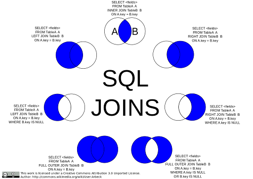
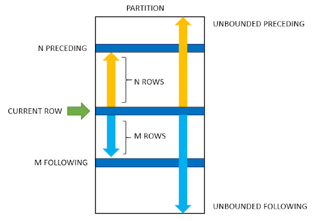
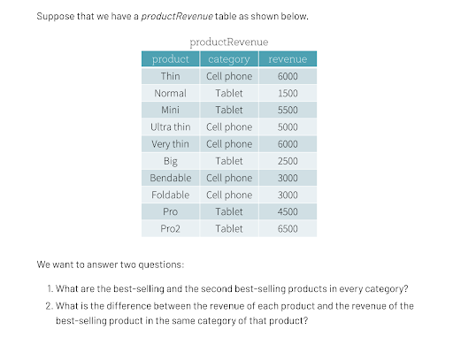

# Practice Domain: EV Charging
collapsed:: true
	- Now that we've covered the theory behind Data Engineering, we'll spend the next few sections putting that to practice in the context of a domain. We'll do that by asking some relevant domain questions, walking through the data processing steps and architectures required to answer those questions, and then implementing them in exercises for the rest of the training.
	- But first, a little more context about our domain...
	- ## Context[​](https://data-derp.github.io/docs/2.0/my-first-dataset/project-domain/?nav=false#context "Direct link to Context")
	  collapsed:: true
		- In the time of climate change, the world is attempting to reduce its dependency on coal and gas (and thereby CO2 emissions) for energy by adopting green/renewable technologies. One of those technologies are Electric Vehicles (henceforth, "EVs" or "EV" [singular]). Governments have additionally announced bans on the sale of gasoline-powered vehicles, some effective in the next 15 years in order to reduce CO2 emissions, putting pressure of automobile companies to invest in the betterment of EV-technology to make it more widespread and accessible. Logistics and large city public transportation fleets are also becoming electrified and charging technology is becoming more widespread and efficient, allowing for an even larger spread of EVs. There are also a multitude of companies whose sole purpose is to coordinate the efforts of at-home Charger installations to make it even more convenient for the typical consumer, which also lays the groundwork for decentralised home energy management (leveraging bidirectional charging and home energy optimisers by way of home Photovoltaics and other energy generators).
			- 在气候变化的时代，世界正尝试通过采用绿色/可再生技术来减少对煤炭和天然气（从而减少CO2排放）的依赖。其中一项技术是电动汽车（以下简称“EVs”或“EV”）。各国政府还宣布将禁止销售汽油动力车辆，其中一些禁令将在未来15年内生效，以减少CO2排放，这迫使汽车公司投资于改善电动汽车技术，使其更加普及和可获得。物流和大城市公共交通车队也正在电动化，充电技术变得更加普及和高效，允许更多电动汽车的使用。还有许多公司专门负责协调家庭充电器的安装，使普通消费者更加方便，同时也为家庭能源管理（通过双向充电和家庭光伏发电等能源生成器）奠定基础。
		- While the trend towards EVs seems optimistic, EVs aren't [yet] the hallmark of sustainability and socioeconomic equality: battery technology largely still uses precious minerals whose method of acquisition are questionable, EVs are expensive thereby making them only available to those who are wealthy enough to afford both the vehicle and access to an at-home charging station, and EV charging networks are more prolific in cities whose living costs are already relatively expensive. There are continued efforts to improve both aspects (sustainability, socioeconomic equality) and make it cheaper, more convenient, and accessible to the wider public which would even more reduce the dependency on oil and gas.
			- 尽管向电动汽车的转变似乎乐观，但电动汽车还不是可持续性和社会经济平等的标志：电池技术主要仍然使用获取方式可疑的贵重矿物，电动汽车价格昂贵，只有那些富裕的人才能负担得起车辆和家庭充电站的费用，电动汽车充电网络在生活成本已经相对较高的城市中更加普及。持续的努力正在改善这两个方面（可持续性、社会经济平等），使其更便宜、更方便、更广泛地可获得，从而进一步减少对石油和天然气的依赖。
		- Charge Point Operators (CPOs), of which there are many, are responsible for installing Charge Points (Chargers) in strategic locations, maintaining security of the Charge Points, ensuring sufficient electricity flow and load management, managing reservations, handling bidirectional charging in compatible locations, and ensuring that charging an electric vehicle is a pleasant experience for the customer. There are four high-level components that a CPO might be concerned with in the space of Charge Management and optimisation:
			- 1.  the Charge Point that dispenses electricity which contains its own hardware and software
			- 2.  the Charging Station Management System (CSMS) with which the Charge Point communicates and interacts
			- 3.  the charging data generated by the Charge Point
			- 4.  intelligent solutions which offer cost-charging optimisations based on integrations with Photovoltaics and real-time and historic data on electricity usage in the vicinity
			- 充电点运营商（CPOs）负责在战略位置安装充电点（充电器），维护充电点的安全性，确保足够的电力流动和负载管理，管理预订，处理兼容地点的双向充电，并确保为客户提供愉快的电动汽车充电体验。CPO可能关注充电管理和优化领域的四个高级组件：
				- 提供电力的充电点，包含其自身的硬件和软件
				- 充电点与之通信和交互的充电站管理系统（CSMS）
				- 充电点生成的充电数据
				- 提供基于光伏发电和当地实时及历史用电数据的成本优化解决方案
		- The data collected by the CSMS is interesting for a variety of reasons. First, it offers drivers and fleet operators a view into their energy consumption and the ability to leverage scheduled/automated charging based on their own needs and charging patterns. Secondly, it offers some insight into charging behaviours which can feed into central electricity grids, allowing governments and electricity companies to better understand electricity consumption patterns and provide sufficient energy to these locations. Thirdly, as we slowly reduce our dependency on coal and gas, there could be interruptions of service from the electricity grid if there are spikes of demand which the grid cannot quickly compensate but a network of plugged-in EVs in a community can quickly resolve in the locality through bidirectional charging back to the grid and decentralised at-home energy generators. In order for these use-cases to become realised, Charge Point data must be treated as a first-class citizen and architectures/technologies allowing for near-real time insights and recommendations will need to be chosen carefully.
			- CSMS收集的数据出于多种原因非常有趣。首先，它为驾驶员和车队运营商提供了对其能源消耗的视图，并能够根据其自身的需求和充电模式利用计划/自动充电。其次，它提供了一些充电行为的洞察，可以反馈到中央电网，允许政府和电力公司更好地了解电力消费模式，并为这些地点提供足够的能源。第三，随着我们逐步减少对煤炭和天然气的依赖，如果电网在需求激增时无法迅速补偿，可能会出现服务中断，但一个社区中插入电网的电动汽车网络可以通过双向充电和去中心化的家庭能源生成器快速解决当地问题。为了实现这些用例，必须将充电点数据视为一等公民，并仔细选择允许近实时洞察和建议的架构/技术。
		- In the next few sections, we'll talk about how the technology works, give an overview of the data that is generated by the Charge Point and sent to the CSMS, suggest some simple questions or insights that can be determined by the data, and describe some of the architectures that would be responsible for providing those insights in a timely manner.
			- 在接下来的几个部分，我们将讨论技术如何工作，概述充电点生成并发送到CSMS的数据，提出一些可以从数据中得出的简单问题或洞察，并描述一些负责及时提供这些洞察的架构。
	- ## How it works[​](https://data-derp.github.io/docs/2.0/my-first-dataset/project-domain/?nav=false#how-it-works "Direct link to How it works")
	  collapsed:: true
		- How it works, at a glance:
			- 1.  EV plugs into a Charge Point
			- 2.  Charge Point connects to and authenticates with a CSMS using Websockets and the OCPP Protocol
			- 3.  The Charge Point sends a message to the CSMS according to the OCPP protocol
			- 4.  The CSMS receives the message, processes/records it, and sends back a positive/negative response
			- 1.  电动汽车插入充电点
			- 2.  充电点使用Websockets和OCPP协议连接并验证CSMS
			- 3.  充电点根据OCPP协议向CSMS发送消息
			- 4.  CSMS接收消息，处理/记录并发送积极/消极的响应
		- The OCPP Protocol is an open standard created by the Open Charge Alliance (OCA) as an effort to standardise communication and encourage interoperability. Both Charge Points (the actual devices) and CSMSs can be certified by the OCA as being compliant with the OCPP Protocol. Despite that, there seems to be some variation between implementations of both Charge Points and CSMSs which are the result of interpretations of OCPP. There is an official testing protocol on the path to certification - both testing and access to the User Acceptance Test (UAT) document provided as part of their OCTT (OCPP Testing Tool) require OCA membership and vetting by OCA. Every year, the OCA has an event called PlugFest where CSMS developers can come to a single place to test their implementations against various Charge Points.
			- OCPP协议是由开放充电联盟（OCA）创建的一个开放标准，旨在标准化通信并鼓励互操作性。充电点（实际设备）和CSMS都可以通过OCA认证为符合OCPP协议。尽管如此，不同充电点和CSMS的实现之间似乎存在一些差异，这些差异是对OCPP解释的结果。认证过程中有一个官方测试协议——测试和访问用户验收测试（UAT）文档（作为OCTT的一部分）都需要OCA会员资格和OCA的审核。每年，OCA都有一个名为PlugFest的活动，CSMS开发人员可以来到一个地方测试其实现与各种充电点的兼容性。
		- The OCPP Protocol, at the time of writing have the following versions:
			- OCPP 1.5 - deemed out of date but many Charge Points still only support this (they're recommended to update to at least the next version)
			- [OCPP 1.6](https://www.openchargealliance.org/protocols/ocpp-16/) - most widely implemented, supports both SOAP/JSON versions
			- [OCPP 2.0.1](https://www.openchargealliance.org/protocols/ocpp-201/) - improvements made in security and smart charging, not all Charge Points and CSMS implement this but are encouraged to do so to stay competitive
		- Staying true to versioning for APIs, version 2.0.1 is not backwards compatible with version 1.6, but they do have some core functionalities that they share.
			- 截至撰写本文时，OCPP协议的版本包括：
				- OCPP 1.5 - 被认为过时，但许多充电点仍然只支持这一版本（建议至少更新到下一个版本）
				- OCPP 1.6 - 最广泛实施的版本，支持SOAP/JSON版本
				- OCPP 2.0.1 - 在安全性和智能充电方面有所改进，并不是所有充电点和CSMS都实现了这一版本，但鼓励这样做以保持竞争力
			- API版本控制，版本2.0.1与1.6不向后兼容，但它们共享一些核心功能。
	- ## Some Core OCPP Actions and its Data[​](https://data-derp.github.io/docs/2.0/my-first-dataset/project-domain/?nav=false#some-core-ocpp-actions-and-its-data "Direct link to Some Core OCPP Actions and its Data")
	  collapsed:: true
		- For every event that is generated by the Charge Point, the CSMS sends a response. The following are examples of raw OCPP data.
		- ### Heartbeat Request[​](https://data-derp.github.io/docs/2.0/my-first-dataset/project-domain/?nav=false#heartbeat-request "Direct link to Heartbeat Request")
			- The Charge Point informs the CSMS it is still responsive. This is a configurable value on the Charge Point. If the Charge Point has not sent any other messages during that allotted time, it sends a Heartbeat to the CSMS.
			- ```
			  {}
			  ```
		- ### Heartbeat Response[​](https://data-derp.github.io/docs/2.0/my-first-dataset/project-domain/?nav=false#heartbeat-response "Direct link to Heartbeat Response")
			- ```
			  {  
			    "current_time": "2023-01-01T09:00:00+00:00"
			   }
			  ```
		- ### BootNotification Request[​](https://data-derp.github.io/docs/2.0/my-first-dataset/project-domain/?nav=false#bootnotification-request "Direct link to BootNotification Request")
			- Whenever a Charge Point boots/reboots, it sends a BootNotification message which lets the CSMS know what configuration it has. The CSMS sends back an `accepted` response if all configuration values are suitable.
			- ```
			  {  
			    "charge_point_model": "AwesomeModel",  
			    "charge_point_vendor": "My Awesome Vendor"
			  }
			  ```
		- ### BootNotification Response[​](https://data-derp.github.io/docs/2.0/my-first-dataset/project-domain/?nav=false#bootnotification-response "Direct link to BootNotification Response")
			- ```
			  {  
			    "current_time": "2023-01-01T09:00:00+00:00",  
			    "interval": 300,  
			    "registration_status": "Accepted"
			  }
			  ```
		- ### MeterValues Request[​](https://data-derp.github.io/docs/2.0/my-first-dataset/project-domain/?nav=false#metervalues-request "Direct link to MeterValues Request")
		  collapsed:: true
			- Sampled readings from the energy meter/sensors to provide information about the amount of energy dispensed at a given time and connector. These readings are sampled while a Transaction is in progress.
			- ```
			  {
			    "connector_id": 1,
			    "meter_value": [
			      {
			        "timestamp": "2022-01-01T08:00:06+00:00",
			        "sampled_value": [
			          {
			            "value": "0.0",
			            "context": "Sample.Periodic",
			            "format": "Raw",
			            "measurand": "Voltage",
			            "phase": "L1-N",
			            "location": null,
			            "unit": "V"
			          },
			          {
			            "value": "7.21",
			            "context": "Sample.Periodic",
			            "format": "Raw",
			            "measurand": "Current.Import",
			            "phase": "L1",
			            "location": null,
			            "unit": "A"
			          },
			          {
			            "value": "1400.77",
			            "context": "Sample.Periodic",
			            "format": "Raw",
			            "measurand": "Power.Active.Import",
			            "phase": "L1",
			            "location": null,
			            "unit": "W"
			          },
			          {
			            "value": "0.0",
			            "context": "Sample.Periodic",
			            "format": "Raw",
			            "measurand": "Voltage",
			            "phase": "L2-N",
			            "location": null,
			            "unit": "V"
			          },
			          {
			            "value": "0.0",
			            "context": "Sample.Periodic",
			            "format": "Raw",
			            "measurand": "Current.Import",
			            "phase": "L2",
			            "location": null,
			            "unit": "A"
			          },
			          {
			            "value": "0.0",
			            "context": "Sample.Periodic",
			            "format": "Raw",
			            "measurand": "Power.Active.Import",
			            "phase": "L2",
			            "location": null,
			            "unit": "W"
			          },
			          {
			            "value": "0.0",
			            "context": "Sample.Periodic",
			            "format": "Raw",
			            "measurand": "Voltage",
			            "phase": "L3-N",
			            "location": null,
			            "unit": "V"
			          },
			          {
			            "value": "0.0",
			            "context": "Sample.Periodic",
			            "format": "Raw",
			            "measurand": "Current.Import",
			            "phase": "L3",
			            "location": null,
			            "unit": "A"
			          },
			          {
			            "value": "0.0",
			            "context": "Sample.Periodic",
			            "format": "Raw",
			            "measurand": "Power.Active.Import",
			            "phase": "L3",
			            "location": null,
			            "unit": "W"
			          },
			          {
			            "value": "1400.77",
			            "context": "Sample.Periodic",
			            "format": "Raw",
			            "measurand": "Energy.Active.Import.Register",
			            "phase": null,
			            "location": null,
			            "unit": "Wh"
			          },
			          {
			            "value": "7.21",
			            "context": "Sample.Periodic",
			            "format": "Raw",
			            "measurand": "Current.Import",
			            "phase": null,
			            "location": null,
			            "unit": "A"
			          },
			          {
			            "value": "1400.77",
			            "context": "Sample.Periodic",
			            "format": "Raw",
			            "measurand": "Power.Active.Import",
			            "phase": null,
			            "location": null,
			            "unit": "W"
			          }
			        ]
			      }
			    ],
			    "transaction_id": 1
			  }
			  
			  ```
		- ### MeterValues Response[​](https://data-derp.github.io/docs/2.0/my-first-dataset/project-domain/?nav=false#metervalues-response "Direct link to MeterValues Response")
			- ```
			  {}
			  ```
		- ### StartTransaction Request[​](https://data-derp.github.io/docs/2.0/my-first-dataset/project-domain/?nav=false#starttransaction-request "Direct link to StartTransaction Request")
			- The Charge Point informs the CSMS that a transaction has been started
			- ```
			  {
			    "connector_id": 1,
			    "id_tag": "ea068c10-1bfb-4128-ab88-de565bd5f02f",
			    "meter_start": 0,
			    "timestamp": "2022-01-01T08:00:00+00:00",
			    "reservation_id": null
			  }
			  
			  ```
		- ### StartTransaction Response[​](https://data-derp.github.io/docs/2.0/my-first-dataset/project-domain/?nav=false#starttransaction-response "Direct link to StartTransaction Response")
			- ```
			  {
			    "transaction_id": 1,
			    "id_tag_info": {
			      "status": "Accepted",
			      "parent_id_tag": "ea068c10-1bfb-4128-ab88-de565bd5f02f",
			      "expiry_date": null
			    }
			  }
			  
			  ```
		- ### StopTransaction Request[​](https://data-derp.github.io/docs/2.0/my-first-dataset/project-domain/?nav=false#stoptransaction-request "Direct link to StopTransaction Request")
			- The Charge Point informs the CSMS that a transaction has been stopped
			- ```
			  {
			    "meter_stop": 2780,
			    "timestamp": "2022-01-01T08:20:00+00:00",
			    "transaction_id": 1,
			    "reason": null,
			    "id_tag": "ea068c10-1bfb-4128-ab88-de565bd5f02f",
			    "transaction_data": null
			  }
			  
			  ```
		- ### StopTransaction Response[​](https://data-derp.github.io/docs/2.0/my-first-dataset/project-domain/?nav=false#stoptransaction-response "Direct link to StopTransaction Response")
			- ```
			  {
			    "id_tag_info": {
			      "status": "Accepted",
			      "parent_id_tag": "ea068c10-1bfb-4128-ab88-de565bd5f02f",
			      "expiry_date": null
			    }
			  }
			  
			  ```
		-
		- ### 分析总结
			- 这段内容详细描述了充电点与充电站管理系统（CSMS）之间的一些核心OCPP（开放充电点协议）操作及其数据交换过程。这些操作包括：
				- 1.  **Heartbeat请求和响应**：确保充电点仍在响应，定期向CSMS发送心跳消息。
				- 2.  **BootNotification请求和响应**：充电点启动或重启时，向CSMS发送启动通知，报告其配置状态。
				- 3.  **MeterValues请求和响应**：提供能量计/传感器的采样读数，记录特定时间点和连接器的能量消耗。
				- 4.  **StartTransaction请求和响应**：通知CSMS交易的开始，包括连接器ID、ID标签、初始能量读数等信息。
				- 5.  **StopTransaction请求和响应**：通知CSMS交易的结束，提供结束时间、最终能量读数等信息。
			- 这些操作展示了充电点与CSMS之间的数据交互，确保系统的正常运行和数据的准确记录。通过这些数据，系统可以实现能源消耗监控、充电行为分析和电力管理优化，从而支持电动汽车充电基础设施的高效运作。
-
- # SQL: A Quick Review
  collapsed:: true
	- When working with data, a solid knowledge of SQL is required to help think about your problem in terms of DataFrame transformations.
	- 
	- Have a quick scan through the topics that you're not too familiar with:
		- [Joins](https://www.w3schools.com/sql/sql_join.asp) and [Unions](https://www.w3schools.com/sql/sql_union.asp)
		- [Aggregate Functions (GROUP BY)](https://www.w3schools.com/sql/sql_groupby.asp)
		- [Window Functions](https://mode.com/sql-tutorial/sql-window-functions/)
		- What’s so great about them anyways? (See next slide)
		- [Indexes & Query Plans](https://www.khanacademy.org/computing/computer-programming/sql/relational-queries-in-sql/a/more-efficient-sql-with-query-planning-and-optimization)
	- ## A Deep Dive on Window Functions
		- 
		-
		- What limitations have you faced in your analytics when using GROUP BY in the past?
		- How can you do rankings per each category efficiently?
		- How can you get the entire row of the best-selling product? (imagine you want to see additional attributes of this product)
		- 
		-
		- It is important to make sure you understand everything about window function semantics.
			- partitionBy
				- similar to `groupBy` (but doesn’t reduce/aggregate information down to a single row)
			- orderBy
				- Just FYI, you can `orderBy(F.col(“myColumn”).desc())` for descending order.
			- rowsBetween
				- You should look up the default arguments for different window functions (e.g. lag, lead, first, last, max, min, row_number)
			- rangeBetween Can you explain the difference between rowsBetween and rangeBetween?
		- These are [all also concepts in SQL and not special to Spark](https://towardsdatascience.com/a-guide-to-advanced-sql-window-functions-f63f2642cbf9).
	- ## Exercise: Windows[​](https://data-derp.github.io/docs/2.0/my-first-dataset/sql-quick-review#exercise-windows "Direct link to Exercise: Windows")
		- The next exercises uses Windows for several critical sections and we find that people are more successful in completing the exercises if they are familiarised with Windows. Follow the instructions here for the [Windows Walkthrough](https://github.com/data-derp/small-exercises/tree/master/window-functions).
-
-
- # Exercise: Last Connection Time of Charge Points
	- | Question | Context |
	  | --- | --- |
	  | **When was the last connection time of a Charge Point?** | A singular Charge Point sends a heartbeat message at a configured interval unless specified differently by the CSMS when it first registers itself. We can find out when it was last responsive by finding the timestamp of the most recent message from any OCPP action for that Charge Point. |
	- In this exercise, we'll answer the question: **When was the last connection time of a Charge Point?**
	- Follow the directions [here](https://github.com/data-derp/exercise-ev-databricks/tree/main/last-connection-time-charge-points) to get started!