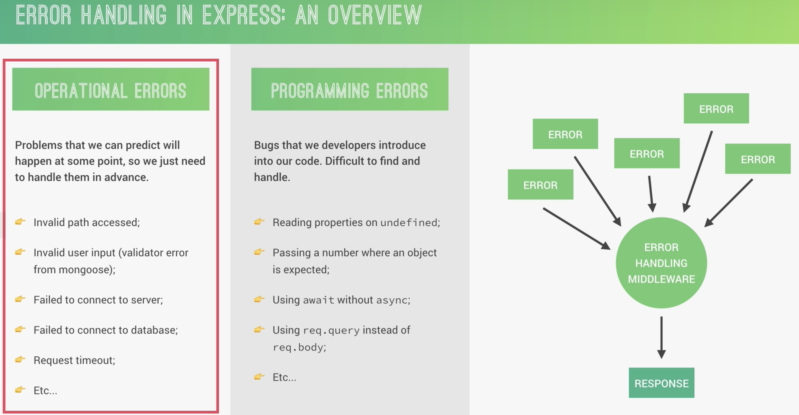

- 
- handle router
  collapsed:: true
	- ```javascript
	  app.all('*', (req, res, next) => {
	    res.status(404).json({
	      status: 'fail',
	      message: `Can't find ${req.originalUrl} on this server`,
	    });
	  });
	  ```
- catch error in async func
  collapsed:: true
	- 这段代码定义了一个高阶函数 `catchAsync`，用于处理异步函数中的错误，并展示了如何使用这个高阶函数来简化异步请求处理中的错误处理逻辑。让我们逐步解析这段代码：
	- ### 1. `catchAsync` 函数
	  ```javascript
	  const catchAsync = (fn) => {
	  return (req, res, next) => {
	    fn(req, res, next).catch(next);
	  };
	  };
	  ```
	- **`catchAsync` 定义**：`catchAsync` 是一个高阶函数，它接受一个异步函数 `fn` 作为参数。
	- **返回一个新的函数**：返回的这个新的函数接受 `req`、`res` 和 `next` 这三个参数（即 Express 中间件的标准参数）。
	- **执行异步函数并捕获错误**：在返回的函数中，执行传入的异步函数 `fn(req, res, next)`。如果这个异步函数抛出错误（即返回一个 rejected 的 promise），错误会被 `.catch(next)` 捕获，并传递给 Express 的错误处理机制。
	- ### 2. 使用 `catchAsync` 处理 `createTour` 控制器
	  ```javascript
	  exports.createTour = catchAsync(async (req, res, next) => {
	  const newTour = await Tour.create(req.body);
	  
	  res.status(201).json({
	    status: 'success',
	    data: {
	      tour: newTour,
	    },
	  });
	  });
	  ```
	- **`createTour` 控制器**：这是一个导出的控制器函数，用于处理创建旅游项目的请求。
	- **`catchAsync` 包装**：通过 `catchAsync` 包装这个异步控制器函数，使其在出现未捕获的错误时自动调用 `next` 传递错误。
	- **异步操作**：在 `createTour` 控制器中，使用 `await` 等待 `Tour.create(req.body)` 执行完成，并将创建的旅游项目存储在 `newTour` 变量中。
	- **响应客户端**：使用 `res.status(201).json` 发送响应，表示成功创建了一个新旅游项目，并返回新创建的项目数据。
	- ### 整体流程
	  1. **定义高阶函数 `catchAsync`**：用于简化异步函数的错误处理。
	  2. **使用 `catchAsync` 包装异步控制器函数 `createTour`**：这样可以避免在每个异步控制器函数中显式地使用 try-catch 块捕获错误。
	  3. **在 `createTour` 中执行异步操作**：创建一个新旅游项目并返回成功响应。如果在执行过程中发生错误，错误将被 `catchAsync` 捕获并传递给 Express 的错误处理中间件。
	- ### 好处
	- **简化错误处理**：通过使用 `catchAsync`，可以避免在每个异步函数中显式地写 try-catch 块，使代码更简洁、更具可读性。
	- **一致的错误处理**：保证所有异步操作中的错误都能通过 Express 的错误处理中间件进行处理，提供一致的错误处理机制。
	- ### 总结
	  这段代码展示了如何通过定义和使用高阶函数 `catchAsync` 来简化 Express 应用中的异步控制器函数的错误处理逻辑，保证了错误能够一致地传递给错误处理中间件进行处理。
- build 404 error
  collapsed:: true
	- ```javascript
	  exports.updateTour = catchAsync(async (req, res, next) => {
	    const tour = await Tour.findByIdAndUpdate(req.params.id, req.body, {
	      new: true,
	      runValidators: true,
	    });
	  
	    if (!tour) {
	      return next(new AppError('No tour found with that ID', 404));
	    }
	  
	    res.status(200).json({
	      status: 'success',
	      data: {
	        tour,
	      },
	    });
	  });
	  ```
- Errors During Development vs Production
  collapsed:: true
	- ```javascript
	  const sendErrorDev = (err, res) => {
	    res.status(err.statusCode).json({
	      status: err.status,
	      error: err,
	      message: err.message,
	      stack: err.stack,
	    });
	  };
	  
	  const sendErrorProd = (err, res) => {
	    // Operational, trusted error: send message to client
	    if (err.isOperational) {
	      res.status(err.statusCode).json({
	        status: err.status,
	        message: err.message,
	      });
	  
	      // Programming or other unknown error: don't leak error details
	    } else {
	      // 1 Log error
	      console.error('ERROR', err);
	      // 2 Send generic message
	      res.status(500).json({
	        status: 'error',
	        message: 'Something went very wrong!',
	      });
	    }
	  };
	  
	  module.exports = (err, req, res, next) => {
	    err.statusCode = err.statusCode || 500;
	    err.status = err.status || 'error';
	  
	    if (process.env.NODE_ENV === 'development') {
	      sendErrorDev(err, res);
	    } else if (process.env.NODE_ENV === 'production') {
	      sendErrorProd(err, res);
	    }
	  };
	  
	  ```
- Handling Invalid Database IDs
  collapsed:: true
	- ```javascript
	  const handleCastErrorDB = (err) => {
	    const message = `Invalid ${err.path}: ${err.value}.`;
	    return AppError(message, 400);
	  };
	  
	  module.exports = (err, req, res, next) => {
	    err.statusCode = err.statusCode || 500;
	    err.status = err.status || 'error';
	  
	    if (process.env.NODE_ENV === 'development') {
	      sendErrorDev(err, res);
	    } else if (process.env.NODE_ENV === 'production') {
	      let error = { ...err };
	      if (error.name === 'CastError') error = handleCastErrorDB(error);
	      sendErrorProd(error, res);
	    }
	  };
	  ```
- Handling Duplicate Database Fields
  collapsed:: true
	- # [RegEx: Grabbing values between quotation marks](https://stackoverflow.com/questions/171480/regex-grabbing-values-between-quotation-marks)
	- ```javascript
	  const handleDuplicateFieldsDB = (err) => {
	    const value = err.errmsg.match(/(["'])(\\?.)*?\1/);
	    console.log(value);
	    const message = `Duplicate field value: ${value}. Please use another value!`;
	    return AppError(message, 400);
	  };
	  if (error.code === 11000) error = handleDuplicateFieldsDB(error);
	  
	  ```
- Handling Mongoose Validation Errors
  collapsed:: true
	- ```javascript
	  const handleValidationErrorDB = (err) => {
	    const errors = Object.values(err.errors).map((el) => el.message);
	  
	    const message = `Invalid input data ${errors.join('. ')}`;
	    return AppError(message, 400);
	  };    
	  if (error.name === 'ValidationError')
	        error = handleValidationErrorDB(error);
	  ```
- Errors Outside Express: Unhandled Rejections
  collapsed:: true
	- ```javascript
	  const server = app.listen(port, () => {
	    console.log(`App running on port ${port}...`);
	  });
	  
	  process.on('unhandledRejection', (err) => {
	    console.log(err.name, err.message);
	    console.log('UNHANDLER REJECTION! Shutting down...');
	    server.close(() => {
	      process.exit(1);
	    });
	  });
	  ```
	-
- Catching Uncaught Exceptions
  collapsed:: true
	- ```javascript
	  process.on('uncaughtException', (err) => {
	    console.log('UNCAUGHT EXCEPTION! Shutting down...');
	    console.log(err.name, err.message);
	    process.exit(1);
	  });
	  console.log(x);
	  ```