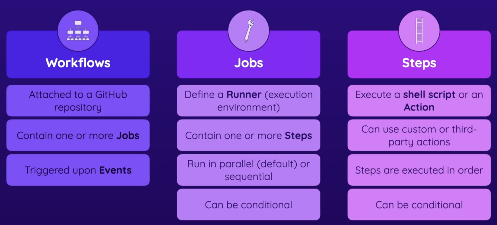
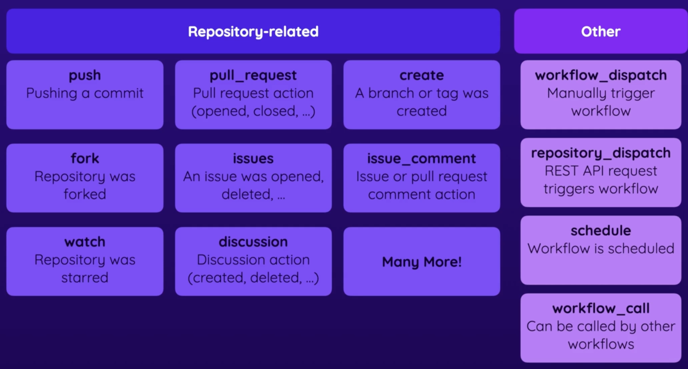
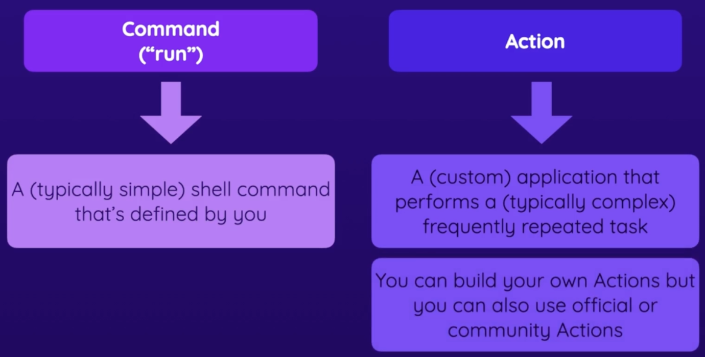

- Workflows；Jobs；Steps
  collapsed:: true
	- GitHub Workflows（工作流）是 GitHub Actions 的核心概念之一。它们是描述在代码仓库中自动化任务的一系列定义。工作流通常用 YAML 格式编写，并存储在仓库的 `.github/workflows` 目录中。每个工作流文件定义了在特定事件发生时应该执行的一系列步骤和任务。
	- 以下是工作流的主要组成部分和概念：
		- 1.  **名称（name）**： 每个工作流可以有一个可选的名称，以便于识别。例如：
			- ```yaml
			  name: CI Workflow
			  ```
		- 2.  **触发事件（on）**： 工作流的触发条件，指定在什么情况下工作流应该运行。常见的触发事件包括 `push`（代码推送）、`pull_request`（Pull Request 创建或更新）、`schedule`（定时任务）、`workflow_dispatch`（手动触发）等。例如：
			- ```yaml
			  on:
			    push:
			      branches:
			        - main
			  ```
		- 3.  **作业（jobs）**： 工作流由一个或多个作业组成，每个作业可以并行或按顺序执行。每个作业运行在一个虚拟环境中，并包含多个步骤。例如：
			- ```yaml
			  jobs:
			    build:
			      runs-on: ubuntu-latest
			      steps:
			        - name: Checkout code
			          uses: actions/checkout@v2
			        - name: Set up Node.js
			          uses: actions/setup-node@v2
			          with:
			            node-version: '14'
			        - name: Install dependencies
			          run: npm install
			        - name: Run tests
			          run: npm test
			  
			  ```
		- 4.  **步骤（steps）**： 每个作业包含多个步骤，每个步骤可以执行一个单独的操作。这些操作可以是运行命令、调用脚本或使用预定义的 GitHub Action。例如，安装依赖和运行测试的步骤：
			- ```yaml
			  steps:
			    - name: Install dependencies
			      run: npm install
			    - name: Run tests
			      run: npm test
			  
			  ```
		- 5.  **虚拟环境（runs-on）**： 指定作业运行的虚拟环境，例如 `ubuntu-latest`、`windows-latest`、`macos-latest` 等。例如：
			- ```yaml
			  runs-on: ubuntu-latest
			  ```
		- 6.  **使用 Actions（uses）**： 在步骤中，可以使用预定义的 Actions 来简化任务。例如，使用 `actions/checkout` 来检出代码：
			- ```yaml
			  - name: Checkout code
			    uses: actions/checkout@v2
			  ```
	- 一个完整的工作流示例：
	  collapsed:: true
		- ```yaml
		  name: CI
		  
		  on:
		    push:
		      branches:
		        - main
		  
		  jobs:
		    build:
		      runs-on: ubuntu-latest
		  
		      steps:
		      - name: Checkout code
		        uses: actions/checkout@v2
		  
		      - name: Set up Node.js
		        uses: actions/setup-node@v2
		        with:
		          node-version: '14'
		  
		      - name: Install dependencies
		        run: npm install
		  
		      - name: Run tests
		        run: npm test
		  
		  ```
	- 这个工作流会在每次推送到 `main` 分支时触发，并执行以下操作：
		- 1.  检出代码。
		- 2.  设置 Node.js 环境。
		- 3.  安装项目依赖。
		- 4.  运行测试。
	- 通过定义工作流，开发者可以自动化代码的构建、测试和部署过程，大大提高开发效率和代码质量。
	-
- image
  collapsed:: true
	- 
-
- Running Multi-Line Shell Commands
  collapsed:: true
	- Thus far, you learned how to run simple shell commands like `echo "Something"` via `run: echo "Something"`.
	- If you need to run multiple shell commands (or multi-line commands, e.g., for readability), you can easily do so by adding the pipe symbol (`|`) as a value after the `run:` key.
	- Like this:
		- ```
		  ...
		   run: |
		   	echo "First output"
		  	echo "Second output"
		  ```
	- This will run both commands in one step.
-
- Events（Workflows Triggers）
  collapsed:: true
	- [Events that trigger workflows](https://docs.github.com/en/actions/using-workflows/events-that-trigger-workflows)
	-
	- images
	  collapsed:: true
		- 
-
- Actions
  collapsed:: true
	- image
	  collapsed:: true
		- 
	- command: `run` or `uses`
	- Action
		- A (custom) application that performs a (typically complex) frequently repeated task
		- You can build your own Actions but you can also use official or community Actions
	- own actions
		- use git to clone the code from the repository onto this machine
		- it is extremely unnecessary work, it is common task, action has been created
		- run command
	- others actions
		- you can go to marketplace, to find all free actions
			- [Marketplace](https://github.com/marketplace?type=actions)
		- official actions
			- created and maintained by github team
				- [Action-checkout](https://github.com/actions/checkout)
					- find usage
					- Download code from the repository onto this runners
		- other group actions
			- created and maintained by other companies or by simple community members
		- key `with` is for setting config
-
- 定义的第一个步骤，是一个实际获取代码的步骤，从代码库中下载代码，jobs和这些steps，是在 GitHub 拥有的服务器或你自己的服务器上运行的，但在这里我们使用的是 GitHub 服务器。它们并不在你的代码库内部运行，你可能会认为它们是这样运行的，但事实并非如此。它们与代码库相关联，它们可以轻松访问代码库代码，但它们并不在代码库中运行。代码库不是服务器，如果一定要说，它只是 GitHub 拥有的一台机器上的硬盘上的一个文件夹。这一点非常重要，因为如果你记住这一点，你就会明白这个服务器是由 GitHub 提供给你用来运行这些步骤的，并不会自动拥有你的代码。因此，如果你有一些步骤依赖于代码的存在，就像这里的这些步骤一样，你必须首先下载你的代码作为第一步。如果你想要安装依赖和运行测试的步骤，你必须首先将你的代码下载到这个由 GitHub 提供的服务器上，因此这是我在这里定义的实际第一步，一个将从这个 GitHub 代码库中下载代码到这个运行环境、这个服务器上的步骤。这就是我们将探索的另一个关键构建块，由 GitHub Actions 提供的一个 Action。
-
- 经过第一步，我们得到了我们的代码，接下来就可以运行我们想要的任务，比如跑测试，不过在跑测试之前，
	- 要确保nodejs是已经安装
		- 如果选中的机器是ubuntu，nodejs是已经安装的
			- 预装软件详情可见 **[runner-images](https://github.com/actions/runner-images)**
		- 当然也可以安装nodejs
			- `uses: actions/setup-node`
			- [setup-node](https://github.com/actions/setup-node)
			- 可以用with来指定node-version
	- 然后需要安装项目依赖
		- `run: npm install or ci`
	- 然后再运行测试
		- `run: npm test`
-
-
-
-
-