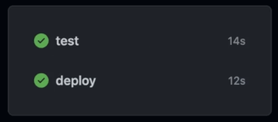
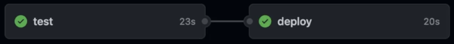
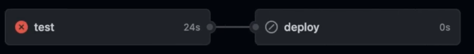
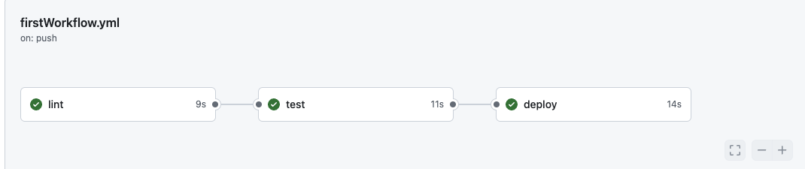
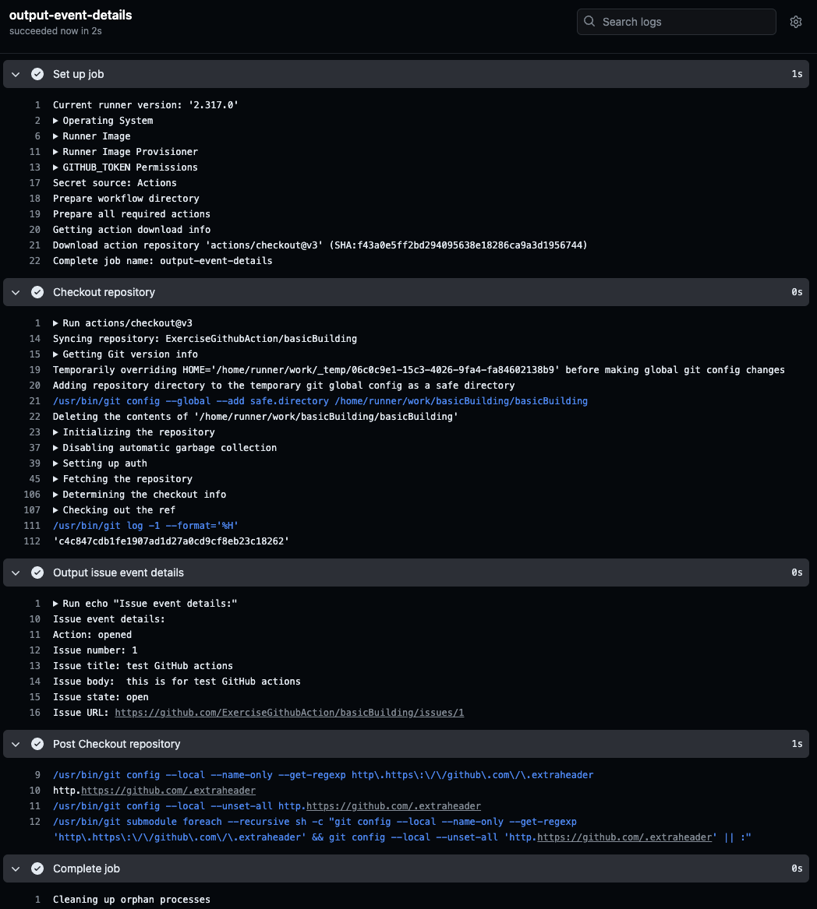
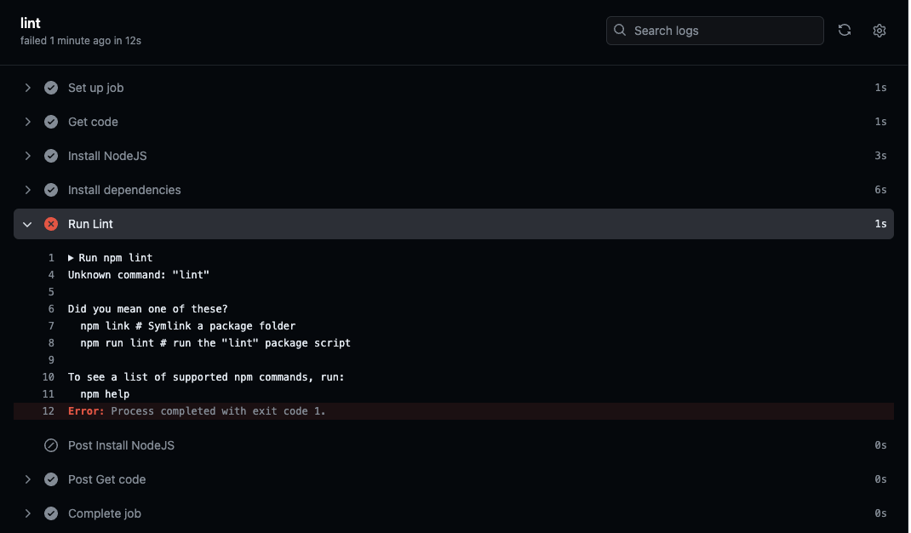

- Workflows；Jobs；Steps
	- GitHub Workflows（工作流）是 GitHub Actions 的核心概念之一。它们是描述在代码仓库中自动化任务的一系列定义。工作流通常用 YAML 格式编写，并存储在仓库的 `.github/workflows` 目录中。每个工作流文件定义了在特定事件发生时应该执行的一系列步骤和任务。
	- 以下是工作流的主要组成部分和概念：
		- 1.  **名称（name）**： 每个工作流可以有一个可选的名称，以便于识别。例如：
			- ```yaml
			  name: CI Workflow
			  ```
		- 2.  **触发事件（on）**： 工作流的触发条件，指定在什么情况下工作流应该运行。常见的触发事件包括 `push`（代码推送）、`pull_request`（Pull Request 创建或更新）、`schedule`（定时任务）、`workflow_dispatch`（手动触发）等。例如：
			- ```yaml
			  on:
			    push:
			      branches:
			        - main
			  ```
		- 3.  **作业（jobs）**： 工作流由一个或多个作业组成，每个作业可以并行或按顺序执行。每个作业运行在一个虚拟环境中，并包含多个步骤。例如：
			- ```yaml
			  jobs:
			    build:
			      runs-on: ubuntu-latest
			      steps:
			        - name: Checkout code
			          uses: actions/checkout@v2
			        - name: Set up Node.js
			          uses: actions/setup-node@v2
			          with:
			            node-version: '14'
			        - name: Install dependencies
			          run: npm install
			        - name: Run tests
			          run: npm test
			  
			  ```
		- 4.  **步骤（steps）**： 每个作业包含多个步骤，每个步骤可以执行一个单独的操作。这些操作可以是运行命令、调用脚本或使用预定义的 GitHub Action。例如，安装依赖和运行测试的步骤：
			- ```yaml
			  steps:
			    - name: Install dependencies
			      run: npm install
			    - name: Run tests
			      run: npm test
			  
			  ```
		- 5.  **虚拟环境（runs-on）**： 指定作业运行的虚拟环境，例如 `ubuntu-latest`、`windows-latest`、`macos-latest` 等。例如：
			- ```yaml
			  runs-on: ubuntu-latest
			  ```
		- 6.  **使用 Actions（uses）**： 在步骤中，可以使用预定义的 Actions 来简化任务。例如，使用 `actions/checkout` 来检出代码：
			- ```yaml
			  - name: Checkout code
			    uses: actions/checkout@v2
			  ```
	- 一个完整的工作流示例：
	  collapsed:: true
		- ```yaml
		  name: CI
		  
		  on:
		    push:
		      branches:
		        - main
		  
		  jobs:
		    build:
		      runs-on: ubuntu-latest
		  
		      steps:
		      - name: Checkout code
		        uses: actions/checkout@v2
		  
		      - name: Set up Node.js
		        uses: actions/setup-node@v2
		        with:
		          node-version: '14'
		  
		      - name: Install dependencies
		        run: npm install
		  
		      - name: Run tests
		        run: npm test
		  
		  ```
	- 这个工作流会在每次推送到 `main` 分支时触发，并执行以下操作：
		- 1.  检出代码。
		- 2.  设置 Node.js 环境。
		- 3.  安装项目依赖。
		- 4.  运行测试。
	- 通过定义工作流，开发者可以自动化代码的构建、测试和部署过程，大大提高开发效率和代码质量。
	-
- image
	- 
-
- Running Multi-Line Shell Commands
	- Thus far, you learned how to run simple shell commands like `echo "Something"` via `run: echo "Something"`.
	- If you need to run multiple shell commands (or multi-line commands, e.g., for readability), you can easily do so by adding the pipe symbol (`|`) as a value after the `run:` key.
	- Like this:
		- ```
		  ...
		   run: |
		   	echo "First output"
		  	echo "Second output"
		  ```
	- This will run both commands in one step.
-
- Events（Workflows Triggers）
  collapsed:: true
	- [Events that trigger workflows](https://docs.github.com/en/actions/using-workflows/events-that-trigger-workflows)
	-
	- images
		- 
-
- Actions
	- image
	  collapsed:: true
		- 
	- command: `run` or `uses`
	- Action
		- A (custom) application that performs a (typically complex) frequently repeated task
		- You can build your own Actions but you can also use official or community Actions
	- own actions
		- use git to clone the code from the repository onto this machine
		- it is extremely unnecessary work, it is common task, action has been created
		- run command
	- others actions
		- you can go to marketplace, to find all free actions
			- [Marketplace](https://github.com/marketplace?type=actions)
		- official actions
			- created and maintained by github team
				- [Action-checkout](https://github.com/actions/checkout)
					- find usage
					- Download code from the repository onto this runners
		- other group actions
			- created and maintained by other companies or by simple community members
		- key `with` is for setting config
-
-
- 单个job
	- 定义的第一个步骤，是一个实际获取代码的步骤，从代码库中下载代码，jobs和这些steps，是在 GitHub 拥有的服务器或你自己的服务器上运行的，但在这里我们使用的是 GitHub 服务器。它们并不在你的代码库内部运行，你可能会认为它们是这样运行的，但事实并非如此。它们与代码库相关联，它们可以轻松访问代码库代码，但它们并不在代码库中运行。代码库不是服务器，如果一定要说，它只是 GitHub 拥有的一台机器上的硬盘上的一个文件夹。这一点非常重要，因为如果你记住这一点，你就会明白这个服务器是由 GitHub 提供给你用来运行这些步骤的，并不会自动拥有你的代码。因此，如果你有一些步骤依赖于代码的存在，就像这里的这些步骤一样，你必须首先下载你的代码作为第一步。如果你想要安装依赖和运行测试的步骤，你必须首先将你的代码下载到这个由 GitHub 提供的服务器上，因此这是我在这里定义的实际第一步，一个将从这个 GitHub 代码库中下载代码到这个运行环境、这个服务器上的步骤。这就是我们将探索的另一个关键构建块，由 GitHub Actions 提供的一个 Action。
	- 经过第一步，我们得到了我们的代码，接下来就可以运行我们想要的任务，比如跑测试，不过在跑测试之前，
		- 要确保nodejs是已经安装
			- 如果选中的机器是ubuntu，nodejs是已经安装的
				- 预装软件详情可见 **[runner-images](https://github.com/actions/runner-images)**
			- 当然也可以安装nodejs
				- `uses: actions/setup-node`
				- [setup-node](https://github.com/actions/setup-node)
				- 可以用with来指定node-version
		- 然后需要安装项目依赖
			- `run: npm install or ci`
		- 然后再运行测试
			- `run: npm test`
	- 如果这个action失败了，那么可以通过log日志来查看，GitHub actions 给每一步都提供了详细的日志
- 多个jobs
  collapsed:: true
	- 每个job都有自己的runner，虚拟机器，这个是完全隔离的与其他机器和jobs
	- 测试的job完之后，这个是部署的job
		- 部署的step跟测试的job前面环境的准备是一样的，只是之后用到的是 `npm run build`，然后再deploy
	- 多个job之间运行是并行的
		- 
	- 如果想串行运行job，比如上一个job完成之后才能运行下一个
		- 
		- 可以使用：`needs`
			- 使用举例
			  collapsed:: true
				- ```yaml
				  name: Deploy Project
				  on: [push, workflow_dispatch]
				  jobs:
				    test:
				      runs-on: ubuntu-latest
				      steps:
				        - name: Get code
				          uses: actions/checkout@v3
				        - name: Install NodeJS
				          uses: actions/setup-node@v3
				          with:
				            node-version: 18
				        - name: Install dependencies
				          run: npm ci
				        - name: Run tests
				          run: npm test
				    deploy:
				      needs: test
				      .....
				  ```
		- 如果上一个job失败，则下一个job不会运行
			- 
-
- Using Multiple Triggers (Events)
  collapsed:: true
	- push
		- 一旦push，就自动触发
		- 可以指定分支监控，比如main
	- workflow_dispatch
		- 可以手动触发
	- 如果这两个都加了，然后可以同时触发两次，比如push+手动
	- ```yaml
	  name: Deploy Project
	  on: [push, workflow_dispatch]
	  ```
- Expressions & Context Objects
  collapsed:: true
	- [Contexts](https://docs.github.com/en/actions/learn-github-actions/contexts)
		- 在workflow里，可以获取GitHub的这个context 信息
		- `${{ <context> }}`
	- [Expressions](https://docs.github.com/en/actions/learn-github-actions/expressions)
		- 在workflow里，可以通过expressions来获取这个context信息，或者设置环境变量等
		- `${{ <expression> }}`
		- expression里面可以是值、上下文引用或函数的任意组合
	- {{embed ((6669104e-7d2e-44da-a351-8414453e6970))}}
-
- Module Summary
	- core components
	  collapsed:: true
		- Workflows
			- Define Events + Jobs
		- Jobs
			- Define Runner + Steps
		- Steps
			- Do the actual work
	- Events-Triggers
		- Broad variety of events (repository-related & other)
		- Workflows have at least one (but possible more) event(s)
	- Defining Workflows
		- `.github/workflows/<file>.yml (on github or locally)`
		- Github Actions syntax must be followed
	- Runners
		- Servers(machines) that execute the jobs
		- Pre-defined Runners(With different OS) exist
		- you can also create custom runners
	- Workflow Execution
		- Workflows are executed when their events are triggered
		- Github provides detailed insights into job execution (+ logs)
	- Actions
		- you can run shell commands
		- but you can also use pre-defined actions (official, community or custom)
- Exercise
	- use the attached project
	- create 2 wrokflows
		- lint, test, deploy on `push`
			- run the `lint`, `test`, `build` scripts
			- use onr or three jobs running after each other
		- output event details on `issues`
			- output event details in the shell via `echo`
			- use the issues event github context
	- working
		- firstworkflow
		  collapsed:: true
			- code
			  collapsed:: true
				- ```yaml
				  name: Lint, Test & Deploy Project
				  on: [push, workflow_dispatch]
				  jobs:
				    lint:
				      runs-on: ubuntu-latest
				      steps:
				        - name: Get code
				          uses: actions/checkout@v3
				        - name: Install NodeJS
				          uses: actions/setup-node@v3
				          with:
				            node-version: 18
				        - name: Install dependencies
				          run: npm ci
				        - name: Run Lint
				          run: npm run lint
				    test:
				      needs: lint
				      runs-on: ubuntu-latest
				      steps:
				        - name: Get code
				          uses: actions/checkout@v3
				        - name: Install NodeJS
				          uses: actions/setup-node@v3
				          with:
				            node-version: 18
				        - name: Install dependencies
				          run: npm ci
				        - name: Run tests
				          run: npm run test
				    deploy:
				      needs: test
				      runs-on: ubuntu-latest
				      steps:
				        - name: Get code
				          uses: actions/checkout@v3
				        - name: Install NodeJS
				          uses: actions/setup-node@v3
				          with:
				            node-version: 18
				        - name: Install dependencies
				          run: npm ci
				        - name: Build project
				          run: npm run build
				        - name: Deploy
				          run: echo "Deploying ..."
				  ```
			- result
				- 
		- secondflow
			- 要通过 GitHub Workflow 实现以下目标：
			  collapsed:: true
				- 输出 `issues` 事件的详细信息
					- 通过 `echo` 在 shell 中输出事件详细信息
					- 使用 `issues` 事件的 GitHub 上下文
			- 你可以编写一个工作流文件，当 `issues` 事件触发时，工作流会运行并输出事件的详细信息。以下是一个示例工作流文件，它可以实现这些目标
				- code
				  collapsed:: true
					- ```yaml
					  name: Issue Details Output
					  
					  on:
					    issues:
					      types: [opened, edited]
					  
					  jobs:
					    output-event-details:
					      runs-on: ubuntu-latest
					  
					      steps:
					      - name: Checkout repository
					        uses: actions/checkout@v2
					  
					      - name: Output issue event details
					        run: |
					          echo "Issue event details:"
					          echo "Action: ${{ github.event.action }}"
					          echo "Issue number: ${{ github.event.issue.number }}"
					          echo "Issue title: ${{ github.event.issue.title }}"
					          echo "Issue body: ${{ github.event.issue.body }}"
					          echo "Issue state: ${{ github.event.issue.state }}"
					          echo "Issue URL: ${{ github.event.issue.html_url }}"
					  
					  ```
				- result
				  collapsed:: true
					- 
			- 这个工作流文件定义了以下内容
			  collapsed:: true
				- 1.  **工作流名称**：`Issue Details Output`。
				- 2.  **触发事件**：`issues` 事件，当问题被打开或编辑时触发。
				- 3.  **作业名称**：`output-event-details`。
				- 4.  **运行环境**：`ubuntu-latest`。
				- 5.  **步骤**：
					- **检出代码库**：使用 `actions/checkout@v2` 操作检出代码库。
					- **输出问题事件详情**：通过 `echo` 命令在 shell 中输出 `issues` 事件的详细信息。
				- ### 解释关键部分：
					- `on: issues: types: [opened, edited]`：指定工作流在 `issues` 事件被触发时运行，尤其是在问题被打开或编辑时。
					- `${{ github.event.action }}`：访问 GitHub 上下文中的事件动作（例如 `opened` 或 `edited`）。
					- `${{ github.event.issue.number }}`：访问问题编号。
					- `${{ github.event.issue.title }}`：访问问题标题。
					- `${{ github.event.issue.body }}`：访问问题内容。
					- `${{ github.event.issue.state }}`：访问问题状态。
					- `${{ github.event.issue.html_url }}`：访问问题的 URL。
					- 这个工作流将帮助你在 shell 中输出 `issues` 事件的详细信息。每当一个新的问题被打开或现有的问题被编辑时，工作流将被触发并输出相应的事件详细信息。
		- bugs
			- Unknown command: "lint"
			  collapsed:: true
				- code
				  collapsed:: true
					- ```yaml
					  name: Lint, Test & Deploy Project
					  on: [push, workflow_dispatch]
					  jobs:
					    lint:
					      runs-on: ubuntu-latest
					      steps:
					        - name: Get code
					          uses: actions/checkout@v3
					        - name: Install NodeJS
					          uses: actions/setup-node@v3
					          with:
					            node-version: 18
					        - name: Install dependencies
					          run: npm ci
					        - name: Run Lint
					          run: npm lint
					    test:
					      needs: lint
					      runs-on: ubuntu-latest
					      steps:
					        - name: Get code
					          uses: actions/checkout@v3
					        - name: Install NodeJS
					          uses: actions/setup-node@v3
					          with:
					            node-version: 18
					        - name: Install dependencies
					          run: npm ci
					        - name: Run tests
					          run: npm test
					    deploy:
					      needs: test
					      runs-on: ubuntu-latest
					      steps:
					        - name: Get code
					          uses: actions/checkout@v3
					        - name: Install NodeJS
					          uses: actions/setup-node@v3
					          with:
					            node-version: 18
					        - name: Install dependencies
					          run: npm ci
					        - name: Build project
					          run: npm run build
					        - name: Deploy
					          run: echo "Deploying ..."
					  ```
				- 
		-
-
- 最终代码
	- first Workflows
	  collapsed:: true
		- ```yaml
		  name: First Workflow
		  on: workflow_dispatch
		  jobs:
		    first-job:
		      runs-on: ubuntu-latest
		      steps:
		        - name: Print greeting
		          run: echo "Hello World!"
		        - name: Print goodbye
		          run: echo "Done - bye!"
		  
		  ```
	- test workflows
	  collapsed:: true
		- ```yaml
		  name: test Project
		  on: push
		  jobs:
		    test:
		      runs-on: ubuntu-latest
		      steps:
		        - name: Get code
		          uses: actions/checkout@v3
		        - name: Install NodeJS
		          uses: actions/setup-node@v3
		          with:
		            node-version: 18
		        - name: Install dependencies
		          run: npm ci
		        - name: Run tests
		          run: npm test
		  ```
	- multi jobs
		- ```yaml
		  name: Deploy Project
		  on: [push, workflow_dispatch]
		  jobs:
		    test:
		      runs-on: ubuntu-latest
		      steps:
		        - name: Get code
		          uses: actions/checkout@v3
		        - name: Install NodeJS
		          uses: actions/setup-node@v3
		          with:
		            node-version: 18
		        - name: Install dependencies
		          run: npm ci
		        - name: Run tests
		          run: npm test
		    deploy:
		      needs: test
		      runs-on: ubuntu-latest
		      steps:
		        - name: Get code
		          uses: actions/checkout@v3
		        - name: Install NodeJS
		          uses: actions/setup-node@v3
		          with:
		            node-version: 18
		        - name: Install dependencies
		          run: npm ci
		        - name: Build project
		          run: npm run build
		        - name: Deploy
		          run: echo "Deploying ..."
		  
		  ```
	- expression context workflow
	  id:: 6669104e-7d2e-44da-a351-8414453e6970
	  collapsed:: true
		- ```yaml
		  name: Output information
		  on: workflow_dispatch
		  jobs:
		    info:
		      runs-on: ubuntu-latest
		      steps:
		        - name: Output GitHub context
		          run: echo "${{ toJSON(github) }}"
		  ```
-