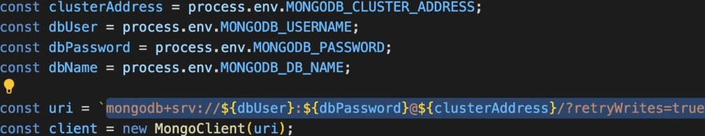
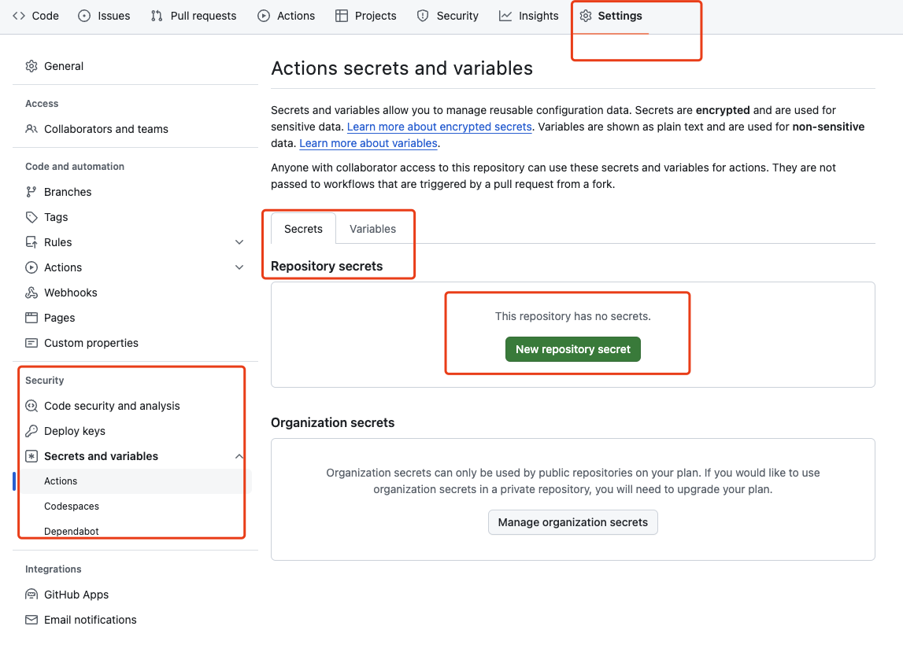
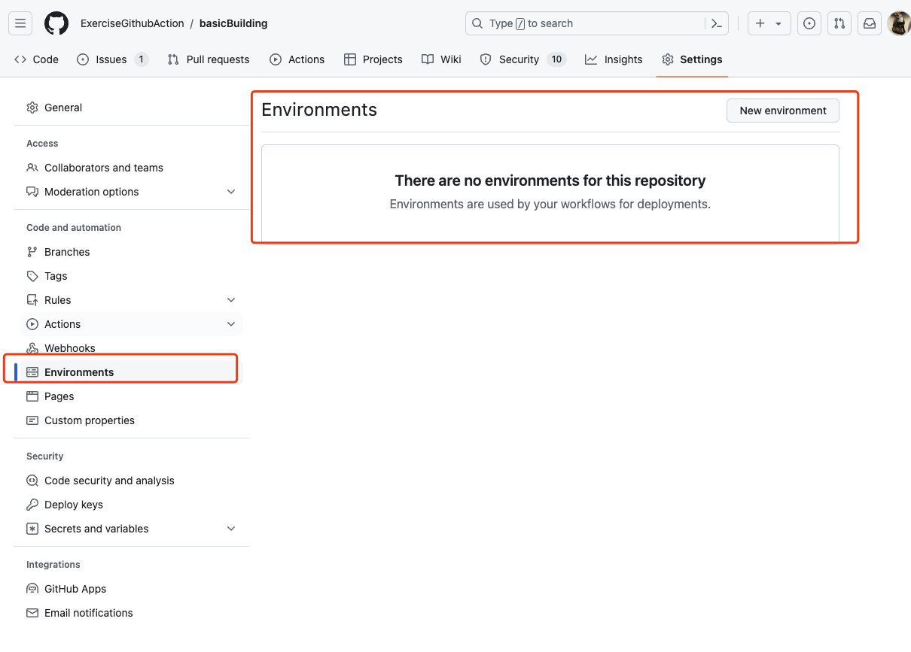

- 环境变量，比如数据库连接密码，地址等等，这些环境变量可能在不同的环境是不同的值
	- 为什么要提供环境变量
		- 
		- 如果我们需要在GitHub action做测试的job，我们就需要提供对应的环境变量值，就算在其他ci/cd的平台，也需要提供环境变量
	- 如何提供环境变量
		- `env`关键字
		- 如果放在整个workflow的层级，那么整个workflow共享这些变量
			- ```yaml
			  name: Deployment
			  on:
			    push:
			      branches:
			        - main
			        - dev
			  env:
			    MONGODB_DB_NAME: gha-demo
			  ```
		- 如果放在单个job，那么单个job共享这些变量
			- ```yaml
			  jobs:
			    test:
			      environment: testing
			      runs-on: ubuntu-latest
			      env:
			        MONGODB_CLUSTER_ADDRESS: cluster0.ntrwp.mongodb.net
			        MONGODB_USERNAME: ${{ secrets.MONGODB_USERNAME }}
			        MONGODB_PASSWORD: ${{ secrets.MONGODB_PASSWORD }}
			  ```
	- 如何使用
		- ```yaml
		  jobs:
		    test:
		      environment: testing
		      runs-on: ubuntu-latest
		      env:
		        MONGODB_CLUSTER_ADDRESS: cluster0.ntrwp.mongodb.net
		        MONGODB_USERNAME: ${{ secrets.MONGODB_USERNAME }}
		        MONGODB_PASSWORD: ${{ secrets.MONGODB_PASSWORD }}
		        PORT: 8080
		      steps:
		        - name: Get Code
		          uses: actions/checkout@v3
		        - name: Cache dependencies
		          uses: actions/cache@v3
		          with:
		            path: ~/.npm
		            key: npm-deps-${{ hashFiles('**/package-lock.json') }}
		        - name: Install dependencies
		          run: npm ci
		        - name: Run server
		          run: npm start & npx wait-on http://127.0.0.1:$PORT # requires MongoDB Atlas to accept requests from anywhere!
		        - name: Run tests
		          run: npm test
		        - name: Output information
		          run: |
		            echo "MONGODB_USERNAME: $MONGODB_USERNAME"
		    deploy:
		      needs: test
		      runs-on: ubuntu-latest
		      steps:
		        - name: Output information
		          env:
		            PORT: 3000
		          run: |        
		            echo "MONGODB_DB_NAME: $MONGODB_DB_NAME"
		            echo "MONGODB_USERNAME: $MONGODB_USERNAME"
		            echo "${{ env.PORT }}"
		  
		  ```
- ## [Default environment variables](https://docs.github.com/en/actions/learn-github-actions/variables#default-environment-variables)
-
-
- Secrets
	- 密码不应该暴露在workflow里，因为workflow是公开的
	- 可以保存在GitHub里，这样可以通过环境变量去获取
	- 
	- 在这里新建secret，没有人能够看到它，但是可以编辑它
	- 然后在workflow可以这样去使用
	  collapsed:: true
		- ```yaml
		  jobs:
		    test:
		      environment: testing
		      runs-on: ubuntu-latest
		      env:
		        MONGODB_CLUSTER_ADDRESS: cluster0.ntrwp.mongodb.net
		        MONGODB_USERNAME: ${{ secrets.MONGODB_USERNAME }}
		        MONGODB_PASSWORD: ${{ secrets.MONGODB_PASSWORD }}
		  ```
-
- Environments
	- ### GitHub Repository Environments
		- 1.  **GitHub Environments**
			- 环境是附加到代码库的，可以在工作流中使用。
		- 2.  **Workflow Jobs can target Environments**
			- 工作流中的作业可以指定目标环境。
	- ### 作用与配置
		- 1.  **Different Configurations**
			- 不同的配置：
				- 每个环境可以有不同的密钥，例如，不同的数据库密码。
				- 这允许根据不同的环境（如开发、测试、生产）来管理不同的配置。
		- 2.  **Special protection rules**
			- 特殊保护规则：
				- 例如，只有与某些分支相关的事件才能使用特定的环境。
				- 这可以确保某些敏感操作只在指定的环境中执行，从而增加安全性。
	- 他就相当于一个secrets的集合，比如测试环境，生产环境，每个环境都有一样的变量，只是值不一样
	- 只有付费的private或者免费public可以设置，在这个环境，不只是可以设置secrets，还可以设置不同的规则，比如分支监控，部署reviewer，定时等等
	- 
-
- Summary
	- ### Environment Variables (环境变量)
		- **Dynamic values used in code (e.g., database name)**:
			- 动态值用于代码中（例如，数据库名称）。
		- **May differ from workflow to workflow**:
			- 可能在不同的工作流中有所不同。
		- **Can be defined on Workflow-, Job- or Step-level**:
			- 可以在工作流、作业或步骤级别定义。
		- **Can be used in code and in the GitHub Actions Workflow**:
			- 可以在代码和 GitHub Actions 工作流中使用。
		- **Accessible via interpolation and the env context object**:
			- 可以通过插值（例如 `${{ env.VARIABLE_NAME }}`）和 `env` 上下文对象访问。
	- ### Secrets (密钥)
		- **Some dynamic values should not be exposed anywhere**:
			- 一些动态值不应该被暴露在任何地方。
		- **Examples: Database credentials, API keys etc.**:
			- 例如：数据库凭据、API 密钥等。
		- **Secrets can be stored on Repository-level or via Environments**:
			- 密钥可以存储在仓库级别或通过环境存储。
		- **Secrets can be referenced via the secrets context object**:
			- 可以通过 `secrets` 上下文对象引用密钥。
	- ### GitHub Actions Environments (GitHub Actions 环境)
		- **Jobs can reference different GitHub Actions Environments**:
			- 作业可以引用不同的 GitHub Actions 环境。
		- **Environments allow you to set up extra protection rules**:
			- 环境允许你设置额外的保护规则。
		- **You can also store Secrets on Environment-level**:
			- 你也可以在环境级别存储密钥。
-