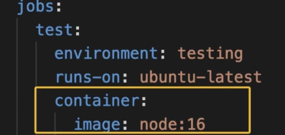

- What are Containers?
	- code + execution environment
- 通过GitHub actions runners，可以根据不同的环境运行不同的container
	- 
-
- key `container`
-
-
- Service Containers
	- 自动化测试，测试数据库作为service container
	- 
	- key：`services`
	-
- Communication between Jobs & Service Containers
	- only run job in container
		- 
		- 
	- if not run job in container
		- 
- code
  collapsed:: true
	- ```yaml
	  name: Deployment (Container)
	  on:
	    push:
	      branches:
	        - main
	        - dev
	  env:
	    CACHE_KEY: node-deps
	    MONGODB_DB_NAME: gha-demo
	  jobs:
	    test:
	      environment: testing
	      runs-on: ubuntu-latest
	      # container:
	      #   image: node:16
	      env:
	        MONGODB_CONNECTION_PROTOCOL: mongodb
	        MONGODB_CLUSTER_ADDRESS: 127.0.0.1:27017
	        MONGODB_USERNAME: root
	        MONGODB_PASSWORD: example
	        PORT: 8080
	      services:
	        mongodb:
	          image: mongo
	          ports:
	            - 27017:27017
	          env:
	            MONGO_INITDB_ROOT_USERNAME: root
	            MONGO_INITDB_ROOT_PASSWORD: example
	      steps:
	        - name: Get Code
	          uses: actions/checkout@v3
	        - name: Cache dependencies
	          uses: actions/cache@v3
	          with:
	            path: ~/.npm
	            key: ${{ env.CACHE_KEY }}-${{ hashFiles('**/package-lock.json') }}
	        - name: Install dependencies
	          run: npm ci
	        - name: Run server
	          run: npm start & npx wait-on http://127.0.0.1:$PORT # requires MongoDB Atlas to accept requests from anywhere!
	        - name: Run tests
	          run: npm test
	        - name: Output information
	          run: |
	            echo "MONGODB_USERNAME: $MONGODB_USERNAME"
	    deploy:
	      needs: test
	      runs-on: ubuntu-latest
	      steps:
	        - name: Output information
	          env:
	            PORT: 3000
	          run: |        
	            echo "MONGODB_DB_NAME: $MONGODB_DB_NAME"
	            echo "MONGODB_USERNAME: $MONGODB_USERNAME"
	            echo "${{ env.PORT }}"
	  
	  ```
-
- Summary
	- 