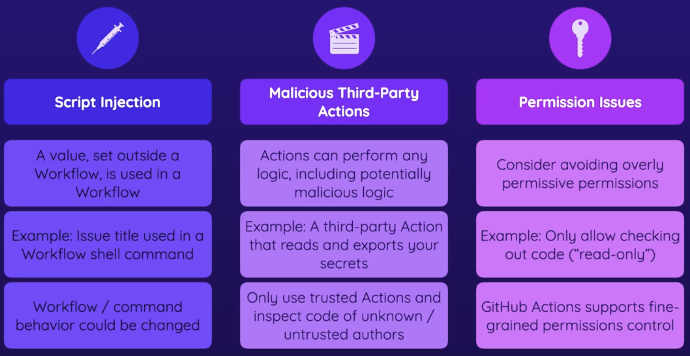
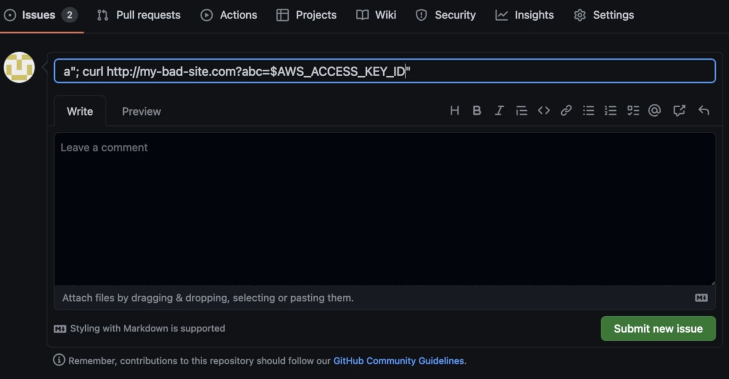
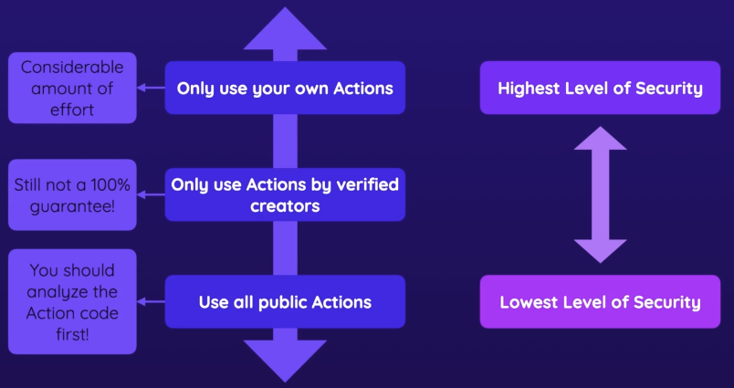

-
- Security Concerns
	- Script Injection
		- A value, set outside a Workflow, is used in a Workflow
		- Example: Issue title used in a Workflow shell command
		- Workflow /command behavior could be changed
	- Malicious Third-Party Actions
		- Actions can perform any logic, including potentially malicious logic
		- Example: A third-party Action that reads and exports your secrets
		- Only use trusted Actions and inspect code of unknown / untrusted authors
	- Permission Issues
		- Consider avoiding overly permissive permissions
		- Example: Only allow checking out code('read-only')
		- Github Actions supports fine-grained permissions control
	- {:height 283, :width 532}
-
- Script inject
	- before code
	  collapsed:: true
		- ```yaml
		  name: Label Issues (Script Injection Example)
		  on:
		    issues:
		      types:
		        - opened
		  jobs:
		    assign-label:
		      runs-on: ubuntu-latest
		      steps:
		        - name: Assign label
		          run: |
		            issue_title="${{ github.event.issue.title }}"
		            if [[ "$issue_title" == *"bug"* ]]; then
		            echo "Issue is about a bug!"
		            else
		            echo "Issue is not about a bug"
		            fi
		  ```
	- 1.  **脚本注入（Script Injection）：** 如果 `github.event.issue.title` 包含恶意脚本代码（如 Shell 命令），这些代码将会被执行。例如，如果标题为 `bug"; rm -rf /`，在 Shell 中执行时可能导致严重的数据丢失。
	- 2.  **命令注入（Command Injection）：** 如果没有正确处理输入的内容，攻击者可能通过巧妙构造的标题执行任意的 Shell 命令，从而危及系统安全。
		- 
	- fix code
	  collapsed:: true
		- ```yaml
		  name: Label Issues (Script Injection Example)
		  on:
		    issues:
		      types:
		        - opened
		  jobs:
		    assign-label:
		      runs-on: ubuntu-latest
		      steps:
		        - name: Assign label
		          env:
		            TITLE: ${{ github.event.issue.title }}
		          run: |
		            if [[ "$TITLE" == *"bug"* ]]; then
		            echo "Issue is about a bug!"
		            else
		            echo "Issue is not about a bug"
		            fi
		  ```
	- 因此脚本注入是一个你应该注意的潜在问题，你可以通过使用 GitHub Actions 而不是自己运行命令，或者使用环境变量来存储用户输入数据并在使用之前进行防御。
-
- Malicious Third-Party Actions
  collapsed:: true
	- 
-
- Permission Issues
  collapsed:: true
	- ## [Defining access for the `GITHUB_TOKEN` scopes](https://docs.github.com/en/actions/using-jobs/assigning-permissions-to-jobs#defining-access-for-the-github_token-scopes)
	- before code
	  collapsed:: true
		- ```yaml
		  name: Label Issues (Permissions Example)
		  on:
		    issues:
		      types:
		        - opened
		  jobs:
		    assign-label:
		      runs-on: ubuntu-latest
		      steps:
		        - name: Assign label
		          if: contains(github.event.issue.title, 'bug')
		          run: |
		            curl -X POST \
		            --url https://api.github.com/repos/${{ github.repository }}/issues/${{ github.event.issue.number }}/labels \
		            -H 'authorization: Bearer ${{ secrets.GITHUB_TOKEN }}' \
		            -H 'content-type: application/json' \
		            -d '{
		                "labels": ["bug"]
		              }' \
		            --fail
		  ```
	-
	- fix code
	  collapsed:: true
		- ```yaml
		  name: Label Issues (Permissions Example)
		  on:
		    issues:
		      types:
		        - opened
		  jobs:
		    assign-label:
		      permissions:
		        issues: write
		      runs-on: ubuntu-latest
		      steps:
		        - name: Assign label
		          if: contains(github.event.issue.title, 'bug')
		          run: |
		            curl -X POST \
		            --url https://api.github.com/repos/${{ github.repository }}/issues/${{ github.event.issue.number }}/labels \
		            -H 'authorization: Bearer ${{ secrets.GITHUB_TOKEN }}' \
		            -H 'content-type: application/json' \
		            -d '{
		                "labels": ["bug"]
		              }' \
		            --fail
		  ```
-
- [About security hardening with OpenID Connect](https://docs.github.com/en/actions/deployment/security-hardening-your-deployments/about-security-hardening-with-openid-connect)
-
-
-
- More On GitHub Actions Security
	- In addition to the concepts covered in this module, you should absolutely also explore the security guides by GitHub itself:
		- General overview & important concepts: [https://docs.github.com/en/actions/security-guides/security-hardening-for-github-actions](https://docs.github.com/en/actions/security-guides/security-hardening-for-github-actions)
		- More on Secrets: [https://docs.github.com/en/actions/security-guides/encrypted-secrets](https://docs.github.com/en/actions/security-guides/encrypted-secrets)
		- Using `GITHUB_TOKEN`: [https://docs.github.com/en/actions/security-guides/automatic-token-authentication](https://docs.github.com/en/actions/security-guides/automatic-token-authentication)
		- Advanced - Preventing Fork Pull Requests Attacks: [https://securitylab.github.com/research/github-actions-preventing-pwn-requests/](https://securitylab.github.com/research/github-actions-preventing-pwn-requests/)
		- Security Hardening with OpenID Connect: [https://docs.github.com/en/actions/deployment/security-hardening-your-deployments/about-security-hardening-with-openid-connect](https://docs.github.com/en/actions/deployment/security-hardening-your-deployments/about-security-hardening-with-openid-connect)