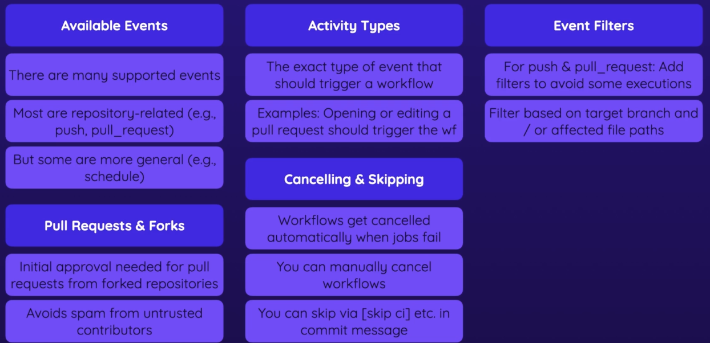

-
- events
	- control workflow execution with event filters
	- detailed control with activity types
	- examples
- Available Events
  collapsed:: true
	- 
- [Events that trigger workflows](https://docs.github.com/en/actions/using-workflows/events-that-trigger-workflows)
-
- 
-
- Activity Types
	- [pull_request](https://docs.github.com/en/actions/using-workflows/events-that-trigger-workflows#pull_request)
	  collapsed:: true
		- ```yaml
		  on:
		    pull_request:
		      types: [opened, reopened]
		  ```
		- 
-
- Filters
	- [Using Filters](https://docs.github.com/en/actions/using-workflows/workflow-syntax-for-github-actions#using-filters)
	- [path filter](https://docs.github.com/en/actions/using-workflows/workflow-syntax-for-github-actions#onpushpull_requestpull_request_targetpathspaths-ignore)
	- ```yaml
	  on:
	    push:
	      branches:
	        - main
	        - 'releases/**'
	      paths:
	        - 'sub-project/**'
	        - '!sub-project/docs/**'
	  ```
	- 如果监控了pull request
		- 那么如果是fork之后再提交pull request，这个workflow需要等待approval
			- 
		- 默认的话，pull request 是基于 forks 不会 trigger workflow
		- workflow的运行是有免费额度限制的，如果forks支持，每个人都可以forks，那么会花掉很多
		- 当然如果将成员加入了collaborators，那么有权限pull
-
- Cancelling & Skipping Workflow runs
	- Cancelling
		- 默认情况下如果jobs失败之后，workflows 会取消，如果一个step失败，那么job就会失败
		- 运行之后也可以手动取消
	- Skipping
		- [Skipping workflow runs](https://docs.github.com/en/actions/managing-workflow-runs/skipping-workflow-runs)
		- 默认情况，监控到events，则会开始一个workflow
		- 如果适当的commit message，则这个workflow会skip
			- like `git commit -m "added comments [skip ci]"`
-
- Summary
	- 