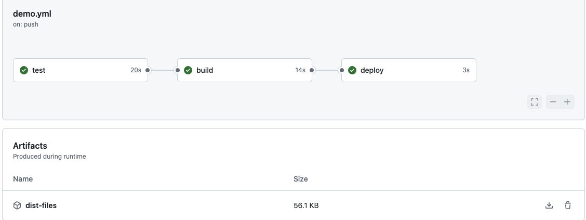
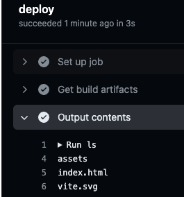
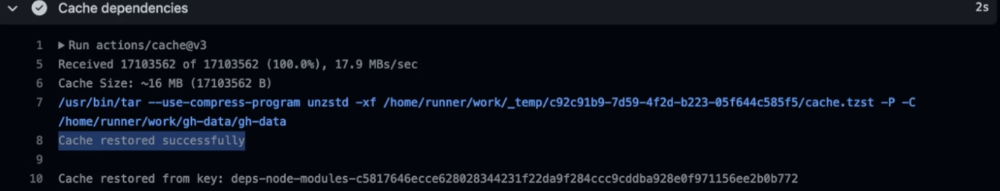
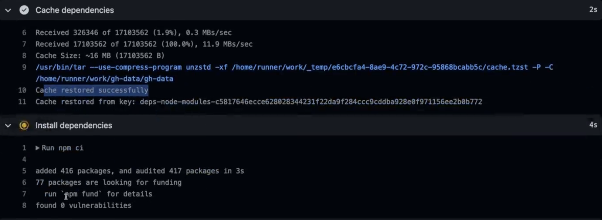

-
- Guide
	- Working with Artifacts
	- Working with Job Outputs
	- Caching Dependencies
-
-
- Job Artifacts
	- GPT解释
	  collapsed:: true
		- 在 GitHub Actions 中，`actions/upload-artifact@v3` 是一个用来上传构建产物（artifact）的官方操作。`with` 部分的 `name` 和 `path` 是这个操作的两个主要参数，分别表示上传的产物名称和路径。
		- ### `name` 参数
			- **描述**：指定上传的产物的名称。
			- **作用**：这个名称会显示在 GitHub Actions 的运行界面中，供你下载和查看。它可以帮助你组织和识别不同的产物。
			- **示例**：如果你上传了构建的二进制文件，你可以命名为 `build-output` 或 `test-results`。
		- ### `path` 参数
			- **描述**：指定要上传的文件或目录的路径。
			- **作用**：这个路径指向要上传的具体文件或目录。可以是单个文件、多个文件（使用通配符）或整个目录。
			- **示例**：如果你想上传所有的日志文件，可以使用 `logs/*`，如果想上传一个特定的文件，可以使用 `build/output.zip`。
		- ### 示例用法
			- 假设你有一个构建产物目录 `output`，其中包含所有你想上传的文件，可以这样定义 `actions/upload-artifact@v3`
			  collapsed:: true
				- ```yaml
				  name: Upload Build Artifacts
				  
				  on:
				    push:
				      branches:
				        - main
				  
				  jobs:
				    build:
				      runs-on: ubuntu-latest
				  
				      steps:
				      - name: Checkout code
				        uses: actions/checkout@v2
				  
				      - name: Build project
				        run: |
				          mkdir output
				          echo "Build successful" > output/build.log
				  
				      - name: Upload Build Artifacts
				        uses: actions/upload-artifact@v3
				        with:
				          name: build-artifacts
				          path: output/
				  
				  ```
			- ### 解释
				- 1.  **Checkout code**：
					- 使用 `actions/checkout@v2` 操作检出代码库。
				- 2.  **Build project**：
					- 模拟一个构建过程，在 `output` 目录中创建一个日志文件。
				- 3.  **Upload Build Artifacts**：
					- 使用 `actions/upload-artifact@v3` 操作上传产物。
					- `name: build-artifacts` 指定上传产物的名称为 `build-artifacts`。
					- `path: output/` 指定要上传的文件路径为 `output` 目录。
				- 上传成功后，你可以在 GitHub Actions 的运行界面中看到并下载这些产物。这个方法可以用于保存构建输出、测试结果、日志文件等任何你想在工作流结束后保留的文件。
	- Eg. building an app
		- the job will be producing the website files, upload to a web server to web hosting provider
	- Eg. building an mobile app
		- upload some package to the app stores
	- 可以build任何事情，如果是这样的job，则会有一个output，这个outputs可以是app files，或者可执行文件，或者ios包等等，这个output就是 artifacts
	- 作为这个仓库的用户，我们可以手动下载和使用这个Artifacts，通过GitHub UI，或者 REST API
	- 也可以通过Action 设置其他的Jobs来下载和使用，比如将这个outputs上传到web hosting provider
	- 在实践中，可以在build 的job中，加一个step，**[upload-artifact](https://github.com/actions/upload-artifact)**
		- ```yaml
		    build:
		      needs: test
		      runs-on: ubuntu-latest
		      steps:
		        - name: Get code
		          uses: actions/checkout@v4
		        - name: Install dependencies
		          run: npm ci
		        - name: Build website
		          run: npm run build
		        - name: Upload artifacts
		          uses: actions/upload-artifact@v4
		          with:
		            name: dist-files
		            path: ｜
		              dist
		              package.json
		  ```
-
-
- 不同的job之间，运行的机器不一样，比如在build的job中，打包好了文件，在deploy中并不能直接使用，所以需要在build中upload artifacts，然后在deploy的job中 download 这个 artifacts
	- download artifacts
	  collapsed:: true
		- ```yaml
		  name: Deploy website
		  on:
		    push:
		      branches:
		        - main
		  jobs:
		    test:
		      runs-on: ubuntu-latest
		      steps:
		        - name: Get code
		          uses: actions/checkout@v4
		        - name: Install dependencies
		          run: npm ci
		        - name: Lint code
		          run: npm run lint
		        - name: Test code
		          run: npm run test
		    build:
		      needs: test
		      runs-on: ubuntu-latest
		      steps:
		        - name: Get code
		          uses: actions/checkout@v4
		        - name: Install dependencies
		          run: npm ci
		        - name: Build website
		          run: npm run build
		        - name: Upload artifacts
		          uses: actions/upload-artifact@v4
		          with:
		            name: dist-files
		            path: dist
		            # path: |
		            #   dist
		            #   package.json
		    deploy:
		      needs: build
		      runs-on: ubuntu-latest
		      steps:
		        - name: Get build artifacts
		          uses: actions/download-artifact@v4
		          with:
		              name: dist-files
		        - name: Output contents
		          run: ls
		        - name: Deploy
		          run: echo "Deploying..."
		  
		  ```
	- result
	  collapsed:: true
		- 
		- 
-
- Job Outputs
	- 可以把它视为 artifacts，但是它不只是artifacts，也可以是一个值（用在其他的jobs，这个值可以被多个jobs互相共用，比如dates，hashes，random values）
	- 我们可以给这个output命名，为后续使用做准备
		- 例如
		  collapsed:: true
			- ```yaml
			    build:
			      needs: test
			      runs-on: ubuntu-latest
			      outputs:
			        script-file: ${{ steps.publish.outputs.script-file }}
			      steps:
			        - name: Get code
			          uses: actions/checkout@v3
			        - name: Install dependencies
			          run: npm ci
			        - name: Build website
			          run: npm run build
			        - name: Publish JS filename
			          id: publish
			          run: find dist/assets/*.js -type f -execdir echo 'script-file={}' >> $GITHUB_OUTPUT ';'
			        - name: Upload artifacts
			          uses: actions/upload-artifact@v3
			          with:
			            name: dist-files
			            path: dist
			            # path: |
			            #   dist
			            #   package.json
			  ```
		- 在上述例子中
			- build后的js文件是随机文件名
			- 获取该文件名，并且在后续step中使用
		- 添加 `outputs` 键以定义作业输出
			- ## [`steps` context](https://docs.github.com/en/actions/learn-github-actions/contexts#steps-context)
			- ```yaml
			  jobs:
			    build:
			      runs-on: ubuntu-latest
			  
			      outputs:
			        script-file: ${{ steps.publish.outputs.script-file }}
			  ```
		- 运行一个脚本来获取 JavaScript 文件的名称, 使用 `echo` 命令和特殊的 `$GITHUB_OUTPUT` 变量将文件名写入 GitHub 管理的输出文件; 给步骤定义一个唯一的 ID, 使用步骤 ID 和输出名称访问步骤输出
		  collapsed:: true
			- ```yaml
			    build:
			      needs: test
			      runs-on: ubuntu-latest
			      outputs:
			        script-file: ${{ steps.publish.outputs.script-file }}
			      steps:
			        - name: Get code
			          uses: actions/checkout@v3
			        - name: Install dependencies
			          run: npm ci
			        - name: Build website
			          run: npm run build
			        - name: Publish JS filename
			          id: publish
			          run: find dist/assets/*.js -type f -execdir echo 'script-file={}' >> $GITHUB_OUTPUT ';'
			  ```
		- ### 关键点
			- 使用 `outputs` 定义作业输出
			- 使用 `echo` 和 `$GITHUB_OUTPUT` 变量设置步骤输出
			- 给步骤定义 `id`，以便在作业级别引用步骤输出
	- 使用output
		- ## [`jobs` context](https://docs.github.com/en/actions/learn-github-actions/contexts#jobs-context)
		- ## [`needs` context](https://docs.github.com/en/actions/learn-github-actions/contexts#needs-context)
		- example code
			- ```yaml
			    deploy:
			      needs: build
			      runs-on: ubuntu-latest
			      steps:
			        - name: Get build artifacts
			          uses: actions/download-artifact@v3
			          with:
			            name: dist-files
			        - name: Output contents
			          run: ls
			        - name: Output filename
			          run: echo "${{ needs.build.outputs.script-file }}"
			        - name: Deploy
			          run: echo "Deploying..."
			  ```
- Dependency caching
	- 如果没有cache，每次运行都需要重新install dependency，运行时间就会花费很多
	- 如果一个workflow有两个job，一个job是测试，一个job是build，这两个操作都需要install dependency，这时候就可以把这个dependency缓存起来，因为这个不会经常改变，然后还会节省很多功夫，不需要重复下载
	- 这个缓存不只是可以在不同的job里缓存，还可以跨workflow保存，如果上一次的workflow的package.json跟这一次的没有变化，也可以用这份缓存
	- 这是非常常见的场景，官方就有对应的Action **[cache](https://github.com/actions/cache)**
	-
	- 在install dependency之前，添加一个缓存步骤，并且指定path，key
	  collapsed:: true
		- 通过这个action，告诉 GitHub Actions，npm 创建的缓存文件夹应该存储在 GitHub 的云端，即在某个 GitHub 服务器上并且应该在其他作业和工作流执行中重用
		- 所以这里是应该被 GitHub 缓存和存储的文件夹路径。然后我们必须为这个缓存指定一个键。这个键的作用是用于将来检索缓存，并在运行器机器上基于 GitHub 管理的缓存重新创建该文件夹
		- ```yaml
		        - name: Cache dependencies
		          uses: actions/cache@v3
		          with:
		            path: ~/.npm
		            key: deps-node-modules-${{ hashFiles('**/package-lock.json') }}
		  ```
		- 我们可以再次使用 GitHub Actions 的表达式语法。在这里，我将使用 GitHub Actions 提供的 `hashFiles` 函数，该函数根据我们传递的文件路径生成一个唯一的哈希值，并且每当传递的文件发生变化时，该哈希值也会随之改变。我们在单引号之间传递文件路径，这里的路径是 `package-lock.json`，无论它位于哪个子文件夹中，该函数会收集所有 `package-lock.json` 文件，并根据这些文件的组合生成一个哈希值。
		- `package-lock.json` 文件指定了项目的所有依赖项及其确切版本。这里的想法是，每当这个文件发生变化时，例如我们更新了某个依赖项，由 `hashFiles` 生成的哈希值将不再相同。因此，我们会得到一个不同的哈希键，指示 GitHub Actions 和缓存操作当前存储的缓存应该被丢弃并重新创建，从而重新安装依赖项。
		- 这就是它的工作原理。尽管在这种工作流设置中，依赖项安装步骤总是会执行，但因为我们要么恢复这个 npm 缓存文件夹，要么不恢复，`npm ci` 命令将自动使用这个 npm 文件夹。如果文件夹存在，它将被使用；如果不存在，则会重新下载依赖项。
		- 缓存步骤在作业结束后还会自动检查这个文件夹，并将其放入缓存中（如果之前没有这个文件夹）。因此，缓存步骤不仅在这里执行，还在整个作业完成后更新缓存，以便如果安装了新的依赖项，这些新的依赖项将再次被缓存。
		- 当然，缓存操作的使用方式取决于你的项目设置。不同的项目设置以及不同的包和编程语言有不同的文件和文件夹需要缓存，以加快工作流速度。这就是为什么你可以找到所有这些官方示例，以便找到适合你用例的示例。这里是npm 的例子
		- 
	- 在使用这个cache的地方，就重复上一个缓存步骤就行
		- 
	- 例子
	  collapsed:: true
		- ```yaml
		  name: Deploy website
		  on:
		    push:
		      branches:
		        - main
		  jobs:
		    test:
		      runs-on: ubuntu-latest
		      steps:
		        - name: Get code
		          uses: actions/checkout@v3
		        - name: Cache dependencies
		          uses: actions/cache@v3
		          with:
		            path: ~/.npm
		            key: deps-node-modules-${{ hashFiles('**/package-lock.json') }}
		        - name: Install dependencies
		          run: npm ci
		        - name: Lint code
		          run: npm run lint
		        - name: Test code
		          run: npm run test
		    build:
		      needs: test
		      runs-on: ubuntu-latest
		      outputs:
		        script-file: ${{ steps.publish.outputs.script-file }}
		      steps:
		        - name: Get code
		          uses: actions/checkout@v3
		        - name: Cache dependencies
		          uses: actions/cache@v3
		          with:
		            path: ~/.npm
		            key: deps-node-modules-${{ hashFiles('**/package-lock.json') }}
		        - name: Install dependencies
		          run: npm ci
		        - name: Build website
		          run: npm run build
		        - name: Publish JS filename
		          id: publish
		          run: find dist/assets/*.js -type f -execdir echo 'script-file={}' >> $GITHUB_OUTPUT ';'
		        - name: Upload artifacts
		          uses: actions/upload-artifact@v3
		          with:
		            name: dist-files
		            path: dist
		            # path: |
		            #   dist
		            #   package.json
		    deploy:
		      needs: build
		      runs-on: ubuntu-latest
		      steps:
		        - name: Get build artifacts
		          uses: actions/download-artifact@v3
		          with:
		            name: dist-files
		        - name: Output contents
		          run: ls
		        - name: Output filename
		          run: echo "${{ needs.build.outputs.script-file }}"
		        - name: Deploy
		          run: echo "Deploying..."
		  
		  ```
-
-
- Summary
	- ### Artifacts
		- **Artifacts** 是指在工作流运行过程中生成并需要共享或分析的资产。这些资产通常包括可以部署的网站文件、日志、二进制文件等。
			- **生成共享或分析的资产**：作业通常会生成需要共享或分析的资产。
			- **示例**：可部署的网站文件、日志、二进制文件等。
			- **称为“Artifacts”或“Job Artifacts”**：这些资产被称为“Artifacts”（或“Job Artifacts”）。
			- **上传和下载的操作**：GitHub Actions 提供了用于上传和下载的操作。
	- ### Outputs
		- **Outputs** 是指除了 Artifacts 之外，步骤（Steps）可以生成和共享的简单值。Outputs 通常用于在不同步骤或作业之间传递数据。
			- **生成和共享简单值**：除了 Artifacts 之外，步骤可以生成和共享简单值。
			- **通过 `::set-output` 共享**：这些输出通过 `::set-output` 来共享。
			- **使用 `steps` 上下文共享步骤输出**：作业可以通过 `steps` 上下文获取和共享步骤输出。
			- **使用 `needs` 上下文共享作业输出**：其他作业可以通过 `needs` 上下文使用作业输出。
	- ### Caching
		- **Caching** 是一种用于加速重复、耗时步骤的方法。缓存通常用于保存依赖项等。
			- **加速重复、耗时步骤**：缓存可以帮助加速重复、耗时的步骤。
			- **典型用例：缓存依赖项**：典型的使用案例是缓存依赖项。
			- **任何文件或文件夹都可以缓存**：但任何文件和文件夹都可以被缓存。
			- **自动存储和更新缓存值**：缓存操作会自动存储和更新缓存值（基于缓存键）。
			- **不要用缓存来存储 Artifacts**：重要的是，不要使用缓存来存储 Artifacts。