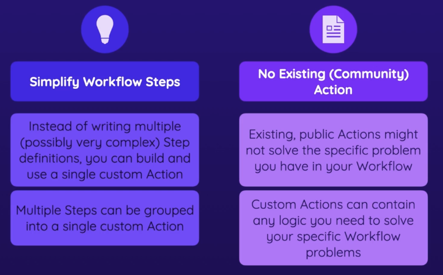
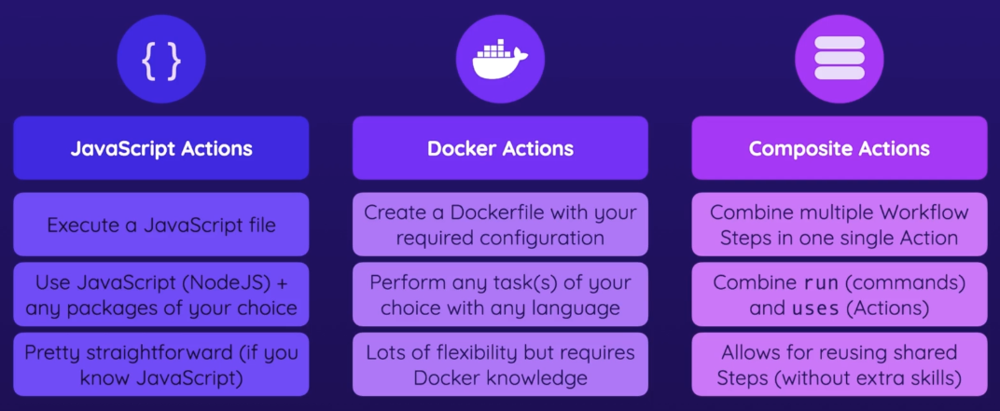
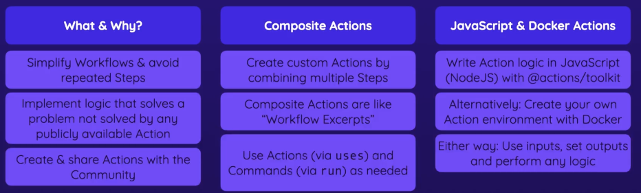

-
- Why Custom Actions
	- 
	- Simplify Workflow Steps
	- No Existing(Community Action)
- Different Types of Custom Actions
	- 
- ## [About custom actions](https://docs.github.com/en/actions/creating-actions/about-custom-actions#about-custom-actions)
- `../actions`
	- composite
		- [Creating a composite action](https://docs.github.com/en/actions/creating-actions/creating-a-composite-action)
		- `/cached-deps`
			- action.yml
			  collapsed:: true
				- ```yaml
				  name: 'Get & Cache Dependencies'
				  description: 'Get the dependencies (via npm) and cache them.'
				  inputs:
				    caching:
				      description: 'Whether to cache dependencies or not.'
				      required: false
				      default: 'true'
				  outputs:
				    used-cache:
				      description: 'Whether the cache was used.'
				      value: ${{ steps.install.outputs.cache }}
				  runs:
				    using: 'composite'
				    steps:
				      - name: Cache dependencies
				        if: inputs.caching == 'true'
				        id: cache
				        uses: actions/cache@v3
				        with:
				          path: node_modules
				          key: deps-node-modules-${{ hashFiles('**/package-lock.json') }}
				      - name: Install dependencies
				        id: install
				        if: steps.cache.outputs.cache-hit != 'true' || inputs.caching != 'true'
				        run: |
				          npm ci
				          echo "cache='${{ inputs.caching }}'" >> $GITHUB_OUTPUT
				        shell: bash
				  ```
	- javaScript
		- [Creating a JavaScript action](https://docs.github.com/en/actions/creating-actions/creating-a-javascript-action)
		- https://github.com/actions/toolkit
		- `/deploy-s3-javascript`
			- action.yml
			  collapsed:: true
				- ```yaml
				  name: 'Deploy to AWS S3'
				  description: 'Deploy a static website via AWS S3.'
				  inputs:
				    bucket:
				      description: 'The S3 bucket name.'
				      required: true
				    bucket-region: 
				      description: 'The region of the S3 bucket.'
				      required: false
				      default: 'us-east-1'
				    dist-folder:
				      description: 'The folder containing the deployable files.'
				      required: true
				  outputs:
				    website-url:
				      description: 'The URL of the deployed website.'
				  runs:
				    using: 'node16'
				    main: 'main.js'
				  ```
			- main.js
			  collapsed:: true
				- ```javascript
				  const core = require('@actions/core');
				  // const github = require('@actions/github');
				  const exec = require('@actions/exec');
				  
				  function run() {
				    // 1) Get some input values
				    const bucket = core.getInput('bucket', { required: true });
				    const bucketRegion = core.getInput('bucket-region', { required: true });
				    const distFolder = core.getInput('dist-folder', { required: true });
				  
				    // 2) Upload files
				    const s3Uri = `s3://${bucket}`;
				    exec.exec(`aws s3 sync ${distFolder} ${s3Uri} --region ${bucketRegion}`);
				  
				    const websiteUrl = `http://${bucket}.s3-website-${bucketRegion}.amazonaws.com`;
				    core.setOutput('website-url', websiteUrl); // echo "website-url=..." >> $GITHUB_OUTPUT
				  }
				  
				  run();
				  
				  ```
			- package.json
			  collapsed:: true
				- ```json
				  {
				    "name": "deploy-s3-javascript",
				    "version": "1.0.0",
				    "description": "",
				    "main": "main.js",
				    "scripts": {
				      "test": "echo \"Error: no test specified\" && exit 1"
				    },
				    "keywords": [],
				    "author": "",
				    "license": "ISC",
				    "dependencies": {
				      "@actions/core": "^1.9.1",
				      "@actions/exec": "^1.1.1",
				      "@actions/github": "^5.0.3"
				    }
				  }
				  
				  ```
			- node_modules不能被ignore，GitHub action不会自动npm install，所以需要这个
				- 需要里面所有的文件，比如dist，如果gitignore有dist，则需要指定根目录的dist，比如`/dist`
	- docker
		- [Creating a Docker container action](https://docs.github.com/en/actions/creating-actions/creating-a-docker-container-action)
		- `/deploy-s3-docker`
			- action.yml
			  collapsed:: true
				- ```yaml
				  name: 'Deploy to AWS S3'
				  description: 'Deploy a static website via AWS S3.'
				  inputs:
				    bucket:
				      description: 'The S3 bucket name.'
				      required: true
				    bucket-region: 
				      description: 'The region of the S3 bucket.'
				      required: false
				      default: 'us-east-1'
				    dist-folder:
				      description: 'The folder containing the deployable files.'
				      required: true
				  outputs:
				    website-url:
				      description: 'The URL of the deployed website.'
				  runs:
				    using: 'docker'
				    image: 'Dockerfile'
				  ```
			- dockerfile
			  collapsed:: true
				- ```dockerfile
				  FROM python:3
				  
				  COPY requirements.txt /requirements.txt
				  
				  RUN pip install -r requirements.txt
				  
				  COPY deployment.py /deployment.py
				  
				  CMD ["python", "/deployment.py"]
				  ```
			- development.py
			  collapsed:: true
				- ```python
				  import os
				  import boto3
				  import mimetypes
				  from botocore.config import Config
				  
				  
				  def run():
				      bucket = os.environ['INPUT_BUCKET']
				      bucket_region = os.environ['INPUT_BUCKET-REGION']
				      dist_folder = os.environ['INPUT_DIST-FOLDER']
				  
				      configuration = Config(region_name=bucket_region)
				  
				      s3_client = boto3.client('s3', config=configuration)
				  
				      for root, subdirs, files in os.walk(dist_folder):
				          for file in files:
				              s3_client.upload_file(
				                  os.path.join(root, file),
				                  bucket,
				                  os.path.join(root, file).replace(dist_folder + '/', ''),
				                  ExtraArgs={"ContentType": mimetypes.guess_type(file)[0]}
				              )
				  
				      website_url = f'http://{bucket}.s3-website-{bucket_region}.amazonaws.com'
				      # The below code sets the 'website-url' output (the old ::set-output syntax isn't supported anymore - that's the only thing that changed though)
				      with open(os.environ['GITHUB_OUTPUT'], 'a') as gh_output:
				          print(f'website-url={website_url}', file=gh_output)
				  
				  
				  if __name__ == '__main__':
				      run()
				  ```
			- requirenments.txt
			  collapsed:: true
				- ```textile
				  boto3==1.24.71
				  botocore==1.27.71
				  jmespath==1.0.1
				  python-dateutil==2.8.2
				  s3transfer==0.6.0
				  six==1.16.0
				  urllib3==1.26.12
				  
				  ```
- workflow
  collapsed:: true
	- ```yaml
	  name: Deployment
	  on:
	    push:
	      branches:
	        - main
	  jobs:
	    lint:
	      runs-on: ubuntu-latest
	      steps:
	        - name: Get code
	          uses: actions/checkout@v3
	        - name: Load & cache dependencies
	          id: cache-deps
	          uses: ./.github/actions/cached-deps
	          with:
	            caching: 'false'
	        - name: Output information
	          run: echo "Cache used? ${{ steps.cache-deps.outputs.used-cache }}"
	        - name: Lint code
	          run: npm run lint
	    test:
	      runs-on: ubuntu-latest
	      steps:
	        - name: Get code
	          uses: actions/checkout@v3
	        - name: Load & cache dependencies
	          uses: ./.github/actions/cached-deps
	        - name: Test code
	          id: run-tests
	          run: npm run test
	        - name: Upload test report
	          if: failure() && steps.run-tests.outcome == 'failure'
	          uses: actions/upload-artifact@v3
	          with:
	            name: test-report
	            path: test.json
	    build:
	      needs: test
	      runs-on: ubuntu-latest
	      steps:
	        - name: Get code
	          uses: actions/checkout@v3
	        - name: Load & cache dependencies
	          uses: ./.github/actions/cached-deps
	        - name: Build website
	          run: npm run build
	        - name: Upload artifacts
	          uses: actions/upload-artifact@v3
	          with:
	            name: dist-files
	            path: dist
	    deploy:
	      permissions:
	        id-token: write
	        contents: read
	      needs: build
	      runs-on: ubuntu-latest
	      steps:
	        - name: Get code
	          uses: actions/checkout@v3
	        - name: Get build artifacts
	          uses: actions/download-artifact@v3
	          with:
	            name: dist-files
	            path: ./dist
	        - name: Output contents
	          run: ls
	        - name: Deploy site
	          id: deploy
	          uses: ./.github/actions/deploy-s3-docker
	          env:
	            AWS_ACCESS_KEY_ID: ${{ secrets.AWS_ACCESS_KEY_ID }}
	            AWS_SECRET_ACCESS_KEY: ${{ secrets.AWS_SECRET_ACCESS_KEY }}
	          with:
	            bucket: gha-security-hosting-demo
	            dist-folder: ./dist
	            # bucket-region: us-east-2
	        - name: Output information
	          run: |
	            echo "Live URL: ${{ steps.deploy.outputs.website-url }}"
	  
	  ```
-
- ### Storing Actions In Repositories & Sharing Actions With Others
  collapsed:: true
	- In this module, we created custom Actions that were stored in the same repository as our Workflow(s).
	- Alternatively, we could've stored the custom Actions in **separate repositories** (which therefore then only include the Action definition + code).
	- This is actually quite straightforward:
		- 1.  Create a new, local project folder which contains your `action.yml` file + all the code belonging to the action (Important: **Don't** put your `action.yml` file or code in a `.github/actions` folder or anything like that - just keep it directly on the root level of your created project!)
		- 2.  Add a local Git repository to your created project (via `git init`)
		- 3.  Create your commit(s) via `git add` and `git commit`
		- 4.  Create a GitHub repository and connect it to your local Git repository (via `git remote add`)
		- 5.  Add a tag via `git tag -a -m "My action release" v1`
		- 6.  Push your local code to the remote GitHub repository (via `git push --follow tags`)
		- 7.  Use your custom Action in any other Workflow (in any other project and repository) by referencing the repository which contains your action (e.g., `my-account/my-action@v1`)
	- If your custom Action is stored in a **public repository**, it can also be published to the GitHub Actions Marketplace as described here: [https://docs.github.com/en/actions/creating-actions/publishing-actions-in-github-marketplace#publishing-an-action](https://docs.github.com/en/actions/creating-actions/publishing-actions-in-github-marketplace#publishing-an-action)
-
- Summary
	- 