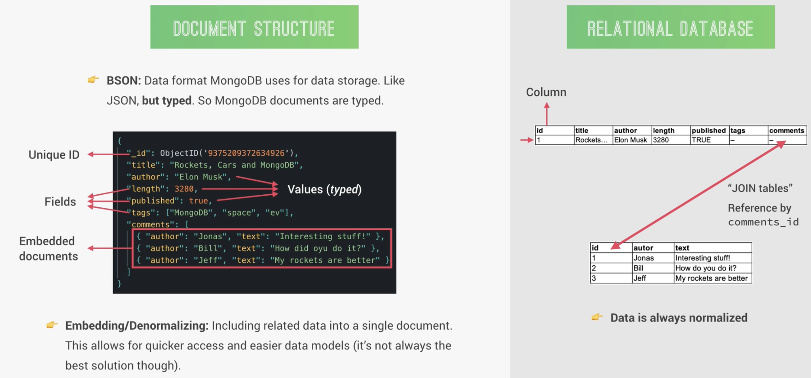

- Basic Theory
	- [[What is NoSQL？]]
	- [[What is MongoDB？]]
	- {:height 297, :width 619}
- Basic Operation
	- `mongo` go to mongo shell
	- `show dbs`
	- `use admin`
	- `use natours-test(databasename)`
		- go to database, if not then create
	- `show collections`
	- insert
		- `db.tours.insertMany({ name: 'The forest Hiker', price: 297, rating: 4.7 })`
			- create document； and insert a value
			- tours is document
		- `db.tours.insertMany([{ name: 'The Sea Explorer', price: 297, rating: 4.7 }, { name: 'The Snow Adventurer', price: 997, rating: 4.9, difficulty: 'easy'}])`
	- search
		- `db.tours.find()`
			- find document
		- `db.tours.find({ name: "The Forest Hiker" })`
		- `db.tours.find({ price: {$lte: 500} })`
			- 找到价格低于等于500的数据
		- `db.tours.find({ price: {$lt: 500}, rating: {$gte: 4.8} })`
			- 1.  价格小于500（`price: {$lt: 500}`）：`price`字段的值小于500。
			- 2.  评分大于等于4.8（`rating: {$gte: 4.8}`）：`rating`字段的值大于或等于4.8
		- `db.tours.find({ ¥or: [ {price: { $lt: 500} }, {rating: { $gte: 4.8} }] })`
			- 上面一个的变形，or代表随意一个满足就行
		- `db.tours.find({ ¥or: [ {price: { $lt: 500} }, {rating: { $gte: 4.8} }] }, {name: 1})`
			- 这个查询在MongoDB中查找符合以下任一条件的文档，同时只返回这些文档的 `name` 字段
	- update
		- `db.tours.updateOne({ name: "The Snow Adventurer"}, { $set: {price: 597} })`
			- 这个命令会在 `tours` 集合中查找第一个 `name` 为 `"The Snow Adventurer"` 的文档，并将该文档的 `price` 字段更新为 `597`。如果有多个文档匹配这个条件，只有第一个匹配的文档会被更新
		- `db.tours.updateMany({ price: {$gt: 500}, rating: {$gte: 4.8} }, { $set: {premium: true}} )`
			- 1.  查询条件：
				- `{ price: { $gt: 500 }, rating: { $gte: 4.8 } }`：选择所有 `price` 字段值大于 500 且 `rating` 字段值大于或等于 4.8 的文档。
			- 2.  更新操作：
				- `{ $set: { premium: true } }`：使用 `$set` 操作符，将匹配到的文档的 `premium` 字段设置为 `true`
	- delete
		- `db.tours.deleteMany({ rating: {$lt: 4.8} })`
			- 1.  查询条件：
				- `{ rating: { $lt: 4.8 } }`：选择所有 `rating` 字段值小于 4.8 的文档。
			- 2.  删除操作：
				- `deleteMany`：删除所有符合查询条件的文档
-