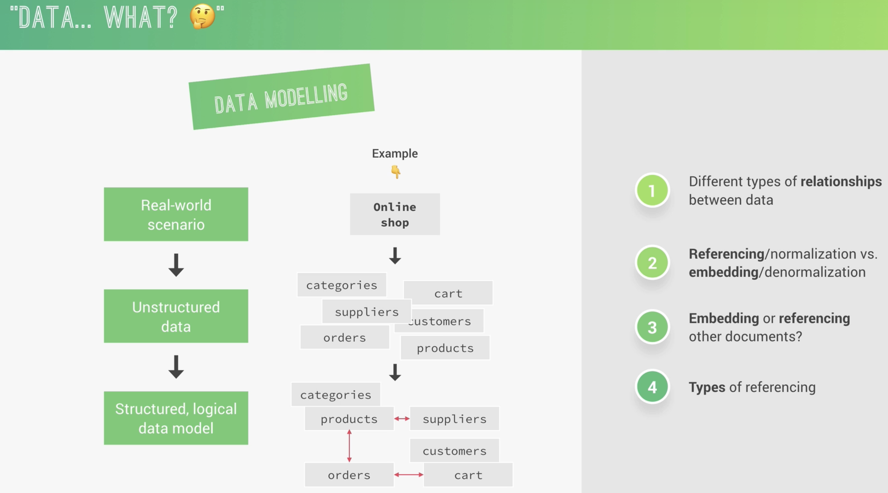
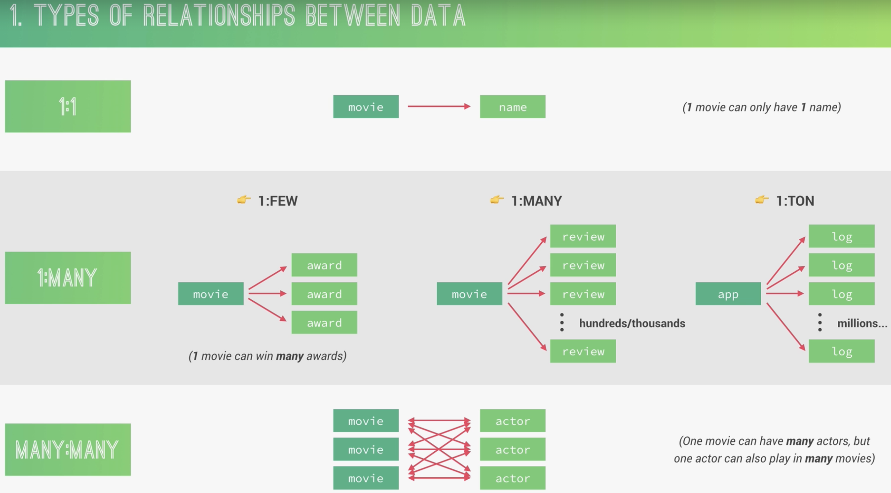
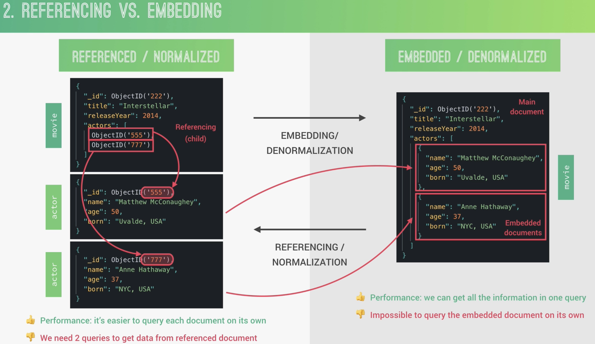
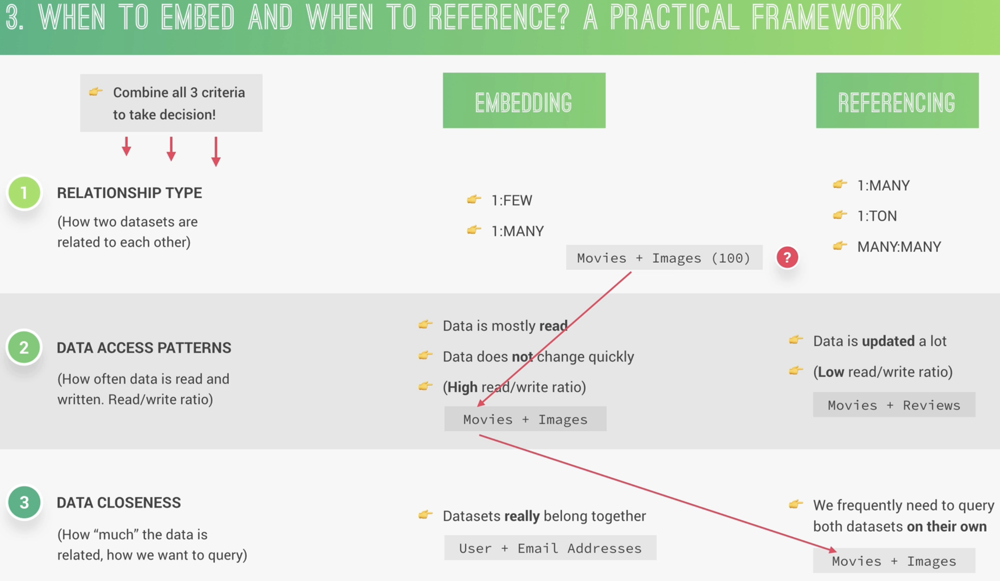
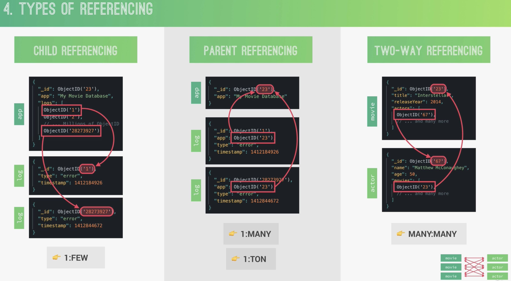
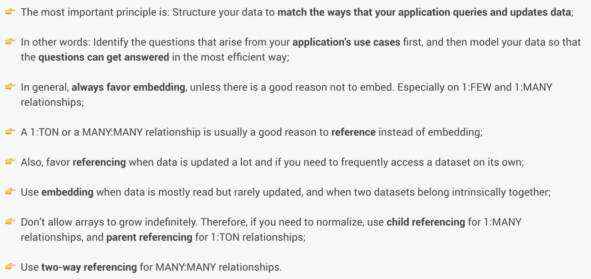

- data？
  collapsed:: true
	- {:height 628, :width 1116}
- types of relationships between data
  collapsed:: true
	- 
- referencing vs embedding
  collapsed:: true
	- 
- when to embed and when to reference? a practical framework
  collapsed:: true
	- 
- type of reference
  collapsed:: true
	- 
- summary
  collapsed:: true
	- 
-
-
-
-