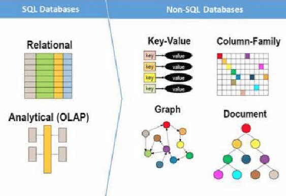
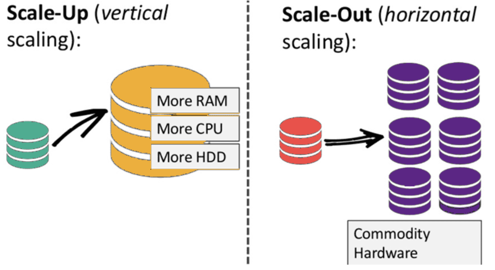

- 定义
	- NoSQL数据库（Not Only SQL）是一类不同于传统关系型数据库（RDBMS）的数据库管理系统，旨在处理大规模数据存储、快速读写需求和灵活的数据模型。
	- NoSQL数据库通常不使用固定的表结构、行和列，而是采用更灵活的数据存储方式，如键值对、文档、列族和图结构
	- 
- 历史
	- NoSQL数据库在2000年代后期兴起，随着存储成本急剧下降，开发人员的生产力优化成为重点。传统复杂数据模型为了避免数据重复已不再必要，因为存储成本降低，应用需要存储和查询的大量数据变得多样化（结构化、半结构化、多态化），预定义模式变得困难。NoSQL数据库允许开发者存储大量非结构化数据，提供了极大的灵活性
	- 同时，**Agile Manifesto**的流行促使软件工程师重新思考软件开发方式，强调快速适应变化的需求，快速迭代和改变整个软件堆栈，包括数据库。NoSQL数据库提供了这种灵活性
	- 云计算的普及使开发者开始在公共云中托管应用和数据，他们希望能够跨多个服务器和区域分布数据，实现应用的弹性、横向扩展以及智能的地理位置数据存储。一些NoSQL数据库如MongoDB提供了这些功能
- 类型
	- 1.  **键值存储（Key-Value Stores）**
		- 每个数据项都包含一个键和一个值。适用于高速读取和写入操作。
		- 示例：Redis, Riak
	- 2.  **文档存储（Document Stores）**
		- 数据以文档的形式存储，每个文档通常是JSON或BSON格式。适用于存储复杂的嵌套数据。
		- 示例：MongoDB, CouchDB
	- 3.  **列族存储（Column-Family Stores）**
		- 数据按列存储，而不是按行。适用于大规模分布式数据存储和分析。
		- 示例：Apache Cassandra, HBase
	- 4.  **图形数据库（Graph Databases）**
		- 数据以图结构存储，节点和边都可以存储属性。适用于复杂关系和连接的查询。
		- 示例：Neo4j, OrientDB
- NoSQL数据库相比关系型数据库具有多项优势
	- 1.  **灵活的数据模型**：NoSQL数据库的模式非常灵活，允许轻松修改数据库结构以适应不断变化的需求，从而加速应用功能的集成和迭代。
	- 2.  **横向扩展**：NoSQL数据库支持横向扩展，可以通过添加廉价的商品服务器来增加容量，而不是依赖于垂直扩展（升级到更大、更昂贵的服务器）。
		- 
	- 3.  **快速查询**：由于NoSQL数据库通常避免数据表之间的联接操作，并将经常一起访问的数据存储在一起，使查询速度非常快。
	- 4.  **开发者友好**：一些NoSQL数据库（如MongoDB）能够将数据结构映射到流行编程语言的对象模型中，使开发者能够以与应用代码一致的方式存储数据，减少代码量，加快开发速度，并减少错误
- NoSQL数据库的主要缺点包括：
	- 1.  **缺乏ACID事务支持**：NoSQL数据库通常不支持跨多个文档的ACID事务，这对需要强一致性的应用来说是一个问题。虽然MongoDB在4.0版本及之后添加了多文档ACID事务支持，并在4.2版扩展到分片集群，但单记录的原子性仍可能不足以满足某些应用的需求。
	- 2.  **数据冗余和存储效率**：NoSQL数据库的数据模型通常为查询优化而设计，而不是减少数据重复，这可能导致数据库比SQL数据库更大。不过，由于存储成本低廉，加上某些NoSQL数据库支持数据压缩，这个缺点相对较小。
	- 3.  **特定数据库类型的局限性**：不同类型的NoSQL数据库适用于不同的用例，可能无法在单个数据库中满足所有需求。例如，图数据库在分析数据关系方面表现出色，但可能不适合处理日常数据检索（如范围查询）。选择NoSQL数据库时，需要根据具体用例考虑是否需要像MongoDB这样的通用数据库。